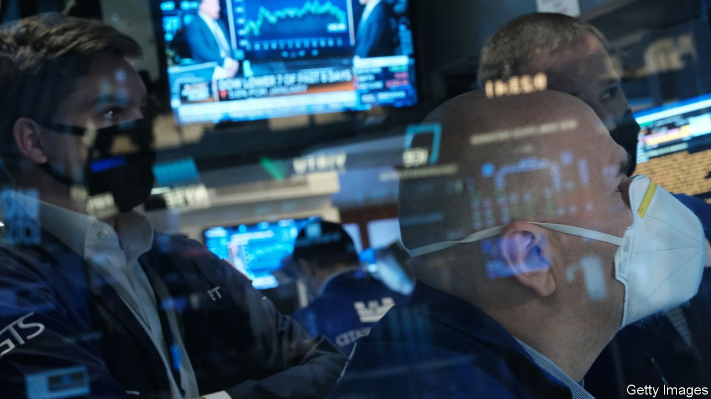
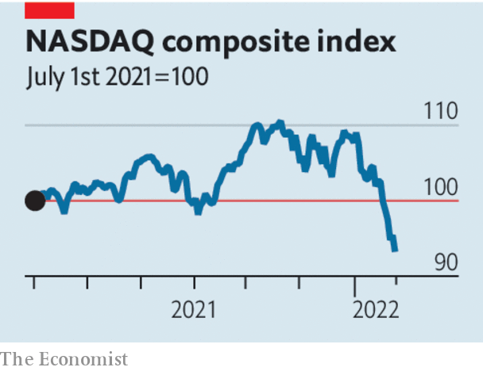

###### A turning point

# Markets have fallen because the era of free money is coming to an end 

##### Tighter money means financial volatility and economic uncertainty 

 

> Jan 29th 2022 

AFTER THE interest-rate cuts and hectic central-bank bond-buying of early 2020, investors came to believe that central-bank stimulus would pretty much last for ever. Today, however, as investors come to terms with the end of the era of free money, financial markets are in spasms. Markets now expect interest rates to increase four times in 2022 as the Fed fights the inflation that has lifted growth in the consumer-price index to 7%, a level barely imaginable a year ago. On January 26th the Fed confirmed that it would end its  and signalled that it would probably raise rates soon.

This hawkish shift is the most important among many to have taken place in the world’s central banks in recent months. But it has only recently begun to bite in asset markets. After reaching a vertiginous high of nearly 40 times earnings at the turn of the year, the S&amp;P 500 index of stocks has fallen by 9% in January (markets in Europe and Asia have fallen too, though by less).  has been just as striking, reflecting investors’ struggle to digest the consequences of tighter money.


One is the repricing of long-dated assets. As interest rates collapsed during the pandemic, the value of securities with pay-offs stretching far into the future soared. Shares of technology firms like Zoom and Netflix, already sent higher by the switch to remote work and at-home entertainment, looked even more desirable as the return on bonds all but vanished. Their rise propelled the American stockmarket. Lately, however, long-term real interest rates have surged in anticipation of monetary tightening, causing a reversal of fortune. The turnaround has been dramatic for the most speculative stocks and novel instruments such as cryptocurrencies.

 


The effect of higher rates on the real economy is slower-burning and harder to anticipate. Ultra-cheap money let companies raise vast amounts of capital in 2021, a boom that will not be repeated. Homebuyers have assumed big mortgages as house prices have soared. Distressed firms have taken advantage of government-backed loans. Government debt-to- GDP ratios have ballooned, because of large, sustained deficits in the rich world and a collapse in growth in many emerging economies.

High indebtedness makes the world economy more sensitive to changes in monetary policy. Central banks must raise rates enough to quell inflation but not so much that they tip economies into recession as interest burdens rise. Households have stronger balance-sheets than you might expect given the depth of the recent recession, but their health depends in part on asset prices staying high. And if tighter money at the Fed causes turmoil in emerging markets, the consequences could rebound on America’s economy.

As they aim for a narrow landing strip, central banks also face high winds, because of the risk of war in Ukraine and uncertainties associated with the pandemic. Economists are struggling to forecast how many people who left the workforce in 2020 will eventually return—and the more that do, the less the chance that a damaging wage-price spiral will take hold.

They are also grappling with doubts over when consumers will shift their spending back to services, easing the upward pressure on goods prices caused by bunged-up supply chains. Economic data have become harder to interpret. If retail sales fall, for example, does it reflect economic weakening, or a welcome return to normal patterns of consumption?

The uncertainty about the global economy’s strength and its ability to withstand higher rates, combined with central banks’ twitchy trigger-fingers as they worry about inflation, means that markets are entering a new phase. During much of the pandemic, cheap money drove asset prices to astonishing highs even as the world economy was in the dumps. Today they are tightly bound to its fate. ■

