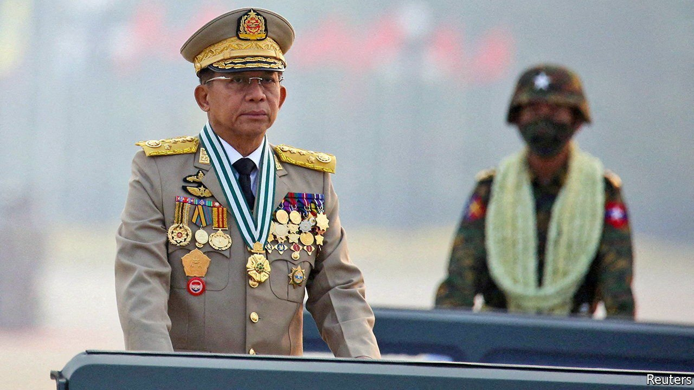

###### Out of mind

# Myanmar’s grinding conflict is at risk of being forgotten 

##### Its neighbours should do much more to encourage the generals to change course 

 

> Jan 29th 2022 

IN THE DECADE when its generals allowed it some semblance of democracy,  flourished. The government brokered a landmark ceasefire agreement with half of the country’s many rebel groups. Poverty rates plummeted and foreign investment surged. The economy grew annually by an average of 6.6%. A middle class emerged.

In just one short year, the generals have undone the gains of the past decade. Employment has fallen. Dollar-a-day poverty has more than doubled, engulfing nearly half the population. In cities it has tripled. The currency has plunged by 60% in the past five months. The economy is 30% smaller than was forecast before the coup and the pandemic. Electricity blackouts are widespread. Schools are, in effect, shut.


Foreign investors are heading for the exit, too. TotalEnergies, a French energy giant that had few qualms about dealing with previous juntas, announced its departure in January. Chevron, an American oil major, and this week Woodside Petroleum, from Australia, have followed suit. Adani Ports, part of a huge Indian firm, is shipping out. Ant Group, a Chinese company, recently pulled out of a deal to buy a stake in a local fintech company.

Worse still, the army is using force to suppress widespread resistance to its rule. General Min Aung Hlaing, the head of the armed forces and leader of the junta, has launched a campaign of mass bloodletting. Soldiers have razed entire towns and massacred civilians. The UN says the army’s attacks against civilians are crimes against humanity. Some ordinary Burmese have taken up arms, unleashing violence across the country. About 400,000 people have fled their homes.

Yet the world is forgetting about Myanmar. by domestic squabbles, an increasingly bellicose China and the prospect of a new war in Europe. India and China, Myanmar’s biggest neighbours, are loth to get involved. The ten-country Association of South-East Asian Nations (ASEAN) is divided over how to handle its most troublesome member. Its strongest response so far has been to ban General Min Aung Hlaing from its summits—a big step by its standards, but a negligible one when set against what is needed.

By remaining silent, Myanmar’s neighbours do themselves no favours. Tens of thousands of refugees are pouring into Thailand and India. Violence and drugs are spilling over borders, too. Methamphetamine is flooding South-East Asia as drug cartels take advantage of the chaos to raise production. Resistance fighters angry at what they perceive as China’s support for the junta are attacking Chinese investments, including a nickel plant and pipelines that carry oil and gas from the Bay of Bengal.

Even if Western countries are reluctant to get involved, they can help bring the junta to the negotiating table. On January 26th America warned businesses of “significant reputational, financial and legal risks” of working in Myanmar. America and Europe have placed sanctions on generals, the companies they control and some state enterprises. They should also target the state agency that collects revenues from oil and gas companies—an industry that is the regime’s biggest source of foreign currency. Firms with links to the junta should divest.

Such measures are only the start. Previous juntas brushed off Western pressure. Myanmar’s Asian neighbours have more influence. But India is worried about ceding the advantage to China, so it continues to sell weapons to the junta and remains officially closed to refugees. China, the country with most sway over the generals, is unhappy. It is thought to be quietly pressing them to release Aung San Suu Kyi, the democracy activist who led the government that the generals toppled. Deposed MPs from her party have formed a shadow government and are co-ordinating resistance to the junta. China has already asked this rival government to restrain the rebels attacking Chinese investments. It would be wise to hedge its bets still more.

ASEAN, too, should be braver, by suspending Myanmar’s membership. The junta is in a precarious position. Its troops are stretched thin. Despite a year of fighting, it has not crushed the resistance. Dissent is growing in the ranks. ASEAN and China claim to cherish stability, yet they are propping up a junta whose efforts to cling to power are unsettling the region. If doing what is right is not motive enough, Myanmar’s neighbours should do what is in their interests, and strive for a return to democracy. ■

