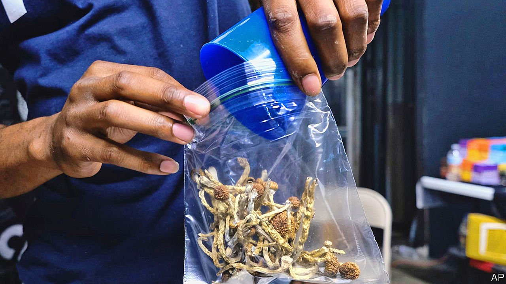

###### American drugs policy

# Psychedelic therapy shows great promise. More states should legalise it 

##### Oregon’s trailblazing sets a fine example 

 

> Jan 29th 2022 

PICTURE YOURSELF in a boat on a river, with tangerine trees, marmalade skies—and licensed professionals who may finally be able to help you overcome your treatment-resistant depression. The first half of that sentence reflects the Beatles-era view of psychedelic drugs. The second is a new policy being pioneered in Oregon, which could herald a welcome shift in America more broadly.

The view in the 1960s was that psychedelic drugs put users into an indolent, blissed-out state that encouraged them, in the words of an early booster, the one-time Harvard psychologist, Timothy Leary, to “turn on, tune in, drop out”. Unfortunately, the moral panic that this stirred up in the United States shut down research into the therapeutic possibilities of psychedelics and led the federal government to declare that they have “a high potential for abuse and serve no legitimate medical purpose”.


That assessment was wrong, and the era of American moral panic over the drugs appears at last to be waning. Early next year, following the passage of a ballot measure in 2020 and under conditions currently being carefully worked out, Oregonians will be able to avail themselves of therapy using psilocybin, the psychoactive compound in “”. Several other states, including conservative ones such as Texas, have approved medical research into psychedelics. America’s drugs regulator may approve MDMA, better known as Ecstasy, for treating post-traumatic stress disorder as early as next year, and has hailed psilocybin as a “breakthrough therapy” in treating severe depression. The European Medicines Agency is conducting large-scale trials of psilocybin to treat otherwise intractable depression.

This new spirit of openness is inspired by the drugs’ promise in the treatment of various maladies of the mind. Studies testifying to their benefits are admittedly small, but they are growing in number. What is more, the results are striking.

The conditions that psychedelics seem to ameliorate include depression, addiction and post-traumatic stress disorder. Precisely how they work is unclear, which is one reason more research is required. Users report an increased sense of connectedness, a decrease in anxiety (particularly for terminally ill patients nearing the end) and a reduction in depressive symptoms. It seems that these benefits persist. In one study, 14 months after taking psilocybin users reported a heightened sense of well-being and a belief that taking the drug was among the most meaningful experiences of their lives.

It is true that the reported experiences are subjective, and some feelings may be suggested by people’s expectations of how this sort of drug will affect them. But a number of things about psychedelics can be said with confidence. They are not addictive; consuming too much of them may be unpleasant but is not fatal; and any harm they cause is limited to the person taking them. At the very least—as a comfortable majority of Oregon’s voters realised in 2020 when, alongside legalising psychedelics, they decriminalised possessing small amounts of all drugs—nobody should be imprisoned for using them.

They certainly show enough promise to justify Oregon’s experimental policy. Psilocybin will be available only in a licensed setting with a trained facilitator, after screening for contraindicative conditions such as schizophrenia or heart trouble. This reduces risk, and will foster networks of professionals who can learn from each other. It will also let people choose a setting that best suits them. Some may feel most comfortable in a surgery; others may prefer to be at a retreat in nature. Psilocybin is not intended to replace conventional therapies, but to sit alongside them; reaping the full benefits requires users to build the experience into their lives.

You answer quite slowly

Some may find psilocybin does not bring them all they hoped for. The drug is not a cure-all; and Oregon’s policies may need to be tweaked. But the state’s voters deserve praise for their clear-headed sense of proportion, too long absent from American drug policy. More states should follow Oregon’s lead of cautious experimentation. Psychedelic drugs show tremendous promise. Initiatives like Oregon’s are essential if they are to realise their potential to help those who today must bear their suffering. ■

