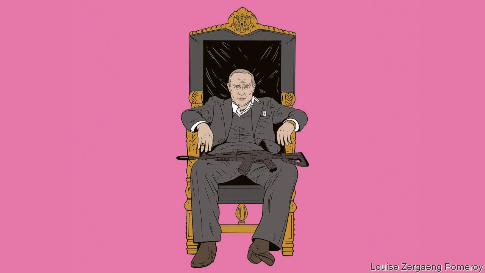
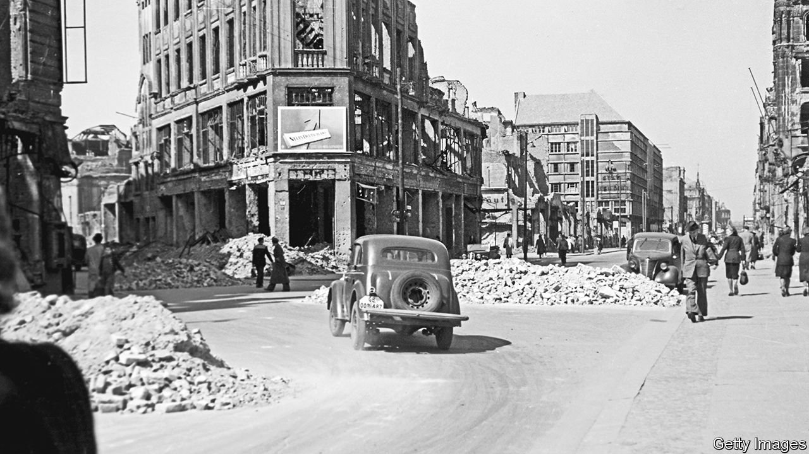
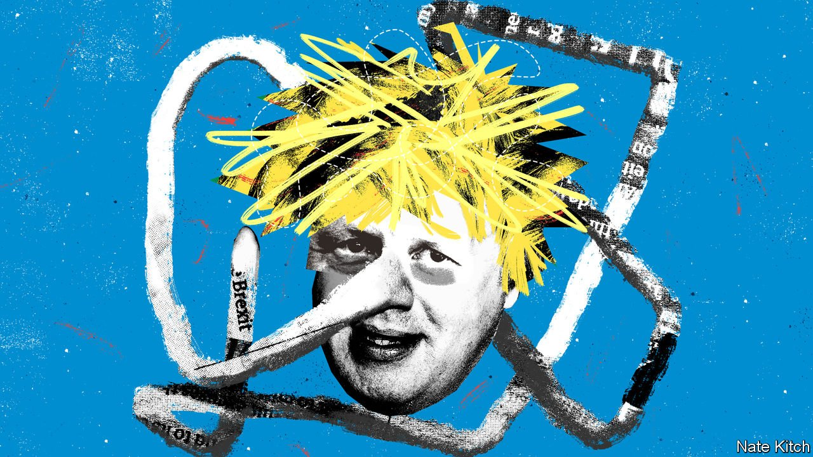

###### On Russia and Ukraine, Herbert von Karajan, Galicia, Mexican energy, blockchain, Boris Johnson

# Letters to the editor 

##### A selection of correspondence 

 

> Jan 29th 2022 


How the West lost Russia

Little has been said about how actions taken by the West with regard to Russia since 1991 have limited the security options available to us today (“”, January 8th). Those decisions have not only complicated our relationship with Russia but also impeded the establishment of democracy in that country. You asserted that “ NATO is a defensive alliance”. It is not perceived that way in Russia. Our decision to expand into areas previously dominated by the Soviet Union reinforced the perception that NATO is aggressively pursuing policies detrimental to Russia’s political and security interests.


Russians find it difficult to understand how NATO membership for Estonia, Latvia and Lithuania enhances the security of countries like Belgium, France and Iceland. Estonia is only 200 miles from St Petersburg. The Russian reaction should have been expected. It is relatively moderate when compared with the American reaction to Moscow’s effort to establish a military presence in Cuba during the 1960s. We would have benefited more by coming up with something for the Baltic countries short of NATO membership that still enhanced their security.

These decisions have helped facilitate the rise of demagoguery in Moscow. In a way we helped create opportunities for people like Vladimir Putin to rule. Now we have no other option than to deal with his like.

ROBERT MORLEY

Former staff member of the National Security Council

Richmond, Texas

 


Dropping the baton

You made the assertion that Herbert von Karajan was Hitler’s favourite conductor (“”, January 15th). Actually, Karajan had the misfortune to be the conductor at a disastrous performance of “Die Meistersinger von Nürnberg” held in Berlin in 1938, which was marred by Rudolf Bockelmann (in the role of Hans Sachs) appearing to be the worse for drink. Hitler blamed Karajan for the debacle. His favourite conductor was Wilhelm Furtwängler.

PETER BEST

Christchurch, Dorset

 


Electricity in Mexico

Your article on Mexico’s energy reforms said that the plans “are a grave threat, not only to the economy but also to the rule of law” as “they would make electricity both dirtier and more expensive” (“”, January 8th). The only contracts that will be cancelled are those for firms that take advantage of the Comisión Federal de Electricidad’s (CFE) transmission and distribution network to avoid paying what they should. This has cost Mexicans around $1bn over the past three years. New contracts will be made to establish alliances with the private sector and promote the generation of energy in a fair way. If a firm operates legally to produce energy it should not be afraid of these reforms.

Moreover, we are not proposing a return to “dirty energy”. In fact, 38% of the total energy injected by CFE into the electrical circuit was clean in 2021. As part of the energy transition CFE will build the most important solar-energy plant in Latin America and keep running its hydroelectric power plants. This will lessen the need to build more coal-fired plants (CFE only has three; China has 946). You were also wrong in thinking that CFE may not produce enough electricity to meet Mexico's needs.

Finally, you say that the proposed changes “would also probably violate several trade agreements”. The reform is not trying to strip private firms of their assets, but rather to foster new links. The Economist promotes a liberal vision of the market and a belief that private initiative should drive a country’s economy. It should review what is happening in Britain’s energy sector, where the commitment to energy deregulation and private initiative has been totally detrimental to its citizens.

LUIS BRAVO NAVARRO

Corporate communication co-ordinator

Comisión Federal de Electricidad

Mexico City

 


Spain’s north-west frontier

It is true that living standards have risen in the Spanish region of Galicia; as you say, until relatively recently the drive from Madrid took nine hours (“”, January 8th). Pricey infrastructure has been a consistent drag; few cheap flights are available to get here. And Galicia has been left out of most public-investment initiatives, which are designed with other regions in mind.

Spanish politics has nothing to do with Galician success. Long neglected by the rest of Spain, Galicia developed itself through stable regional politics, learning not to expect solutions from the Spanish government. Inditex (the Zara fashion group) embodies this spirit. It works in a highly competitive market without government aid, creating thousands of jobs and contributing more to Galician living standards than any rail connection or state body.

JAVIER CASTRO VALDIVIA

A Coruña, Spain

 


The pitfalls of blockchains

One fundamental point missing from your “” (January 1st) was a meaningful explanation of what problem blockchains, particularly public blockchains, are meant to solve. “Openness” is an aspiration that has been around for years. Yet public blockchains are arguably less open because each one uses a different technology and there is no accountable party in charge to make changes.

Moreover, the notion that blockchains are more resistant to government influence is fundamentally a call for abandoning all attempts to regulate the financial system. If blockchain and cryptocurrency advocates simply want a financial system with no controls at all against fraud, reckless behaviour or tax evasion, the honest thing to do would be to campaign through the political system to change the law. That would be better than pursuing regulatory arbitrage and special treatment by hiding behind a wall of complex, unnecessary and wasteful technology.

MARTIN WALKER

Director for banking and finance

Centre for Evidence-Based Management

Leiden, Netherlands

 


Boris done wrong

Boris Johnson did not get Brexit done (, January 15th). We are still renegotiating the Northern Ireland protocol, which was apparently acceptable to sign, but was then not acceptable. The sunny uplands and reinvigorated relationships with our closest allies are nowhere to be seen. Unless of course Liz Truss and, previously Lord Frost, have a similarly tenuous relationship with the truth as their boss. A more accurate description would be Boris botched Brexit.

HUGH MCEVOY

Lamberhurst, Kent

Bagehot wrote a fine column on Mr Johnson’s penchant for lying, but Captain Jack Sparrow from “Pirates of the Caribbean” said it best:


ALEX FINE

Washington, 

