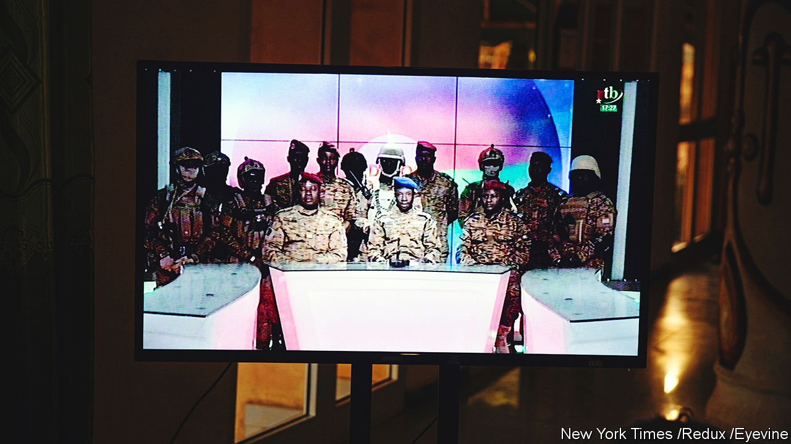
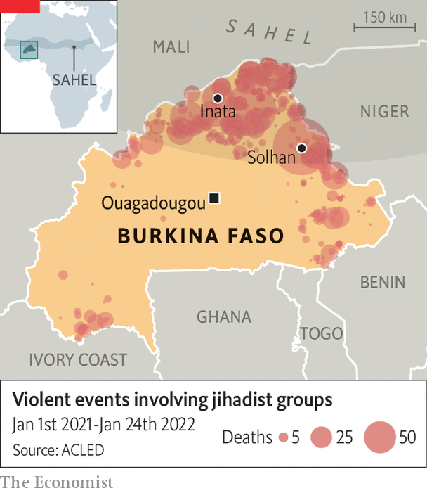

###### The juntas and the hunted

# A coup in Burkina Faso will help the Sahel’s jihadists 

##### Military rule will exacerbate the problems that have allowed extremism to thrive 

 

> Jan 29th 2022 

MOST COUPS begin with confusion. In Burkina Faso the first sign was gunfire echoing from army bases in Ouagadougou, the capital, on January 23rd. Mutinous soldiers soon emerged, demanding the resignation of the top brass and better equipment for their  terrorising the Sahel. By daybreak bullet-riddled presidential vehicles were visible in the streets and soldiers surrounded the main television station.

Then came clarity and cliché: uniformed men armed with guns and a clunky label, the Patriotic Movement for Safeguarding and Restoration (pictured), announced that they had taken over. The government had been dissolved and the constitution suspended, they said. The president, Roch Kaboré, has not been seen and is thought to be under arrest. In his place came a new strongman, Lieutenant-Colonel Paul-Henri Sandaogo Damiba, an infantry officer who last year published a book criticising the way the war against jihadists is being waged.


But the coup itself threatens to undermine the campaign. It is the biggest anti-terrorism operation in the world involving Western forces, now that they have withdrawn from Afghanistan.  has deployed about 5,100 soldiers in the Sahel, a band of scrubby bush along the southern edge of the Sahara. The French troops are backed by commandos from America and from other European countries.

The UN, meanwhile, has a force of about 15,000 peacekeepers in Burkina Faso’s neighbour, , which has had two coups of its own since 2020. All of these foreign soldiers are battling alongside local forces to hold back insurgents loosely affiliated with al-Qaeda and Islamic State.

The fight was already going badly. The jihadists have tormented three of the poorest and most poorly governed countries in the region: Burkina Faso, Mali and Niger. In Burkina Faso more than 1.5m people out of a population of 21m have been forced to flee their homes in the past three years. Almost 7,000 have been killed.

A growing part of the West’s strategy has been an effort to build accountable democracies. Corruption and bad government, after all, have spread disaffection across the region, fuelling the insurgencies. France, which in the past was only too happy to prop up friendly autocrats, now emphasises the “return of the state”, and is planning to reduce the number of troops it has fighting in Africa.

Other European countries and America, focused on training, have tried to instil Western notions of civil-military relations—whereby the army answers to civilian leaders—and respect for human rights, in the hope that this will reduce the brutality that drives young men to join the rebels.

Yet the recent spate of coups has complicated these efforts. Mali’s junta has postponed elections and a handover to civilians until 2025, prompting its neighbours to impose financial sanctions and close their borders with it. Mali has also hired Russian mercenaries accused of human-rights abuses to protect its officials and train its soldiers, which has prompted several Western countries to threaten to withdraw their forces. Even if Burkina Faso’s putschists do not fall out so spectacularly with the West, relations are bound to become more fraught.

The region’s long-suffering citizens seem to be losing faith in democracy. In Burkina Faso people rose up in 2014 to kick out Blaise Compaoré, who had first taken power in a coup 27 years earlier. Shortly before this just 24% told pollsters from Afrobarometer that they approved of the army running the country. Yet by 2018 sentiment had swung sharply: almost 50% of Burkinabés supported military rule. After the coup on January 23rd people jubilantly danced and drummed in the capital. Some waved Russian flags or burned the French one. The new lot can’t be worse than the ousted president, said Aliou Ouedraogo, one of those celebrating.

Mr Kaboré seems to have been well aware of the risk of a coup. Burkina Faso has suffered eight successful putsches and many more attempted ones since it gained independence from France in 1960. In December he reshuffled his cabinet and put a general in charge of the defence ministry, replacing a civilian. On January 11th the security forces arrested eight soldiers for allegedly plotting against the government, among them an officer said to have trained with Colonel Damiba.

 


Insecurity underpins the latest putsch. In June last year jihadists slaughtered more than 100 people in Solhan, a village in the north (see map). In November they killed 49 police officers and four civilians near Inata, another northern town. The soldiers there had run out of food and had been forced to commandeer livestock, according to a memo they sent their superiors. Mr Kaboré boasted of having bumped up the security budget but little extra gear seemed to make it to the front lines. After the slaughter in Inata angry protesters rallied in the capital against the government and French forces.

The coup’s main beneficiaries may well be the jihadists. The junta will have its hands full consolidating power in the capital and seeing off the possibility of a counter-coup. That may leave a vacuum in the countryside for jihadists to fill.

In Mali the soldiers now running the government have not done a better job than civilians at maintaining security. In fact, the army’s withdrawal from embattled towns and bases has accelerated since the coups there, says Héni Nsaibia of Mena stream, a consultancy.

The African Union and the Economic Community of West African States (ECOWAS), a regional bloc, have condemned the coup in Burkina Faso and called for the release of Mr Kaboré. Some may see irony in its demand: three of ECOWAS’s 15 members—Mali, Guinea and Burkina Faso—are now led by men with guns. Other members may be more worried about the spread of insurgents than about democratic niceties.

Jihadists are steadily moving south from Burkina Faso into Ivory Coast and Benin, where the number of attacks is increasing. Stopping them will require not just better governance but also more co-operation between countries in the region, their armed forces and politicians, and between local armies and their foreign backers. That has never looked more elusive. ■

Correction (January 25th 2022): An earlier version of this article incorrectly named the village of Solhan as Sobha. Sorry.

