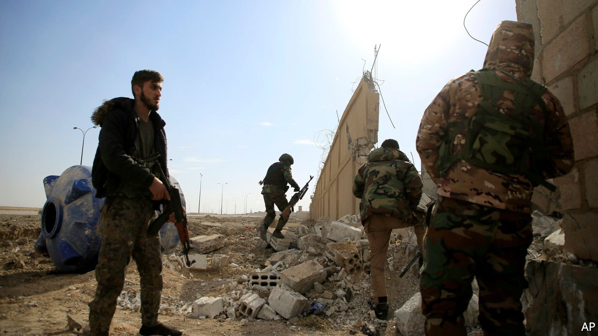

###### Jailhouse rocked

# A prison battle in Syria was a disaster long foretold 

##### Hundreds of jihadists were left in a poorly guarded prison. What could go wrong? 

 

> Jan 29th 2022 

PRISON BREAKS have played a central role in the mythology of Islamic State (IS). In 2007 the jihadist group’s predecessor claimed responsibility for a jailbreak at Badush prison, in northern Iraq, that freed 140 detainees. Five years later it launched a campaign called “Breaking the Walls”, a series of attacks on Iraqi prisons. The climax, in July 2013, was a simultaneous raid on jails in Taji and Abu Ghraib that freed more than 500 people, mostly Iraqi insurgents. Soon IS would seize a large stretch of Iraqi territory and proclaim its caliphate.

In some ways the battle this month at Ghweiran prison, in north-eastern Syria, harked back to earlier times. The jail houses around 5,000 people, many of them Syrians and Iraqis accused of links to IS. On January 20th the group attacked and seized it in a well-planned assault.


It took almost a week for the Syrian Democratic Forces (SDF), a Kurdish-led militia, to wrest back control. Hundreds of inmates escaped; not all have been recaptured. Dozens of people were killed in fighting inside the prison and in surrounding neighbourhoods. Some of the dead are thought to be children held in Ghweiran who were used as human shields by IS.

The fighting drew in America, which has troops in both Syria and neighbouring Iraq. It sent armoured vehicles to aid the SDF and carried out air strikes. Britain sent special forces. It was the largest clash with IS since 2019, when the group was defeated at its final redoubt in Baghouz, near the Syrian-Iraqi border.

IS is not the organisation it once was, though. It has not held territory since 2019, and for now seems unlikely to do so. Instead it has morphed into a low-level insurgency—one that has proved remarkably resilient. The UN estimates it has around 10,000 members in Iraq and Syria. It carries out 100 to 150 attacks a month there, according to American officials. Around the time of the prison attack, an IS cell stormed an army outpost in eastern Iraq, killing 11 soldiers. In December another cell beheaded an Iraqi police colonel.

The siege at Ghweiran was a predictable catastrophe. Critics have long warned that the prisons in north-eastern Syria were kindling soaked in petrol. Governed by a Kurdish-led administration, the semi-autonomous region is fragile, facing not only IS but a hostile Turkey and a Syrian regime that wants to bring it back under central control. The SDF, by its own admission, struggles to guard the prisons; attempted escapes are common.

Though most of the detainees are Syrian and Iraqi, thousands are foreigners, hailing from around 60 countries. Many countries, particularly in Europe, are reluctant to bring their citizens home, fearing they will be hard to prosecute or monitor. Instead they have been left for years in squalid conditions.

The largest prison camp, al-Hol, houses around 56,000 people, most of them children. Some of the camp’s adult detainees still believe in IS and work to indoctrinate the young. They enforce a strict dress code, ban smoking and music and torment those who turn away from their ideology, especially women. Suspected deviants are sometimes tortured or have their tents burned. At least 90 people have been murdered in al-Hol since last January.

Among the prisoners at Ghweiran were perhaps 800 children. None has been charged with a crime; some were transferred from other camps when authorities deemed them too old to stay. Though separated from adults, they are stuffed a dozen or more to a cell and given no schooling.

The SDF says it has recaptured the whole prison complex. There were no precise casualty figures. The attack was a reminder that IS remains a threat—and that, as long as tens of thousands of detainees languish in north-eastern Syria, more such attacks will follow. ■

