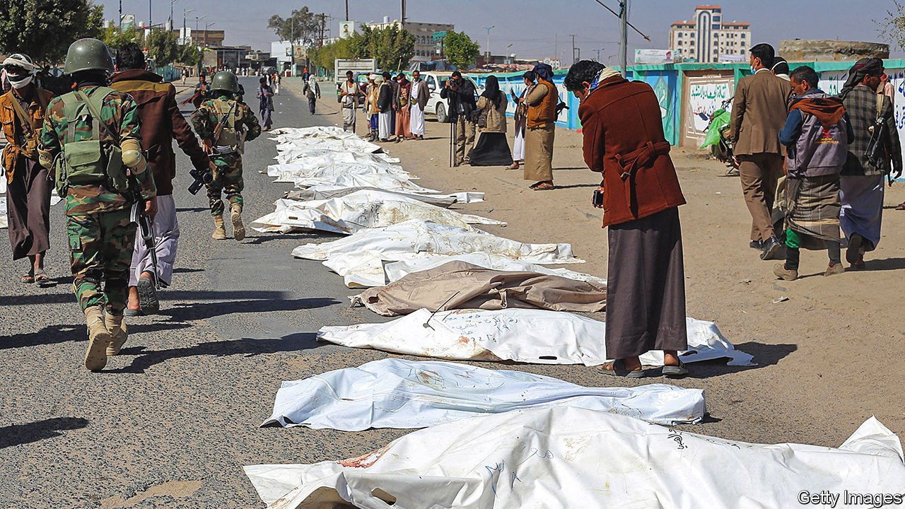

###### UAVs over the UAE

# The war in Yemen reaches Abu Dhabi 

##### Drone and missile strikes threaten the UAE’s reputation as a haven of stability 

 

> Jan 29th 2022 

AFTER SEVEN years of fighting in Yemen, the roar and thump of missile interceptors is a familiar sound in Saudi Arabia. But it was a shock for residents of the United Arab Emirates (UAE). Early on January 24th the UAE said it had shot down a pair of ballistic missiles fired from Yemen. Videos posted on social media captured loud booms over Abu Dhabi, the capital.

The Houthis, an Iranian-backed militant group that controls part of Yemen, claimed responsibility. Since 2015 they have been fighting a coalition led by Saudi Arabia, and including the UAE, which invaded Yemen to depose them. A week before the missile attack, the Houthis launched a drone attack on Abu Dhabi’s airport and an industrial area. Three workers from India and Pakistan were killed.


That attack triggered a ferocious wave of Saudi and Emirati air strikes in Yemen, many of which killed civilians. The deadliest, on January 21st, hit a prison in Saada, a northern city. Médecins Sans Frontières, a medical charity with employees there, said at least 82 people were killed (pictured). A separate strike on a telecoms facility in Hodeida disconnected Yemen from the internet for four days.

Houthi attacks have become common in Saudi Arabia, which shoots down missiles or drones almost every week. This was the first time the Houthis had successfully targeted the UAE. It reflects their fury at an abrupt battlefield reversal in Yemen, engineered by the Emiratis. And it presents the UAE with a difficult choice: to back off, allowing the Houthis to capture an important city, or to risk more attacks that could inflict real damage on its economy.

For more than a year the main front line in Yemen has been around the city of Marib, 120km (75 miles) east of Sana’a, the capital. It is home to 3m people, one-third of them displaced from other regions, and to Yemen’s largest oil and gas reserves. The Houthis have thrown waves of fighters at the city, including children. Casualties have been horrific, but they have slowly worn down the city’s defenders.

The UAE had little to do with this. In 2019 it withdrew most of its troops from a war it had come to see as a quagmire. Emiratis had fought largely in south Yemen, which was an independent country until 1990 and retains a secessionist streak. The Houthis have little support there. For a time it seemed the Emiratis were pursuing de facto partition: they would maintain a sphere of influence in the south, while the Saudi-backed and internationally recognised government struggled against the Houthis in the north.

Last year, however, the Houthis invaded Shabwa, an energy-rich southern province. With Marib teetering and the south under threat, the coalition changed tactics. On December 25th Saudi Arabia agreed to sack the governor of Shabwa, a controversial figure affiliated with Islah, an Islamist party disliked by the Emiratis. His replacement, a tribal figure, has good relations with the UAE (where he lived for years).

The Giants Brigades, a militia backed by the UAE, then moved thousands of its fighters from the Red Sea coast to Shabwa. Their gains were swift: they pushed the Houthis out of Shabwa and went on to seize bits of Marib province as well. Battlefield victories in Yemen are not always durable. Still, the Houthis have suffered a big setback in the past few weeks. Instead of a seemingly inexorable march to seize Marib, they now face a new threat on their southern flank.

The attacks on Abu Dhabi were an ultimatum to the UAE: halt your advance or face further bombardment. The physical danger is modest. Houthi missiles and drones cannot carry big payloads, and the UAE has advanced air defences—bolstered by America, which has thousands of troops at al-Dhafra, an air base south of Abu Dhabi (they fired their own air-defence systems at the Houthi missiles on January 24th).

The reputational risk is far greater. The UAE markets itself as an oasis of stability, seemingly immune to the region’s conflicts, even as it has pursued an aggressive foreign policy that embroiled it in them. Investors view it as a safe place to start a business or buy property. The 22m tourists who visited in 2019 had little to worry about beyond sunburn or some bad oysters at brunch. Continued attacks would jeopardise that image.

They could also complicate the UAE’s recent efforts at rapprochement with Iran. Tahnoun bin Zayed, the national security adviser, visited Tehran in December. Ebrahim Raisi, Iran’s president, has been invited to visit Abu Dhabi. The UAE hoped friendlier ties would allow it to avoid exactly these sorts of attacks. The Houthis are not fully an Iranian proxy—they often act independently. But the attacks on the UAE were made possible by Iranian support. The drones and missiles aimed at Abu Dhabi were probably based on Iranian designs.

Now the UAE must decide whether to press forward or pull back in Yemen. It could reach a deal with the Houthis to keep the Giants Brigades in Shabwa as a defensive force. If Marib falls, however, Shabwa would become more vulnerable. The Houthis could also force the UAE’s hand. They have threatened strikes on Dubai, the UAE’s business and tourism hub; on January 25th a spokesman for the group warned visitors to avoid Expo 2020, the world’s fair that opened in October.

Such attacks would be a serious escalation, which would probably draw the UAE deeper into the war—and perhaps also America, which last year ended support for “offensive operations” by the coalition. All of this, then, could backfire on the Houthis. They benefited from the withdrawal of the UAE, with the coalition’s most capable army. Trying to keep the Emiratis out, the Houthis could instead pull them back in. ■

