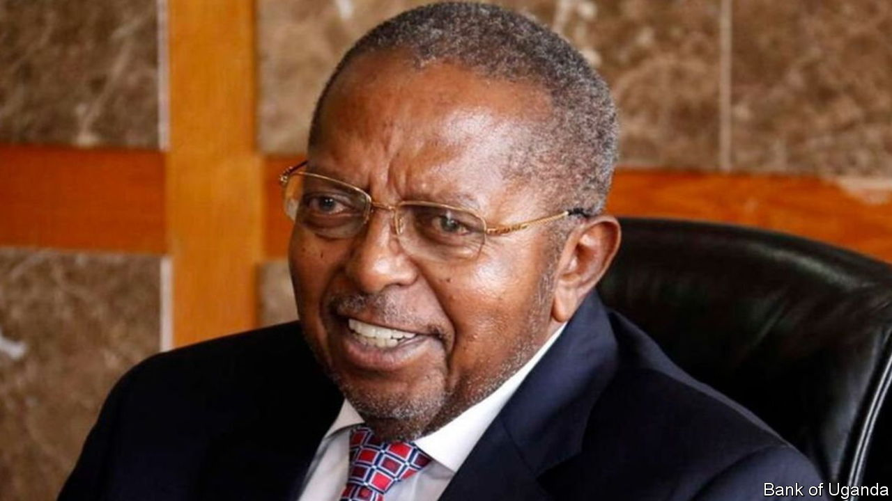
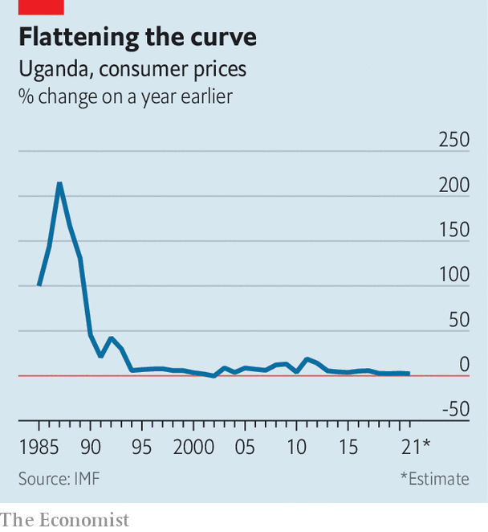

###### Market preacher

# Uganda’s most influential economist has died 

##### Emmanuel Tumusiime-Mutebile tamed inflation and let markets loose 

 

> Jan 27th 2022 

SOMETIMES CHANGING an economy starts with a metaphor. In 1992 Emmanuel Tumusiime-Mutebile, the top civil servant in Uganda’s finance ministry, began comparing inflation to indiscipline in the army. He knew that would resonate with Yoweri Museveni, a rebel who had fought his way to power six years earlier. Soon the president was declaring that “inflation is indiscipline.” The slogan was pinned on office walls and Mr Mutebile was given a licence to slash spending. Inflation fell from 200% to single digits in a few months.

The formidable Mr Mutebile would spend another decade at the ministry, and two more at the helm of the Bank of Uganda. When he died on January 23rd, aged 72, he was the longest-serving central bank governor in Africa. But his most enduring legacy is those frenetic years in the 1990s when he pushed his country decisively towards the free market. It was a time of fraught, painful change across the continent, often spurred by the World Bank and IMF. As the career of Mr Mutebile shows, reform went furthest when pushed by locals who actually believed in it.


Mr Mutebile was used to telling presidents what they didn’t want to hear. As a student he stood up in a meeting to tell Idi Amin, a capricious despot, that it was wrong to expel Ugandan Asians. Mr Mutebile subsequently fled the country—disguised, the story goes, as an Asian refugee. For most of the 1970s he studied and taught economics in Britain and Tanzania.

 


The collapse of the economy back home gave him an obsession with macroeconomic stability. He spoke about it at every meeting; his colleagues said he was “preaching the gospel”. In the 1990s, when he had more power than any of the ministers above him, Uganda took an axe to spending, cut tariffs, sold state-owned firms and unified parallel exchange rates. Other African countries made similar reforms, but rarely with such conviction. Mr Mutebile’s admirers were in awe of his tenacity. Abebe Aemro Selassie, the director of the IMF’s African Department, describes him as a “lion of a policymaker” who laid the ground for rapid GDP growth.

Not everyone was so enamoured. Critics said Mr Mutebile was too close to the authoritarian regime he served. In 2011, despite his grumbling, the central bank helped finance an election-related spending splurge. Inflation subsequently jumped (see chart), and security forces shot protesters in the streets. There were questions, too, about the bank handing over $741m to buy Russian fighter jets.

But the biggest challenge was one that Mr Mutebile himself acknowledged: Uganda’s vaunted stability had not sparked industrialisation or created enough jobs. That is a problem in much of Africa, and younger policymakers are cautiously revisiting ideas of a more interventionist state. They can afford to do so only because “the basics have been handled,” argues Damoni Kitabire, an economist who worked alongside Mr Mutebile in the 1990s. The heyday of the free-market generation is passing. Its legacy runs deep. ■

