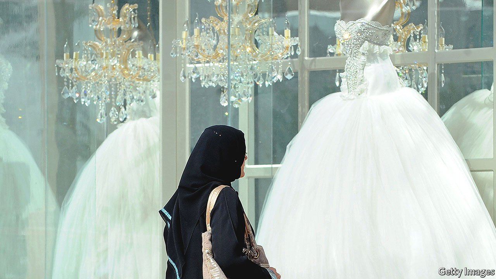

###### Lockdown love

# Why some Saudi couples welcomed the pandemic 

##### Covid-19 has made weddings a whole lot cheaper 

 

> Jan 29th 2022 

THE COST of a typical Saudi wedding is enough to deter the most passionate lover. Even a modest party involves renting a sumptuous ballroom and inviting hundreds of guests. The bridal dais should be fit for royalty; the cake must have many tiers. Then there are the swordsmen, cheerleaders and musicians. Men and women gather in separate halls, doubling some of the prices. Altogether it might cost 200,000 riyals ($53,000), though rich Saudis will pay four times that just to hire the top crooners. Many of these marriages will end in divorce. Those that don’t are often burdened with debt. “Seven years into my marriage and I’m still paying off bank loans for a two-hour bash,” says Rayan al-Sameiri, a teacher in Medina who also works as a taxi-driver.

Many couples have therefore welcomed covid-19—or, at least, the restrictions that have come with it. In 2020 Saudi Arabia limited gatherings to 50 people or fewer. So couples could downsize their weddings without losing face. Some ditched the zaffa (musical procession) and the arda (sword dance), and chose communal halls over ballrooms. Smaller crowds ate smaller cakes. Travel bans ruled out extravagant honeymoons. All in all a Saudi couple might have spent 90% less on their nuptials. The same was true in much of the Gulf, where couples rushed to grab the discount. The number of marriages leapt by 9% in Saudi Arabia in 2020. They were up in Kuwait, Qatar and the United Arab Emirates, too.


Will modest weddings become the new norm? Few couples complained when the Omicron surge forced Saudi Arabia to reimpose some restrictions. As the outbreak recedes, some still feign concern over the health of in-laws. “A girl always dreams of a five-star marriage, but covid has made us more practical,” says Bayan Zahran, a lawyer in Jeddah. “Why fritter away your future with five hours of exorbitant costs?” Some couples are opting for Misyar marriages, which impose few obligations on either side. (Licensed by clerics, Misyar is also popular with adulterers, who take their mistresses as additional wives.)

The betrothed, though, must still deal with pressure from their family and peers. “Paradise without people is not worth going to,” runs an Arabic proverb doing the rounds. The same is true of weddings, say traditionalists.

Dig deeper

All our stories relating to the pandemic can be found on our . You can also find trackers showing ,  and the virus’s spread across .

