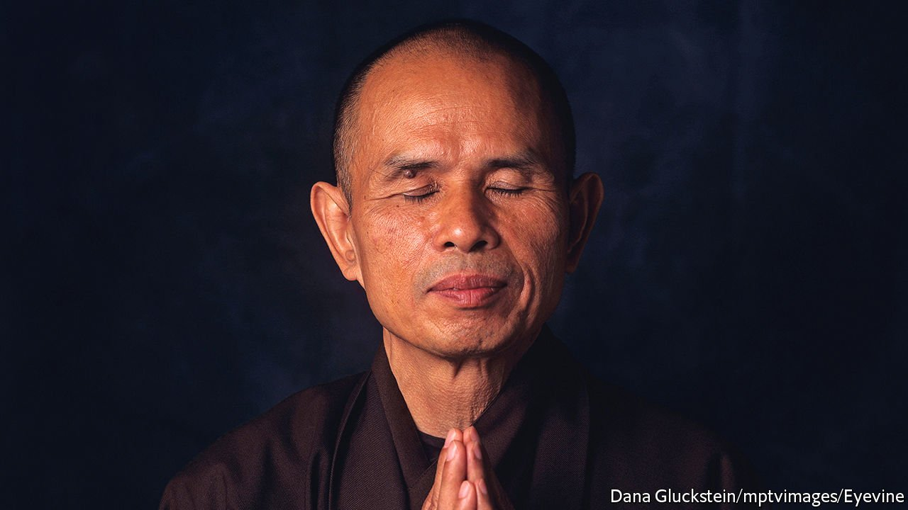

###### The time is now

# Thich Nhat Hanh believed that Buddhism should be a force for change 

##### The Vietnamese monk and “father of mindfulness” died on January 22nd, aged 95 

 

> Jan 29th 2022 

IN THE WEST’S imagination a Buddhist monk is a model of otherworldliness. He sits silently in his temple, or under a tree in a manicured garden, lost in the inner vastness of contemplation. A small bowl of water and a bowl of rice are all that sustain him. His day is marked out by gentle gongs and bells, and he causes no more disturbance to the earth than a falling leaf or passing clouds.

Thich Nhat Hanh was a Buddhist monk, drawn to his calling in childhood by a picture of the smiling Buddha and a cold, astonishing draught of water from a natural well. He, too, often prayed. But there the similarity ended. As a novice he abandoned his Buddhist training college for Saigon University, where he could study world literature, philosophy and science. He was one of the first monks in Vietnam to ride a bicycle, hitching up his robes. He went to Princeton, taught Buddhism at Columbia and, at the height of the Vietnam war, confronted Robert McNamara, then secretary of defence, with his pleas for peace. Photos from that time showed him, tiny among towering Americans, with his jaw set, his arms folded and his gaze firmly determined.


His “engaged Buddhism”, as he called it, went out in the world solving problems. In the Indochinese war, when French soldiers shot up his monastery in Hue and killed monks in cold blood, he knew that the heart of spirituality survived; but Buddhism could not be a simple spiritual refuge in a country as ferociously fought over, for so long, as Vietnam was. Instead he founded his own institute, edited a journal that called for Buddhist action and set up a corps of lay and monastic workers to restore the country as fast as it was wrecked. Eventually 10,000 volunteers went out to rebuild villages, set up schools and rescue victims of disasters. He saw Buddhism as a raft that could lift the whole country and save it.

He and his followers took no sides. His aim was peace and his motivation was compassion, a wish to understand and lighten the suffering of others. This “interbeing”, as he called it, was a sense of connectedness with the whole fabric of life. As he once told a UN session on disarmament, unfolding a crumpled poem from his pocket, he was both the 12-year-old girl raped by a pirate and that pirate, forced perhaps by poverty into a life of pillage. He was both the festering prisoner and his gaoler, the blithe frog and the snake that slyly ate it. He was not a separate entity, had no separate self; everything he did affected the suffering of the world.

Suffering meant feelings of anger, fear, intolerance and false hope, as well as bodily pain. These were man’s enemies, rather than other people. But just as such suffering was inevitable, so too it could be ended: by right action, right thinking, right understanding, and by mindfulness, or full self-awareness. Human beings had to embrace the present moment, looking neither forward nor past, and deal with things as they were. His books showed how. In everyday life he matched his walking to his breathing, as if every step was an awakening to peace and his feet were kissing the earth; he saw an orange as a miracle, slowly colouring and forming for him under sun and rain; as he cleaned a pot he did so tenderly, as if bathing a holy child. His daily practice became by the 21st century the most active Buddhist movement in the West.

The West had also become, by default, his main teaching ground. After his peace trip to Washington in 1966, when he persuaded Martin Luther King to speak against the Vietnam war, he was declared a traitor and barred from returning home for almost 40 years. He used his exile to write dozens of books, go on lecture tours and turn an old farmhouse in south-west France into a centre for mindfulness, Plum Village, which grew into more than 1,000 practising communities worldwide.

He was revered now as “Thay”, or teacher, by ardent backpackers and middle-class seekers alike. But there were plenty of sceptics and mockers, too. To them mindfulness seemed ludicrous, an exercise in self-absorption. To him it was the reverse, a clearing away of the hindrances of “self” in order to love others. The best practical example was his operation, in 1978, to rescue the Vietnamese boat-people who were being turned away from Singapore to drown or starve at sea. He worked with fishermen to send food, medicine and bigger boats, and smuggled the refugees into the compound of the French embassy. Everything was done secretly, mostly at night, and everything was underpinned by meditations in which he calmly discerned what was possible. He spent those hours mentally in the lives of both the politicians and the police, while floating also with the terrified refugees in the South China Sea. With mindful diplomacy, thousands were saved.

More modern sorts of suffering caught his eye, too: the profit motive, the race to the top, the moment-by-moment distraction of devices, carelessness towards the planet. As his fame grew he found himself invited to the World Bank and the Google campus, where he told his listeners that voracious consumption was just a way of papering over unhappiness. They did not need to be number one; their inventions should actively bring healing; and they should practise “aimlessness”, the art of stopping, looking into their lives and asking what they were running from.

How far those teachings sank in, he did not know. The future would tell. But every little helped, as it also helped to be at the Paris peace talks in 1969, or to lead a walking meditation round the grounds of Stormont in 2012, bringing Northern Ireland’s factions together. For a while, they all trod the same earth and were conscious of doing it. They embraced the present moment as all there was: no future, no past. This was it. He dreamed of marketing a watch in which each number was replaced by the word “now”.

In 2014 a severe stroke felled him. Four years later, since he was no longer a general gadfly, offending governments both Catholic and Communist as well as conservative Buddhists, he was allowed to live again in Vietnam. He spent his days sitting silently in his temple at Hue, the city in which he had been born and died: though there was no birth or death, only transformation, moment by moment, like the passing clouds. ■

