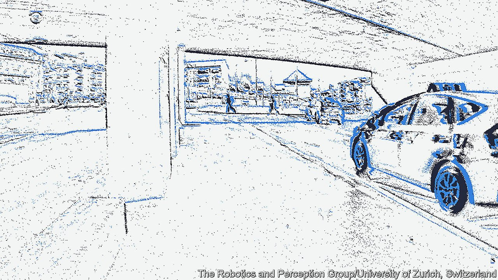

###### Photography

# A new type of camera 

##### It could prove invaluable for robots, drones and driverless cars 

 

> Jan 29th 2022 

CONVENTIONAL CAMERAS focus light onto a recording medium to preserve an image as a field of tiny dots. The media have changed over the years from plates of silver to plates of glass to acetate films to charge-coupled devices. The dots, meanwhile, have gone from being grains of chemicals to electronic pixels. But the principle has stayed the same. And moving pictures are simply streams of such images shown in sequence.

This arrangement is known as a frame camera. But there is now an alternative, the event camera. Unlike a frame camera, an event camera does not activate the dots simultaneously, using a physical or virtual shutter. Instead, a dot responds only when the nature of the incoming light changes.


Since changing light is frequently a consequence of movement, these cameras often record events rather than objects—hence their name. Though the data they record can, if desired, be used to reconstruct images of objects (see picture), they have other, better, uses, particularly if the camera in question is, itself, in motion.

For example, an event camera’s modus operandi provides a quick and easy way of determining the rate at which objects are moving through its visual field—known in the argot as “optical flow”. Optical flow shows both how fast the camera is travelling and how close other things are to it, for nearby objects change position in its field more rapidly than do distant ones.

Insect eyes are natural examples of instruments optimised to record optical flow. That is why house flies are so good at judging speed and height—and also how close an approaching swatter is. Taking their lead from these animals, Guido de Croon of the Delft University of Technology, in the Netherlands, and his colleagues used an event camera on a drone to judge speed during landing. This allowed the drone to make a controlled landing faster than was possible with a frame camera.

Events, dear boy

A frame camera shooting 20 images a second supplies data at 50-millisecond intervals. Event cameras, unconstrained by such a fixed timetable, can respond in microseconds. Davide Scaramuzza, director of the Robotics and Perception Group at the University of Zurich, has, like Dr de Croon, been working with event cameras mounted on drones. Collision-detection cameras usually take 50-200 milliseconds to react. His team used an event camera to cut this below four milliseconds, enabling faster manoeuvring whilst avoiding obstacles.

Response time is equally important for self-driving cars. Dr Scaramuzza’s team are working on event cameras for this application with what he terms a “top-tier” company in the automotive sector.

Event cameras bring benefits besides speed. Frame-based moving-picture cameras capture redundant information, such as areas of unchanging blue sky. To avoid wasting disk space and bandwidth, images taken this way are often compressed by special software, such as MPEG, for storage or transmission. But event-camera images do not require compression. According to Dr Scaramuzza, they are about 40 times as efficient in this respect as frame cameras.

On top of that, event cameras are practically immune to motion blur. Capturing images of speeding bullets is no problem, and they can film the hare and the tortoise at the same time with equal clarity. They could thus solve the perennial problem of extracting unblurred stills from closed-circuit television feeds.

Yet another advantage of event cameras is that they cope easily with bright and dim lighting in a single image. A frame camera on a self-driving car might miss a pedestrian in a shadow beside a well-lit street—with disastrous consequences. An event camera will catch the slightest movement, even in deep shade.

These benefits make event cameras attractive, but they are still fairly new and unknown. The first commercial examples, which appeared in 2014, had a resolution of just 100x100 pixels. Versions branded as “high resolution” appeared in 2019, but all things are relative. The 640x480 pixel resolution of these machines matches that of Apple’s QuickTake camera of 1994. Something closer to real high resolution may be coming soon, though. Both Samsung and Sony are working on event cameras for the mass market. Sony’s will have a recording field measuring 1,280x720 pixels.

Military establishments are interested, too. America’s army, air force and space force all have event-camera projects. They are especially attracted to infrared versions. These would help identify targets rapidly by looking at their heat signatures. Besides having superior movement-detecting abilities, event cameras need less processing power, so generate less signal-confusing heat. This is an even bigger advantage for cameras that are cooled by liquid nitrogen, to increase their sensitivity.

Looking further ahead, both Dr de Croon and some of the military researchers are linking event cameras to “neuromorphic” processing units (computer processors supposedly built in imitation of the ways that brains work). Like event cameras—and unlike conventional computer processors, which are governed by the tick of an internal clock—neuromorphic processors are asynchronous. Combining the two seems to work well, and to promise fast, low-power visual processing.

Event cameras could thus be important elements of an automated future, guiding drones that deliver goods, helping to pilot cars (wheeled or flying) that carry people around, and giving vision to robots in homes and on streets. They may not be much cop for selfies. But they might still be wildly successful. ■

To enjoy more of our mind-expanding science coverage, , our weekly newsletter.

