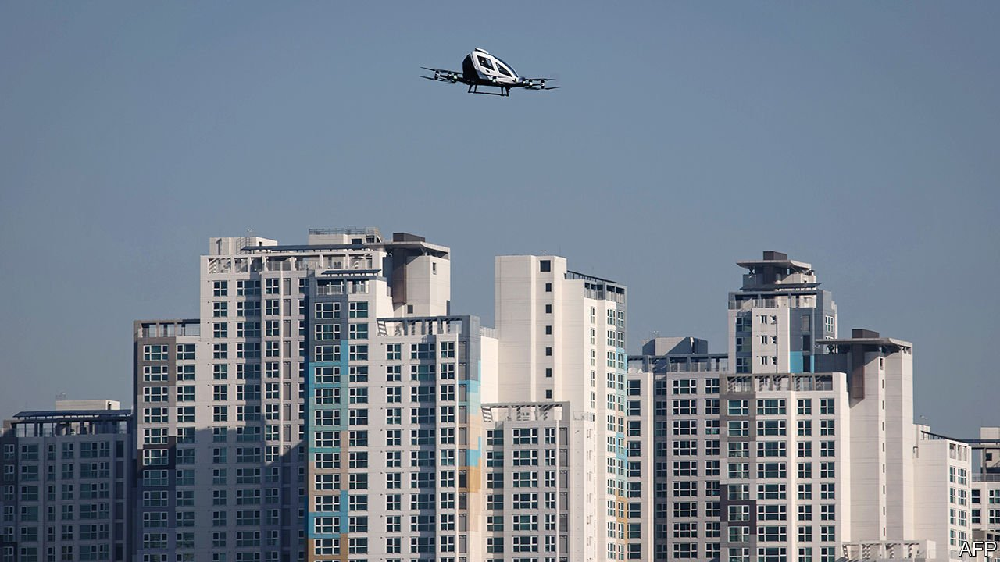
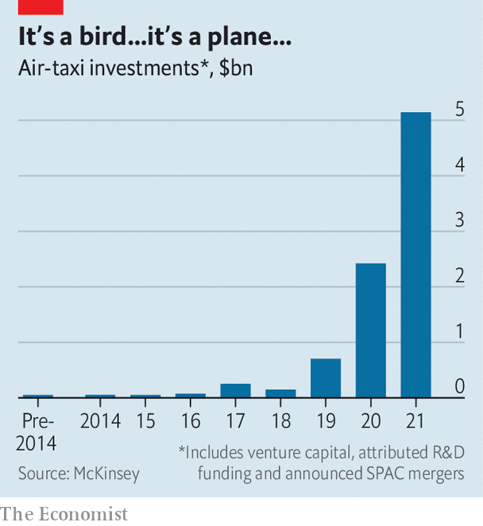

###### eVTOLs

# Flying taxis are lining up for certification 

##### A Chinese firm may be first past the post 

 

> Jan 29th 2022 

“THIS IS THE next revolution in flying,” says Mark Henning, a graduate of the Technical University of Munich and a 25-year veteran of the aerospace industry. Mr Henning is excited about his new job. After running projects for Airbus, a giant European aircraft-maker, he has joined AutoFlight, a Chinese firm, where he is responsible for getting the company’s small electrically powered air taxi approved by Europe’s air-safety regulators.

Mr Henning is not alone in betting that electric vertical take-off and landing (eVTOL) aircraft have a bright future. Other aeronautical engineers have thrown in their lots with some 200 such projects around the world, attracting $5.1bn in investment last year, according to McKinsey, a consultancy (see chart). Most are working on designs that resemble hovering drones—using multiple small rotors to take off and land like a helicopter. The idea is that, being simpler, cheaper, greener and quieter than combustion-engined helicopters, eVTOLs will be well suited to operate short-range passenger services across large urban areas, such as flying people between airports and city centres.


At first, regulators scratched their heads as to how these new flying machines could be allowed to take to the sky—especially as some will operate without a pilot on board. However, after working with companies in the field, aviation authorities are starting to finalise the safety standards by which eVTOLs will be governed. This gives the most serious contenders an opportunity to get ahead in the race to become airborne.

Rules and regulations

As AutoFlight’s new European managing director, Mr Henning is setting up an operation at Augsberg airport in Germany to further the development of Prosperity I, the company’s air taxi. So far, the Shanghai-based firm, which has a background in making cargo drones, has flown a “proof-of-concept” version only. Prosperity I can seat three passengers and a pilot. It is a hybrid between a helicopter and a fixed-wing plane. It takes off and lands vertically, using multiple rotors, but these are switched off when it is cruising. At that point a “pusher” propeller at the back takes over, to provide forward thrust, and thus lift via the wings. This arrangement makes more efficient use of the aircraft’s battery, giving Prosperity I a range of some 250km.

 


A prototype will be test-flown in Germany in order to obtain what is known as a type certificate from the European Union Aviation Safety Agency (EASA). This signifies the airworthiness of a new aircraft. Although AutoFlight is also seeking certification in China, the company reckons the addition of European approval will help speed the machine’s entry into service in other markets, too. It hopes to complete the approval process by 2025.

Other companies aim to lift off much earlier. EHang, another Chinese maker of eVTOLs, hopes one of the air taxis it is developing, the EH216 (pictured), will obtain a type certificate from the Civil Aviation Administration of China (CAAC) this year. It has been working with the agency on a test programme that has involved more than 20,000 trial flights.

The EH216 looks like an old-fashioned bubble car surrounded by small rotors. It seats just two passengers and has no pilot. Though it flies autonomously it is monitored by a control centre on the ground, which can take over in order to land it in an emergency. It has a range of 35km between charges, and a top speed of 130kph.

EHang has formed partnerships for trial flights in several cities, including Guangzhou in southern China, where the firm is based. Once a type certificate is obtained, the company plans to offer commercial air-taxi and sightseeing flights from these places, along with parcel deliveries.

Crossing continents

For eVTOLs to operate commercially and at scale in most countries, three kinds of regulatory approval will be required, says Jennifer Trock, who is based in Washington, DC, and leads the aviation practice of Baker McKenzie, a law firm. Besides a type certificate, firms will also need production certification, which permits manufacturing of an aircraft to begin at volume. And, in order to carry fare-paying passengers, an airline-style operating licence is required.

Though there are bilateral safety agreements between EASA, CAAC and America’s Federal Aviation Administration (FAA), the three agencies which dominate the world’s aviation market, certification by one does not automatically apply elsewhere, especially for new designs like eVTOLs. This, says Ms Trock, gives makers two options if they wish to sell their aircraft in another market. They can set up a local operation and apply for another certificate, as AutoFlight is doing. Or they can submit to a full technical validation of the certificate they have obtained in another country, though this might involve further test flights.

There is also uncertainty about how the rules will differ from place to place. After examining some 150 designs, EASA concluded that e VTOLs were neither aeroplanes, nor helicopters, nor both. It therefore decided to make them a “special category” of aircraft, with their own set of regulations. The FAA, by contrast, says it can certify them by tailoring its existing rules where necessary. It has set up a unit called the Centre for Emerging Concepts and Innovation to work with eVTOL companies to establish detailed safety requirements.

Nonetheless, enough regulatory progress has been made for eVTOL pioneers to remain optimistic. In America, Joby Aviation hopes next year to become the first to obtain type certification from the FAA. It is making a dozen or more aircraft at a new manufacturing plant in Marina, California, to step up its flight-testing programme. Joby’s air taxi, which seats four passengers and a pilot, uses multiple rotors to take off and land. It then tilts the rotors forward when cruising, so they work like propellers. One of the company’s backers is Uber, a firm that currently makes its money organising terrestrial taxi rides.

Hot on Joby’s heels is Archer Aviation, also Californian. Archer plans a commercial ride-sharing service using a four-passengers-plus-pilot design, to start in 2024. One of its investors is United Airlines. In Europe, Volocopter, a German firm, is testing a multirotor eVTOL in both crewed and uncrewed form. It hopes to provide air-taxi services for the 2024 Olympic games in Paris. Lilium, another German firm, is working on an all-electric seven-seater.

And it is not only new firms which are getting into the business. Airbus is developing ideas for eVTOLs. So is Boeing, its American rival. On January 24th, Boeing invested $450m in Wisk Aero, of San Francisco, which is developing yet another autonomous eVTOL. Larry Page, a co-founder of Google, is backing this firm, too. With so much effort and money going into this new form of aviation, some of these birds will surely fly. ■

To enjoy more of our mind-expanding science coverage, , our weekly newsletter.

