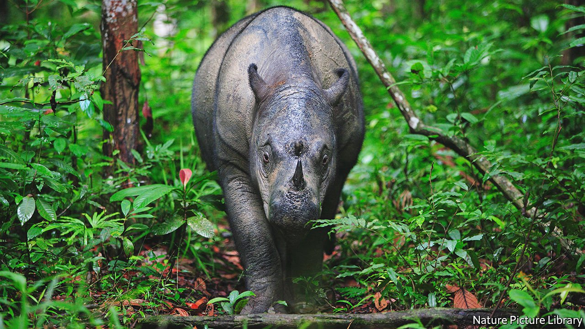

###### Conservation

# Save the rhino, save the plant 

##### Sumatran rhinos spread seeds. Without them some plants may vanish 

 

> Jan 29th 2022 

ALL SPECIES of rhinoceros are in trouble, as poachers kill them to take their horns. But Sumatran rhinos are in extremis. Fewer than 80 remain alive, and that handful is scattered between three groups in Sumatra and one in Borneo. This is terrible news for the species itself. But Kim McConkey and Ahimsa Campos-Arceiz at the University of Nottingham, in Britain, think it has wider ramifications—for, as they explain in a paper in Biotropica, several plant species also depend on Sumatran rhinos for their survival.

A large proportion of a Sumatran rhino’s diet is fruit. The evolutionary bargain between frugivores and plants is that the plants coat indigestible seeds with tasty and nutritious pulp as payment for the frugivores’ dispersal of those seeds by defecation far from the plant that produced them. Some plants, indeed, go further. Their seeds will not germinate unless they have passed through an animal’s digestive system. This arrangement works well as long as suitable frugivores are available. But for plants with large seeds, these need to be big animals. And of those, there may be a restricted supply.


Dr McConkey and Dr Campos-Arceiz suspected that this might be a problem for a number of South-East Asian plants which live in the range once occupied by Sumatran rhinos. Nor is this a theoretical threat. Madagascar hosts many endangered plants, including baobabs, palms and members of the Proteaceae (a group represented elsewhere by the macadamia nut tree) known by botanists as orphans of extinction. The reason for this moniker is that the large frugivores, such as giant lemurs, which used to disperse their seeds were exterminated when people arrived on the island in the first millennium AD.

In the case of Sumatran rhinos, an alternative means of seed dispersal may be available. The local elephants are certainly large enough to eat the seeds in question. If they actually do so, then the problem is diminished. But, when Dr McConkey and Dr Campos-Arceiz began their study, the extent to which elephants’ and rhinos’ diets overlapped was unknown.

To investigate, they and their colleagues scoured 18.5km of forest trails in Way Kambas National Park, in Sumatra, for rhino faeces. Over the course of two and a half months they discovered 48 piles of the stuff (29kg in total), and sifted through these for seeds, which they brought back to their laboratory for identification.

They also delved into history. First, they interviewed members of the Orang Asli, a group of people indigenous to Peninsular Malaysia, across the Malacca Straits from Sumatra—and to its forests, in particular—to obtain their recollections. Sumatran rhinos still existed in the Malay Peninsula less than 20 years ago, and though they are now gone, memories of the animals, including what they ate, remain.

To cap things off, the researchers then ran a literature search in which they examined the accounts of explorers, hunters and scientists who had come across Sumatran rhinos in other parts of South-East Asia during the early 20th century, when they ranged more widely still. They noted down every observation concerning the animals’ diets. Once this was done, they ran a similar investigation into the diets of the local elephants, to determine how much overlap there was.

The result was not good. Elephants turn out to be picky eaters. Rhinos were the only recorded dispersers of 35% of the large-fruited species found in the regions where data were available.

To put it another way, of 79 plants known to have their seeds dispersed by rhinos, elephants disperse only 57. Seeds of the remaining 22 are therefore restricted, if no rhinos are around, to germinating where they fall. So, if a local population of one of these plants is destroyed for some reason, it is unlikely to be replaced. And there is also a risk of local inbreeding. Indeed, three of the species the researchers identified are already listed as threatened.

Precisely why elephants do not eat the fruits of these 22 plants is unknown. But whatever that reason is, it looks as if almost two dozen South-East Asian plants should be joining the list of orphans of extinction. Short of a deliberate campaign of planting, their days seem numbered. ■

To enjoy more of our mind-expanding science coverage, , our weekly newsletter.

