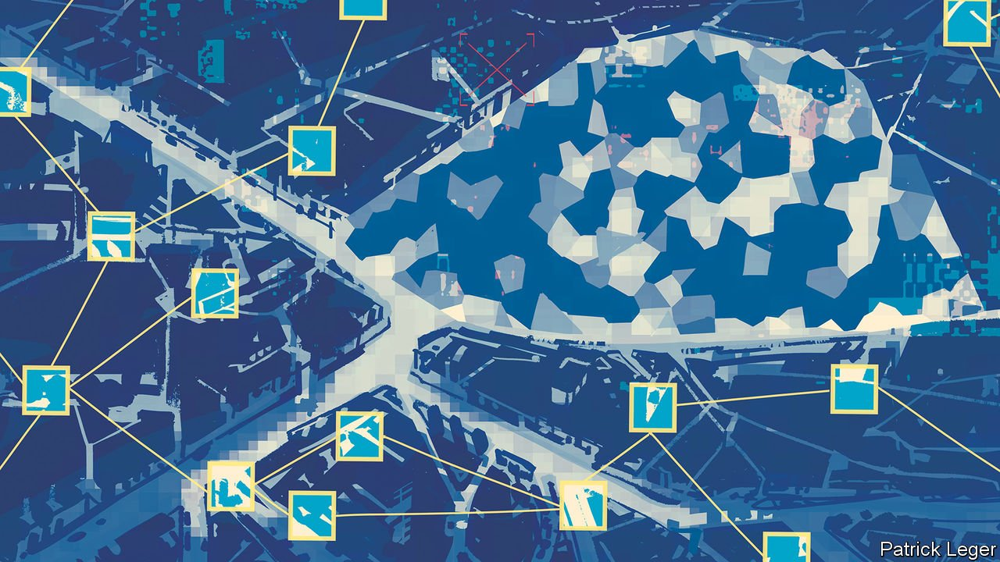

###### Fierce contests

# Deception and destruction can still blind the enemy 

##### Many outcomes will still remain uncertain 

 

> Jan 27th 2022 

THERE ARE four ways for those who would hide to fight back against those trying to find them: destruction, deafening, disappearance and deception. Technological approaches to all of those options will be used to counter the advantages that bringing more sensors to the battlespace offers. As with the sensors, what those technologies achieve will depend on the tactics used.

Destruction is straightforward: blow up the sensor. Missiles which home in on the emissions from radars are central to establishing air superiority; one of the benefits of stealth, be it that of an F-35 or a Harop drone, lies in getting close enough to do so reliably.


Radar has to reveal itself to work, though. Passive systems can be both trickier to sniff out and cheaper to replace. Theatre-level air-defence systems are not designed to spot small drones carrying high-resolution smartphone cameras, and would be an extraordinarily expensive way of blowing them up.

But the ease with which American drones wandered the skies above Iraq, Afghanistan and other post-9/11 war zones has left a mistaken impression about the survivability of UAVs. Most Western armies have not had to worry about things attacking them from the sky since the Korean war ended in 1953. Now that they do, they are investing in short-range air defences. Azerbaijan’s success in Nagorno-Karabakh was in part down to the Armenians not being up to snuff in this regard. Armed forces without many drones—which is still most of them—will find their stocks quickly depleted if used against a seasoned, well-equipped force.

Stocks will surely increase if it becomes possible to field more drones for the same price. And low-tech drones which can be used as flying IEDs will make things harder when fighting irregular forces. But anti-drone options should get better too. Stephen Biddle of Columbia University argues that the trends making drones more capable will make anti-drone systems better, too. Such systems actually have an innate advantage, he suggests; they look up into the sky, in which it is hard to hide, while drones look down at the ground, where shelter and camouflage are more easily come by. And small motors cannot lift much by way of armour.

Moving from cheap sensors to the most expensive, satellites are both particularly valuable in terms of surveillance and communication and very vulnerable. America, China, India and Russia, all of which would rely on satellites during a war, have all tested ground-launched anti-satellite missiles in the past two decades; some probably also have the ability to kill one satellite with another. The degree to which they are ready to gouge out each other’s eyes in the sky will be a crucial indicator of escalation should any of those countries start fighting each other. Destroying satellites used to detect missile launches could presage a pre-emptive nuclear strike—and for that very reason could bring one about.

Everybody has a plan until they get punched in the face

Satellites are also vulnerable to sensory overload, as are all sensors. Laser weapons which blind humans are outlawed by international agreement but those that blind cameras are not; nor are microwave beams which fry electronics. America says that Russia tries to dazzle its orbiting surveillance systems with lasers on a regular basis.

The ability to jam, overload or otherwise deafen the other side’s radar and radios is the province of electronic warfare (EW). It is a regular part of military life to probe your adversaries’ EW capabilities when you get a chance. The deployment of American and Russian forces close to each other in northern Syria provided just such an opportunity. “They are testing us every day,” General Raymond Thomas, then head of American special forces, complained in 2018, “knocking our communications down” and going so far as “disabling” America’s own EC-130 electronic-warfare planes.

In Green Dagger, an exercise held in California last October, an American Marine Corps regiment was tasked with seizing a town and two villages defended by an opposing force cobbled together from other American marines, British and Dutch commandos and Emirati special forces. It struggled to do so. When small teams of British commandos attacked the regiment’s rear areas, paralysing its advance, the marines were hard put to target them before they moved, says Jack Watling of the Royal United Services Institute, a think-tank in London. One reason was the commandos’ effective EW attacks on the marines’ command posts.

Just as what sees can be blinded and what hears, deafened, what tries to understand can be confused. Britain’s national cyber-strategy, published in December, explicitly says that one task of the country’s new National Cyber Force, a body staffed by spooks and soldiers, is to “disrupt online and communications systems”. Armies that once manoeuvred under air cover will now need to do so under “cyber-deception cover”, says Ed Stringer, a retired air marshal who led recent reforms in British military thinking. “There’s a point at which the screens of the opposition need to go a bit funny,” says Mr Stringer, “not so much that they immediately spot what you’re doing but enough to distract and confuse.” In time the lines between EW, cyber-offence and psychological operations seem set to blur.

The ability to degrade the other side’s sensors, interrupt its communications and mess with its head does not replace old-fashioned camouflage and newfangled stealth; they remain the bread and butter of a modern military. Tanks are covered in foliage; snipers wear ghillie suits. Warplanes use radiation-absorbent material and angled surfaces so as not to reflect radio waves back to the radar that sent them. Russia has platoons dedicated to spraying the air with aerosols designed to block ultraviolet, infrared and radar waves. During their recent border stand-off, India and China both employed camouflage designed to confuse sensors with a broader spectral range than the human eye.

According to Mr Biddle, over the past 30 years “cover and concealment”, along with other tactics, have routinely allowed forces facing American precision weapons to avoid major casualties. He points to the examples of al-Qaeda at the Battle of Tora Bora in eastern Afghanistan in 2001 and Saddam Hussein’s Republican Guard in 2003, both of whom were overrun in close combat rather than through long-range strikes. Weapons get more lethal, he says, but their targets adapt.

Hiding is made easier by the fact that the seekers’ new capabilities, impressive as they may be, are constrained by the realities of budgets and logistics. Not everything armies want can be afforded; not everything they procure can be put into the field in a timely manner. In real operations, as opposed to PowerPoint presentations, sensor coverage is never unlimited.

“There is no way that we're going to be able to see everything, all of the time, everywhere,” says a British general. “It's just physically impossible. And therefore there will always be something that can happen without us seeing it.” In the Green Dagger exercise the attacking marine regiment lacked thermal-imaging equipment and did not have prompt access to satellite pictures. It was a handicap, but a realistic one. Rounding up commandos was not the regiment’s “main effort”, in military parlance. It might well not have been kitted out for it.

When hiding is hard, it helps to increase the number of things the enemy has to look at. “With modern sensors…it is really, really difficult to avoid being detected,” says Petter Bedoire, the chief technology officer for Saab, a Swedish arms company. “So instead you need to saturate your adversaries’ sensors and their situational awareness.” A system looking at more things will make more mistakes. Stretch it far enough and it could even collapse, as poorly configured servers do when hackers mount “denial of service” attacks designed to overwhelm them with internet traffic.

Dividing your forces is a good way to increase the cognitive load. A lot of small groups are harder to track and target than a few big ones, as the commandos in Green Dagger knew. What is more, if you take shots at one group you reveal some of your shooters to the rest. The less valuable each individual target is, the bigger an issue that becomes.

Decoys up the ante. During the first Gulf war Saddam Hussein unleashed his arsenal of Scud missiles on Bahrain, Israel and Saudi Arabia. The coalition Scud hunters responsible for finding the small (on the scale of a vast desert) mobile missile launchers he was using seemed to have all the technology they might wish for: satellites that could spot the thermal-infrared signature of a rocket launch, aircraft bristling with radar and special forces spread over tens of thousands of square kilometres acting as spotters. Nevertheless an official study published two years later concluded that there was no “indisputable” proof that America had struck any launchers at all “as opposed to high-fidelity decoys”.

One of the advantages data fusion offers seekers is that it demands more of decoys; in surveillance aircraft electronic emissions, radar returns and optical images can now be displayed on a single screen, highlighting any discrepancies between an object’s visual appearance and its electronic signature. But decoy-making has not stood still. Iraq’s fake Scuds looked like the real thing to UN observers just 25 metres away; verisimilitude has improved “immensely” since then, particularly in the past decade, says Steen Bisgaard, the founder of GaardTech, an Australian company which builds replica vehicles to serve as both practice targets and decoys.

Mr Bisgaard says he can sell you a very convincing mobile simulacrum of a British Challenger II tank, one with a turret and guns that move, the heat signature of a massive diesel engine and a radio transmitter that works at military wavelengths, all for less than a 20th of the £5m a real tank would set you back. Shipped in a flat pack it can be assembled in an hour or so.

Seeing a tank suddenly appear somewhere, rather than driving there, would be something of a giveaway. But manoeuvre can become part of the mimicry. Rémy Hemez, a French army officer, imagines a future where armies deploy large “robotic decoy formations using AI to move along and create a diversion”. Simulating a build up like the one which Russia has emplaced on Ukraine’s border is still beyond anyone’s capabilities. But decoys and deception—in which Russia’s warriors are well versed—can be used to confuse.

Disappearance and deception often have synergy. Stealth technologies do not need to make an aircraft completely invisible. Just making its radar cross-section small enough that a cheap little decoy can mimic it is a real advantage. The same applies, mutatis mutandis, to submarines. If you build lots of intercontinental-ballistic-missile silos but put ICBMs into only a few—a tactic China may be exploring—an enemy will have to use hundreds of its missiles to be sure of getting a dozen or so of yours.

Shooting at decoys is not just a waste of material. It also reveals where your shooters are. Silent Impact, a 155mm artillery shell produced by SRC, an American firm, can transmit electronic signals as if it were a radar or a weapons platform as it flies through the sky and settles to the ground under a parachute. Any enemy who takes the bait reveals the position of their guns.

The advent of AI should offer new ways of telling the real from the fake; but it could also offer new opportunities for deception. The things that make an AI say “Tank!” may be quite different to what humans think of as tankiness, thus unmasking decoys that fool humans. At the same time the AI may ignore features which humans consider blindingly obvious. Benjamin Jensen of American University tells the story of marines training against a high-end sentry camera equipped with object-recognition software. The first marines, who tried to sneak up by crawling low, were quickly detected. Then one of them grabbed a piece of tree bark, placed it in front of his face and walked right up to the camera unmolested. The system saw nothing out of the ordinary about an ambulatory plant.

The problem is that AIs, and their masters, learn. In time they will rumble such hacks. Basing a subsequent all-out assault on Birnam Wood tactics would be to risk massacre. “You can always beat the algorithm once by radical improvisation,” says Mr Jensen. “But it's hard to know when that will happen.”

The advantages of staying put

Similar uncertainties will apply more widely. Everyone knows that sensors and autonomous platforms can get cheaper and cheaper, that computing at the edge can reduce strain on the capacity of data systems, and that all this can make kill chains shorter. But the rate of progress—both your progress, and your adversaries’—is hard to gauge. Who has the advantage will often not be known until the forces contest the battlespace.

The unpredictability extends beyond who will win particular fights. It spreads out to the way in which fighting will best be done. Over the past century military thinking has contrasted attrition, which wears down the opponent’s resources in a frontal slugfest, and manoeuvre, which seeks to use fast moving forces to disrupt an enemy’s decision-making, logistics and cohesion. Manoeuvre offers the possibility of victory without the wholesale destruction of the enemies’ forces, and in the West it has come to hold the upper hand, with attrition often seen as a throwback to a more primitive age.

That is a mistake, argues Franz-Stefan Gady of the International Institute for Strategic Studies, a think-tank. Surviving in an increasingly transparent battlespace may well be possible. But it will take effort. Both attackers who want to take ground and defenders who wish to hold it will need to build “complex multiple defensive layers” around their positions, including air defences, electronic countermeasures and sensors of their own. Movement will still be necessary—but it will be dispersed. Consolidated manoeuvres big and sweeping enough to generate “shock and awe” will be slowed down by unwieldy aerial electromagnetic umbrellas and advertise themselves in advance, thereby producing juicy targets.

The message of Azerbaijan’s victory is not that blitzkrieg has been reborn and “the drone will always get through”. It is that preparation and appropriate tactics matter as much as ever, and you need to know what to prepare against. The new technologies of hide and seek will sometimes—if Mr Gady is right, often—favour the defence. A revolution in sensors, data and decision-making built to make targeting easier and kill chains quicker may yet result in a form of warfare that is slower, harder and messier. ■

