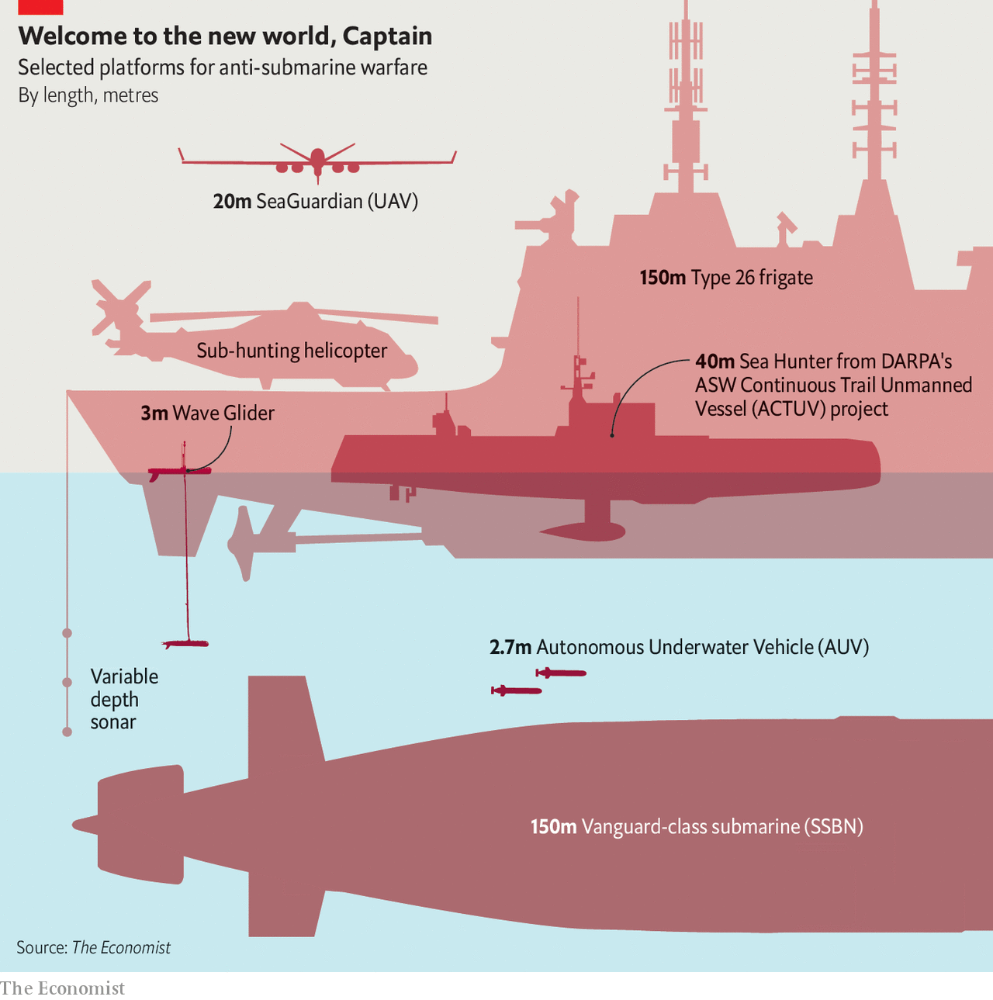

###### See-through seas

# Finding submarines is likely to get easier 

##### But it will still be hard, and some waters will remain inviolable 

 

> Jan 27th 2022 

MARITIME MYSTERIES are not unknown on the ragged western flank of the British Isles, buffeted by cruel seas and bitter winds. But the tiny stranded vessel reported to the coastguard on Tiree, the most westerly island of the Inner Hebrides, in October 2020 was particularly mysterious. It bore no markings, broadcast no identifying signal and carried no running lights.

Once pictures showing its distinctive surfboard shape and solar panelling were put online, though, it was quickly identified as a “Wave Glider”—an uncrewed surface vessel (USV) built by Liquid Robotics, a California company owned by the aerospace giant Boeing. First developed to listen to humpback whales, the vessels’ ability to carry sensors slowly through the seas (they have an ingenious way of turning the rise and fall of waves into forward motion) has seen them put to all sorts of uses by researchers and navies alike; over 500 have been sold to date.


Whales are not the only things they listen to. When contacted about the Wave Glider found in Tiree, and others that have washed up on the coasts of Lewis in the Outer Hebrides, Unst in Shetland and Donegal, Liquid Robotics simply said it would let the owners know. But it is a matter of record that in 2016 Wave Gliders were used to detect and track a Royal Navy submarine in an exercise; and it is past those north-western coasts that Britain’s nuclear armed submarines (SSBNs) make their way from their base at Faslane, near Glasgow, to the open ocean.

The idea that submarines loitering in the depths are undetectable is fundamental to modern nuclear deterrence. America, Britain, China, France, India, Israel and Russia act on the basis that though a nuclear-armed adversary could conceivably destroy their land-based forces in a first strike, it could not wipe out their submarines. A submarine at depth cannot be seen from afar—daylight is all but undetectable at depths of more than a couple of hundred metres. Radio waves fare even worse, making underwater radar a non-starter. Sound carries, but the boats can be remarkably silent; the noise made by a modern SSBN is less than a millionth of the racket produced by the first such boats.

That leaves active sonar, which rather than listening for noises made by its quarry emits sounds designed to bounce off them. This lets an adversary locate a submerged submarine precisely enough to attack it. But it is limited in its range, and by the ways sounds are distorted and dissipated by changes in pressure, temperature and salinity.

This is all taken to mean that weapons on SSBNs can be relied on for retaliation if a first strike devastates everything else. That guaranteed capability to respond is held to keep deterrence stable.

From surfboards to Red October

America’s most recent review of nuclear policy concluded that “There are no known, near-term credible threats to the survivability of the SSBN force.” But what is near-term, and for that matter credible, is a matter of opinion. In 2020 a panel of experts assembled by the National Security College of the Australian National University concluded that, “The oceans are, in most circumstances, at least likely…to become transparent by the 2050s.” Trends making it harder to hide above the waves—more numerous and more capable sensors and more powerful ways of sifting through their output—are at play underwater, too.

To put a submarine at risk you must first detect it, then track it. Since the 1980s America and its allies have relied on the hydrophone arrays of the Fixed Distributed System (FDS) for such detection. The sensors, tethered to the sea floor, float at a “critical depth” where acoustical geometry shields them from extraneous noise and makes the faint sounds of a submarine passing overhead stand out. America now has FDS systems in both the Atlantic and the Pacific, with ships, submarines and aircraft available to set about tracking anything they detect.

Owen Cote, a submarine expert at MIT, says that such listening arrays remain, for now, the only truly effective method of detecting a very quiet submarine. Their drawback is that, being quite short range, they cannot cover whole ocean basins. They just cover choke points, such as the gaps between Greenland and Iceland and Iceland and Britain, or the entrances to the Philippine Sea.

Arrays that can be towed behind ships are crucial to tracking what has been thus detected. If they could be made far more numerous, they might be able to do more detecting themselves. The sensors available for such arrays have improved greatly, according to Bryan Clark, a former submariner now at the Hudson Institute, a think-tank in Washington. New solid-state “vector” sensors measure the velocity and acceleration of water molecules, which means they get more information out of a sound wave than a simply pressure-sensitive hydrophone does. The signal-processing systems required to discern a submarine’s screw in the din of the ocean are improving even more quickly.

 


They are also shrinking. Ken Perry, a retired rear-admiral and vice-president of ThayerMahan, a Connecticut-based firm which builds maritime-surveillance platforms, recalls a time when sonar computers were so large and inefficient that submariners warmed up their coffee on them. Now a surfboard’s worth of solar panels can run them and still provide enough juice to transmit the information thus produced. Hence the interest in things like Wave Gliders and ThayerMahan’s rather larger USVs, which carry ten times the payload capacity and move a lot quicker.

A fleet of array-towing USVs could cover millions of square kilometres of ocean for “a fraction of the cost of a single frigate or submarine”, says Mr Perry, whose company has tested the concept in exercises with America’s navy. The bit of the Pentagon charged with pushing technological boundaries, DARPA, is working on an “Ocean of Things” project which would contain thousands of “low-cost floats…that drift as a distributed sensor network”. The idea is that armadas of prowling hydrophones could eventually plug into a wider network of sensors, including fixed arrays, sonobuoys dropped from the air and autonomous underwater vehicles (AUVs)—drone submarines.

Another DARPA project has worked on new ways to follow up such detections. In 2016 it produced a USV called Sea Hunter, a robot prototype designed to follow a submarine for thousands of kilometres entirely autonomously while respecting all the international rules designed to avoid collisions at sea. Such vessels, a lot bigger than most surface drones but much smaller, and far cheaper, than a frigate with a crew, could in theory be deployed in fairly large numbers, and in contested waters.

Whatever happened to Jonesy?

An ocean that is suffused with sensors above and below the surface and which has sub-tracking robots on the prowl is certainly a more inhospitable place for a submarine—or at least, for one that does not belong to America or one of its allies. Flooding the world’s oceans with such sensors is something only a great power can do. As far as most people are concerned, says Mr Cote, “the oceans are opaque, and will probably remain so.”

Changing this would require some new technique to supplement what is available, and there is lots of research on detecting magnetic disturbances and very faint wakes, sniffing out telltale chemicals or radiation, and pinging targets with lasers tuned to the blue-green wavelengths which best penetrate seawater. Some of these techniques might work best underwater. Pictures of curious appendages that might hold sensors of various sorts on submarines coming into or leaving port reliably spark discussion in the sub-curious parts of the internet. Others could be deployed from aerial drones, and thus could be used a lot more if such drones became more numerous. But short ranges look likely to remain a problem for all these methods, as does the fundamental challenge of separating signal from noise in big messy oceans.

And submariners could fight back, notes David Blagden of the University of Exeter. A submarine leaving port might “delouse” itself of inquisitive USVs by using technology as rudimentary as a tugboat and rope netting. Should wake detection show promise, submarines could simply head to rougher seas. The low-power transmissions from USVs to satellites or nearby warships could be jammed by other USVs, or by drones.

The last of those tactics speaks to a perennial problem for anti-submarine warfare. The oceans do not just make it hard to gather information; they also make it hard to pass it on. Sensors which spend all their time submerged have either to be hard wired to cables or to communicate using acoustic modems that are slow, cumbersome and limited in range. This is a real bottleneck for systems trying to make use of AUVs.

This requirement for cables on the sea floor makes geography important. Navies fight above the seabed they have, not the one they would like. In the North Atlantic, America enjoyed the advantage of laying its cables in very deep water—inaccessible to all but highly specialised submarines—and then up a continental shelf that rose, sharply, on to allied territory. By contrast, if China wanted to assemble a sonar net across the Philippine Sea, it would have to lay fibre-optic cable all across the South China Sea, bits of which are shallow enough that cables there are frequently cut by fishing vessels. Those cables would be at the mercy of foreign navies. .

That could make it hard for China to stop submarines getting close to its shores. And sonar systems at choke points like the Luzon Strait could make it difficult for Chinese submarines to slip into the open ocean. Both constraints would be to its disadvantage in wartime. But they would not render its SSBNs useless. Such submarines do not need to be able to prowl every ocean with impunity. They just need an area within range of their missiles’ targets but out of bounds to other navies and their sensors—what navies call a “bastion”. Seeing through an ocean will be hard enough if you have access to its surface and its depths. Seeing through a sea you can be kept out of is a different kettle of invisible fish. ■

