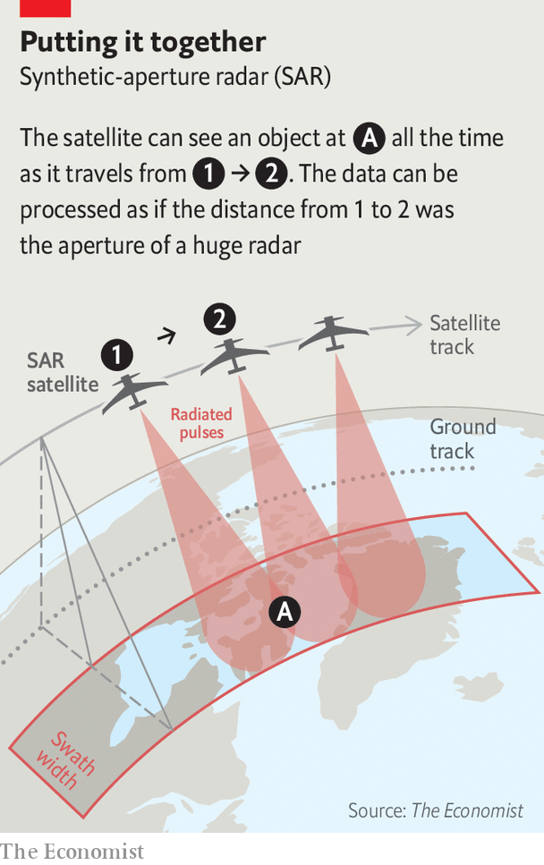

###### All the targets, all the time

# Synthetic-aperture radar is making the Earth’s surface watchable 24/7 

##### Cloud cover and the dark of the Moon matter no more 

 

> Jan 29th 2022 

THE FIRST time that humans observed a battlefield from a celestial vantage point was in June 1794, scarcely a decade after the Montgolfier brothers had invented the hot-air balloon. The French Aerostatic Corps, a motley crew of chemists, carpenters and hangers on (sometimes literally), flew a tethered hydrogen balloon, l’Entrepenant, over the battlefield at Fleurus, in what is now Belgium. The spotters on board informed their comrades down below about the disposition and movements of their Austrian enemies by semaphore. France won the battle.

The success was not in itself trendsetting. When France, Britain and Prussia met 21 years later at Waterloo, 30km north of Fleurus, no one looked down but the birds: Napoleon had abolished the Aerostatic Corps in 1799. Military ballooning did not really come into its own until the American civil war, and its importance was short lived. When war returned to the low countries in 1914 the balloon was already beginning to give way to the aeroplane; by the end of the war it had been completely eclipsed. By the time NATO moved its military headquarters to Mons, 40km west of Fleurus, in the 1960s, satellites had entered the picture.


Yet even as the method of elevation changed, the means of sensing did not. What struck the retinas of the French balloonists—visible light—was the same thing that struck the film of the panoramic cameras aboard America’s first spy satellites. Film sensitive to the near infrared has sometimes been used to differentiate camouflage (which until recently tended not to reflect those wavelengths) from foliage (which reflects them strongly). Satellites built to spot the launch of ballistic missiles do so by picking out the longer infrared wavelengths associated with hot rocket exhausts. But most systems for looking down from orbit have relied mostly on visible light.

This has two obvious problems when you are looking down from orbit: night and cloud. Half the world is in darkness at any given time. Most of it is sometimes cloudy and some of it is nearly always cloudy. More than half of Europe is typically obscured at any given time and in parts of South America cloud-free images only appear every decade or so, according to Adam Maher of Ursa Space, a startup based in Ithaca, New York, which uses satellite pictures for business intelligence. Planet, a company which aims to take one-metre resolution pictures of the entire land surface every day, says that about 70% of the surface is cloudy at any one time. Soldiers, sneaky as they are, have been moving troops and equipment under cover of inclement weather for decades.

In the past few years, though, an alternative to visible wavelengths has been making enormous strides. The satellites from which Ursa draws its images are built around radio antennae, not lenses. These orbiting radars illuminate the surface using wavelengths hundreds of thousands of times longer than those of visible light. Such wavelengths pass easily through clouds, fog, smog and, when necessary, camouflage netting before hitting the surface and bouncing back out into space.

The advantages long wavelengths offer in terms of penetration come with compensating drawbacks. The resolution a sensor depends on the wavelength and on the size of its aperture—the mirror or lens in the case of a camera or a telescope, the antenna in a radar. If you lengthen the wavelength, you increase the size of the aperture you need in order to achieve a given resolution. To produce detailed images with radar requires a very large aperture indeed—far larger than anything a single spacecraft can offer.

 


Synthetic-aperture radar (SAR) provides a way round that problem. Satellites move at quite a clip—typically, in low orbit, around 25,000kph. By taking all the echoes a radar satellite gets from a given target as it passes over it—and processing them into a single image, SAR produces a result as precise as if it had been made using a single aperture as wide across as the distance the satellite travelled while gathering the data—tens of hundreds of kilometres (see diagram).

This technology has been available since the 1960s, and used by spy satellites since the 1980s. But it was limited, expensive and highly classified. It was not until the late 2000s, when India and Israel both had military SAR satellites of their own that America’s National Reconnaissance Office, an arm of the Pentagon, declassified the existence of its own such satellites, finally allowing its employees to talk to Air Force officers about them. Civilian space agencies in America, Canada and Europe used the technology for various environmental missions, but not as a routine way of looking at human activities. It was simply too expensive.

Advances in electronics, spacecraft engineering and on-orbit computation mean it is now possible to put SAR systems with resolutions of a few metres or less onto small satellites at a reasonable price. In 2018 two startups, Capella Space, in California, and ICEYE, in Finland, launched commercial SAR satellites, and the field is now booming. Realising that trying to stop the boom would be pointless, as other countries have similar capabilities anyway, the Pentagon has encouraged it—in part because it greatly increases its own capacities.

Kings of heaven

Jack O’Connor, who retired from America’s National Geospatial-Intelligence Agency in 2013, says that back when everything was classified the amount of available SAR coverage was not sufficient for the sort of analysis that is now normal. More for everyone means more for the spooks. “If you’re in a professional intelligence agency, now you have additional sources and you can check the orbits to see do they give me coverage at times and in places I couldn’t get before?”

Though intelligence agencies and armed forces tend not to brag about what this makes possible, others are happy to. Russia has been testing a nuclear-powered cruise missile which NATO calls “Skyfall” at facilities in the Novaya Zemlya archipelago, high up above the Arctic Circle. And as the “Arms Control Wonk” podcast put it in the title of an episode last September, “It’s always cloudy in Novaya Zemlya”. The episode was about the way that Jeffrey Lewis of the James Martin Centre for Nonproliferation Studies at the Middlebury Institute of International Studies at Monterey and his colleagues had used SAR images provided by Capella to show that new tests of the system were being prepared. American intelligence sources subsequently confirmed to CNN that they, too, had clocked the preparations.

The ability to see through poor weather, day or night, lends itself to tracking things that are changing over time. A military build-up like that on the border of Ukraine is the perfect target; the imagery may not be sharp enough to identify the specific type of tank, but it is good enough to count the number of them.

And changes at a specific site can be analysed with remarkable precision. Radar systems can get data from the phase of the waves they are using in ways that optical systems using ambient light cannot. The “coherent change detection” this allows can show up even minute anomalies. When America discovered that it was losing more of its soldiers in Iraq and Afghanistan to roadside IEDs than any other type of weapon, boffins at Sandia National Laboratory, one of the facilities responsible for America’s nuclear weapons, developed Copperhead, a drone-mounted SAR system that used this sort of change detection to spot tiny disturbances in the soil where insurgents might have buried IEDs or the command wires that triggered them. Similar techniques allow satellites to reveal the slight surface subsidence which comes with the building of tunnels for nuclear tests.

Detecting very subtle changes over time is useful for intelligence applications. Detecting blatant ones as they happen is useful for war-fighting ones. Assessing whether bombs have struck the correct targets and what damage they have brought about needs to be done as quickly as possible, lest the other side clean up or obscure the site. India used its burgeoning fleet of SAR satellites for just this purpose after an air strike on Pakistan in February 2019. America’s air force did the same thing in tests carried out in December 2020, pointing explicitly to weather conditions in Europe and the Pacific as the motivation.

Dwellers all in time and space

Being able to see a site on a regular basis regardless of the weather also allows armed forces to create archives which will only come into their own in the future. A good example comes from another system the Pentagon developed to counter IEDs: “Gorgon stare” allowed aircraft to take near-continuous video of whole cities over weeks and months. The idea was that, after an attack, it would be possible to run back the tape, as it were, to see when the IED had been emplaced and to trace members of the insurgent group responsible. In principle, SAR archives could provide an analogous ability to turn back the clock in light of new data for select sites all around the world.

Payam Banazadeh, the founder of Capella, says that with the six satellites his company now has in orbit it can check in on any spot on the planet every six hours. The company’s planned 40-satellite constellation is intended to get that revisit time down to no more than 15 minutes—less time than it would take for a country to launch a ballistic missile, Mr Banazadeh notes. The satellites cannot operate 24/7: their power-hungry antennae take their sustenance from solar panels, and their batteries are not large enough for them to operate continuously at night. But they do pretty well. The growth of ICEYE, which is currently operating 14 SAR satellites, Capella and other companies means the number of satellites available is rising rapidly, reducing gaps in coverage. All these companies have military customers.

The time it takes to get the information down from space and into the hands of those who need it is also falling quickly, as big data companies like Amazon Web Services pile into the market and expand the number of ground stations. In five years it will be possible to request an image, communicate with the satellite and receive the product in minutes, says Joe Morrison of Umbra, a California firm which launched its first SAR satellite last June. “You’ll snap your finger and in that same hour you’ve got 25-centimetre resolution imagery—maybe 15-centimetre if it’s a US government national-security use case.”

Umbra hopes to nurture the growth of a downstream industry that could sell analysis based on SAR data to civilian and government customers by making those data cheaper than the optical equivalent offered by companies like Planet and Maxar, an Earth observation company based in Colorado. It plans to sell images covering 16 square kilometres at a resolution of one metre—good enough to make out a car—for $500 a time under a Creative Commons licence which lets buyers do as they please with the product. The current price of an optical image of equivalent granularity would be around six times as much, and be sold under restrictive conditions that limit how it could be disseminated and used, he says. Such competition should drive down the price all round—and increase the scope for adding all sorts of value.

Huge amounts of satellite images at relatively low prices provides a pretty much ideal input for the sort of machine-learning algorithms that have powered recent advances in AI: lots of well structured data with which to learn how to recognise all sorts of different things. Such automation allows both new insights and analysis at scale. Mr Maher of Ursa says that his firm might check in on 20,000 facilities once a week for a single client. “It’s less than a full-time job for one person to monitor those sites,” he says.

The capabilities of SAR are just one example, albeit a dramatic one, of the sort of progress being made with all sorts of advanced sensors and the data-processing systems needed to interpret their output. Satellite providers of optical images, hyperspectral data and radio-location services which keep tabs on aircraft and ships are springing up around the world. The ability to use radar to track moving objects from space in real time is getting closer. And pretty much everything which can be done from orbit can also be done with drones closer to the target and capable of responding to new requests almost instantly. There are few places, if any, on the surface of the Earth that are free from such snooping. Below the surface of the seas, though, there is still a redoubt—for now. ■

