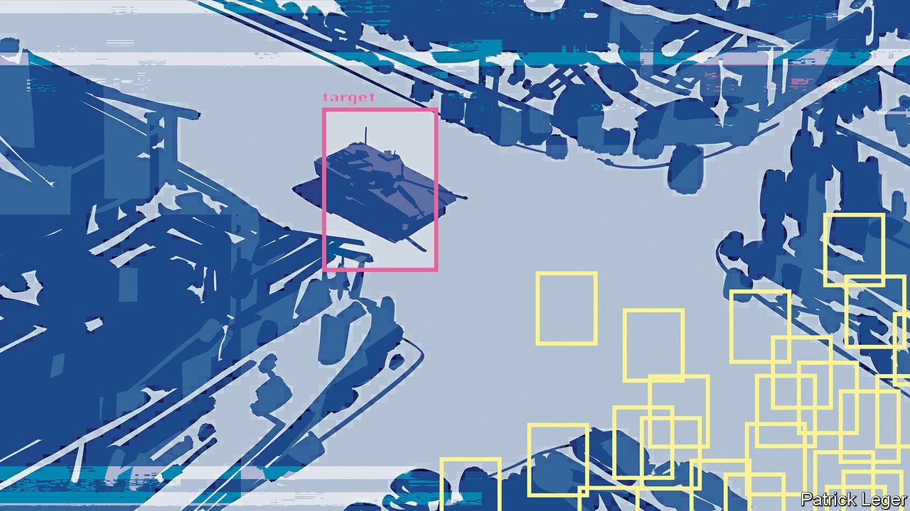
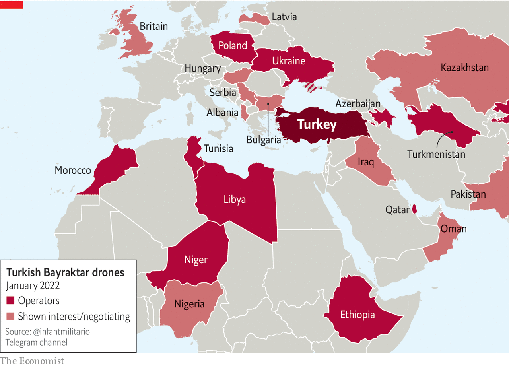

###### Like smartphones, but lethal

# The technology of seeing and shooting your enemies 

##### War among the sensors poses new challenges, says Shashank Joshi 

 

> Jan 29th 2022 

THE WAR which began when Azerbaijan attacked its neighbour Armenia on September 27th 2020 was a bloody affair, with over 7,000 lives lost. The previous war between the countries, which dragged on from 1988 to 1994, had left Armenian forces occupying much of Nagorno-Karabakh, an ethnic Armenian enclave within Azerbaijan. When, in 2020, the guns fell silent after just 44 days, Azerbaijan had taken back three-quarters of the territory those forces had held in and around the enclave—a victory as decisive as any in recent years.

Azerbaijan had some advantages at the outset. It had a larger population and a bigger military budget, far more artillery pieces and a better equipped air force. That said, much of its equipment dated back to the Soviet era, which is to say to that previous war where it had proved ineffective. And it is a military dictum that, other things being equal, an attacker needs a force perhaps three times larger than the one under attack to prevail.


But the Azeris also had a fleet of drones which included TB2s procured from Turkey and Harops bought from Israel. The TB2s, with a wingspan of 12 metres, were remote-controlled, could launch either bombs or missiles, and stayed in the air for up to 24 hours at a time. The Harops were smaller, stealthier, more autonomous and designed for kamikaze attacks on radars. Between them they blew up more than two-dozen air-defence systems and scores of artillery pieces. Hundreds of armoured vehicles were destroyed. A similar bonfire of armour had played out in Syria’s Idlib province earlier that year, where Turkey’s TB2S obliterated the Syrian tank fleet in a two-day blitz.

Military leaders across the world paid close attention. “The hallmarks of a different form of land warfare are already apparent,” General Sir Mark Carleton-Smith, Britain’s chief of general staff, told a conference which took place a year after the conflict. “Small wars…are already throwing up some quite big lessons.”

The drones themselves were only a part of the curriculum. The rest looked at the command, control and communications systems that gathered information on what needed to be hit, decided priorities and brought them about. Satellite communications let tactical commanders see what the drones saw and feed them targets identified by other means. In Azerbaijan Turkish radar-spotting spy planes seem to have provided some spotting; Turkey’s ground-based KORAL system, which detects and jams enemy radars, helped the tank-busting drones over Idlib.

Joo joo eyeball

This sort of highly networked warfare is something military technologists have been working on for decades. Its true believers imagine a “battlespace”—think of an old-fashioned, seen-through-binoculars, two-dimensional, ships-soldiers-and-tanks battlefield, but extended vertically all the way up to orbit and electronically well out into infrared and radar wavelengths—in which ubiquitous sensors can pass targeting information to all sorts of “shooters” through seamless communication networks.

Huge investments have provided the great powers—pre-eminently, America—and developed-world allies with some of these wished for capabilities. As General Mark Milley, America’s top military officer, put it last year, “You’ve got an ability to see and an ability to hit at range that has never existed before in human history.” Such abilities are likely to matter a lot in some sorts of set-piece conflict. In the wars America has actually been fighting, wars against insurgencies armed with improvised explosive devices (IEDs) and the like, they have proved less of a help.


Now Azerbaijan, a decidedly non-great power, had achieved a similar sort of capability far more cheaply. Similar does not mean truly comparable: a better armed and prepared adversary might have easily seen them off. But that a small war in the Caucasus provided portents of a “transparent battlespace [which is] effectively one giant sensor,” as Sir Mark put it, was still an eye opener.

Telecommunications—semaphore, then telegraph, then wireless—have been letting spotters tell shooters of targets the shooters cannot see for centuries. But the modern notion of creating “kill chains” from a range of sensors to a range of shooters on the fly is widely traced to the 1970s. That was when Soviet military theorists began to talk of what they called the “reconnaissance-strike complex”—a networked system in which, for example, a fighter jet might funnel data on a target it could not attack itself to a cruise missile fired from a warship which could.

Phoning it in

For the culmination of such thinking, consider America’s F-35. As well as sneaking past air defences and dropping precision guided munitions on them and other targets, this strike aircraft also gathers scads of information for others and functions as a giant flying router, channelling data to and from nearby aircraft, other forces in the area and commanders who may be half a world away.

The reconnaissance-strike complex has thus come of age. “Today this cycle—reconnaissance-fire-defeat—is literally tens of seconds,” boasted Major-General Vladimir Marusin, then Russia’s deputy chief of ground forces, in 2015. Still more speed may be available quite soon; hypersonic missiles and speed of light weapons such as laser beams and microwaves are all the rage.

In practice, the time it has taken Russian guns to act on data from Russian drones during the conflict in Ukraine’s Donbas region, the conflict to which General Marusin was referring, has not come down quite as far as it might. But it is short enough to make life on the receiving end ever harder. When Mick Ryan, a major-general who led Australia’s defence academy until December, says that, “The ability to link sensors to commanders and to weapons over the last 20-30 years has profoundly changed our conception of time on the battlefield,” it is the fighting in the Donbas he is thinking of. In the Gulf war, or for that matter along the Ho Chi Minh trail, there was often most of an hour between being spotted and being on the receiving end of an artillery barrage or airstrike. Now, says General Ryan, “If we think we’ve been spotted, we have ten minutes—and if we’re not gone, we’re dead.”

 


As technologies get more affordable they spread. Bayraktar, Turkey’s TB2 maker, has plenty of customers for its drones (see map). More important than the change in who uses such systems, though, may be how they are used. Having a few drones allows you to replace a few planes. Having a lot of drones allows you to do things that were not previously possible, such as establishing wide ranging and persistent surveillance systems. And developments outside the military suggest that the trend towards things getting smaller, cheaper and more numerous has a long way to go.

Over the past decade smartphone engineers have been making a wide range of sensors smaller and less energy-intensive with the sort of well resourced zeal only an industry with revenues in the trillions can command. A $1,000 phone comes not just with a panoply of cameras pointed in various directions and working at various wavelengths but also with one or more photometers, barometers, accelerometers, hygrometers, magnetometers, gyroscopes and microphones. It also boasts radio antennae that pick up signals from navigation satellites, nearby Bluetooth accessories, payment terminals, Wi-Fi networks and even, now and then, mobile-phone towers.

A remarkable amount of the processing power those sensors and networks need sits right there in the phone. More is to be found in the cloud, where it can be fed into artificial intelligence (AI) systems which plot the best route to take in this evening’s traffic, translate from Serbian to Portuguese and recognise your friends in pictures.

Applied beyond the phone these continuously improving technologies make all sorts of wizardry possible. They have, for example, hugely expanded what can be done with small, cheap satellites, as well as with civilian drones. And they can now be built into artillery shells, or into battledress, or just scattered around the combat zones. “I’m going to have to think very hard about how I can get to within three kilometres of an objective,” says a British infantry officer who recently completed an exercise involving cheap, off-the-shelf camera technology capable of recognising humans at long ranges.

This report looks at the “intense competition between hiding and finding” these technologies are making possible, to borrow a phrase from the new “operating concept” for Britain’s armed forces announced in 2020. It examines newly accessible and newly affordable ways of seeing, and at ways for the data thus collected to be brought together and understood. It also looks at the stealth, electronic warfare, cyber-attacks and other deception which hiders can use to stay hidden.

Come together

These changes have tactical implications. The trend towards transparent battlespaces may see basic military tenets rethought. Officers drilled in the importance of massing their forces in order to concentrate their firepower will be learning to fight in smaller, more dispersed units. “Mass potentially can be a weakness,” warned General Sir Nick Carter, Britain’s then chief of defence staff, reflecting on the lessons of Nagorno-Karabakh.

The same may be true of manoeuvre—a principle which, like that of mass, military thinkers hold dear. “These co-evolving concepts, tactics, and commercial and military technologies are once again creating a battlespace in which movement becomes extremely dangerous,” writes T.X. Hammes of America’s National Defence University. “If a unit moves, it will create a signal and can be attacked at much greater ranges than in the past.” In his book “Eyes in the Sky”, Arthur Holland Michel quotes a defence official describing being under wide-area drone-based video-surveillance as like “the scene in ‘Jurassic Park’ where Dr Alan Grant faces down a T. Rex: ‘Don’t move. He can’t see us if we don’t move.’”

The advantage of surprise, idiomatic since the days of Sun Tzu, will become more difficult to achieve at scale. Coups like China’s offensive over the Yalu river in the Korean war, or Egypt’s dazzling strike on Israel in October 1973, will be all but impossible. Russia has tried various tactics to confuse those observing its deployments on Ukraine’s border, including removing unit markings, shuttling convoys back and forth and shutting down trainspotting websites. The brute fact of the build-up is impossible to hide.

Some go as far as to argue that military offensives may no longer be possible against forces that have embraced all that technology now has to offer: to move will be to be seen will be to be shot. Others suggest that the changes may be less marked than worried officers are imagining. Stephen Biddle of Columbia University points out that as early as the first world war, tacticians learnt how to avoid exposing their forces to modern artillery and air power—capabilities as remarkable then as quick sensor-to-shooter kill-chains are today. The basics of concealment and deception can and will be updated for the digital age. “The Armenians made the mistake of not having thought hard enough about this,” says Mr Biddle. “Nobody else is going to make that mistake.” ■

