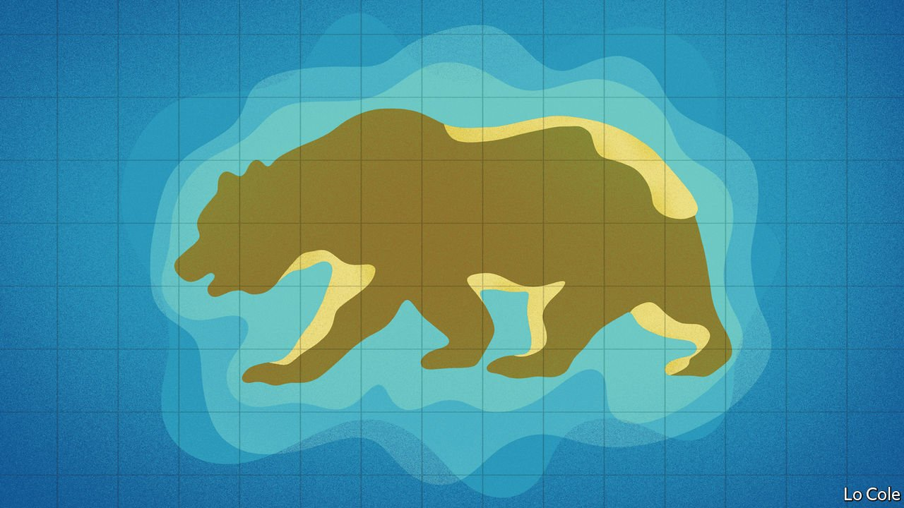

###### Bello

# Russia has become a crucial ally of Venezuela’s dictatorship 

##### Vladimir Putin has propped it up with some 200 agreements 

 

> Jan 29th 2022 

IT RAISED EYEBROWS in the West. Amid talk of war in Ukraine, Kremlin officials this month dangled the possibility that, if NATO did not stop protecting countries close to Russia, Russia might deploy forces to Venezuela and Cuba. Jake Sullivan, the United States’ national security adviser, dismissed such talk as “bluster”. A large-scale deployment is indeed unlikely. Nonetheless, Russia’s role in the region is troubling. For the past 15 years or so it has propped up crooked dictatorships in Venezuela and Nicaragua. Vladimir Putin relishes a chance to needle the United States and look mighty on Russian television.

On three occasions since 2008 Russia has sent a pair of Tupolev bombers, capable of carrying nuclear weapons, halfway around the world to Venezuela for missions that have lasted around a week. They have twice strayed into the airspace of Colombia, an ally of the United States. In 2008 Russia sent the Peter the Great, a nuclear-powered guided-missile cruiser, and several other ships for exercises with the Venezuelan navy.


These deployments all coincided with moments of tension with the United States over Russian attacks on Georgia and Ukraine. Their purpose is “symbolic reciprocity”, says Vladimir Rouvinski, a Russian academic at Icesi University in Cali, Colombia. “You, the United States and Europe, do things in Ukraine. We will do things in your zone of influence.”

Perhaps the closest the world ever came to armageddon was in 1962 when the Soviet Union installed nuclear missiles in Fidel Castro’s Cuba, only 100 miles or so from Florida. They were withdrawn in return for an American guarantee not to invade Cuba, which remained a subsidised satellite of the Soviet Union until that empire’s collapse in 1991. When Mr Putin came to power in Russia a decade later one of his first acts was to shut a Soviet-era listening post on the island in a gesture of détente.

Hugo Chávez, Venezuela’s late leftist and anti-American strongman, offered Mr Putin a way back into Latin America. When Chávez was flush with oil money he spent some $6bn on Russian armaments, including 24 Sukhoi fighter jets, 50 helicopters, tanks, anti-aircraft missiles and 100,000 Kalashnikov rifles. That was the start of what has become a broad and deep relationship. Between them Chávez and Nicolás Maduro, his successor, have signed some 200 agreements with Russia.

For Mr Putin Venezuela has become a colourful example of his claim to be restoring his country’s global influence. He lacks the cash to be a paymaster in Latin America. But he is a source of short-term loans, limited investment, arms sales and diplomatic support for anti-American regimes. In 2018 Mr Maduro staged an illegitimate election and the democratic world recognised Juan Guaidó, the opposition speaker of the legislature, as president. It looked as if Mr Maduro might fall, as President Donald Trump piled on sanctions and mused about military intervention. Mr Putin came to Mr Maduro’s aid, deploying a team of around 100 uniformed Russian military advisers to maintain the missile systems, advise on drone warfare and act as a geopolitical tripwire. They have stayed.

In 2017 Russia opened a fortress-like building in Managua, Nicaragua’s capital, officially to train Central American police to curb drug-trafficking. It is run by Russia’s interior ministry. Nicaragua’s opposition believes it to be an intelligence post conducting surveillance for Daniel Ortega, the country’s dictator. Mr Putin’s ties with Cuba are more distant.

Russia has suffered setbacks in Venezuela. The relationship has been marked by mutual corruption: a Kalashnikov factory announced in 2006 has still not been built, and the money for it vanished. Rosneft, a Russian oil giant, secured stakes in Venezuela’s oilfields only to announce its withdrawal from the country in 2020 to avoid American sanctions. Its assets there were transferred to the Russian government.

Mr Putin wants to be seen as the leader who made Russia a great power again. So he may be reluctant to retreat from Venezuela. But he lacks the resources to turn it into a successful satellite. His interventions have been cheap. Though there has been talk of Russia setting up a base at La Orchila, a Venezuelan island in the Caribbean, that would be too costly, thinks Mr Rouvinski. Some say Russia would welcome a negotiated solution to Venezuela’s political conflict, provided that the interests it has acquired in the country were respected. But that prospect depends on what happens in Russia’s own neighbourhood.

Read more from Bello, our columnist on Latin America: (Dec 11th 2021) (Nov 27th 2021) (Nov 20th 2021)

