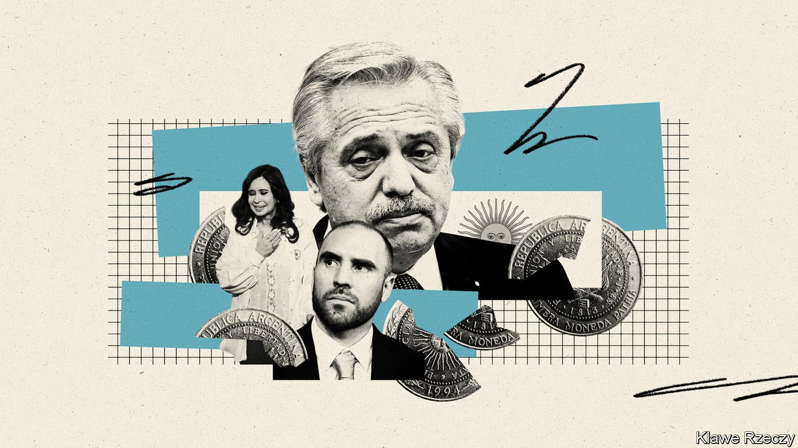
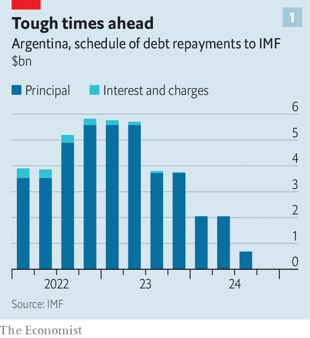
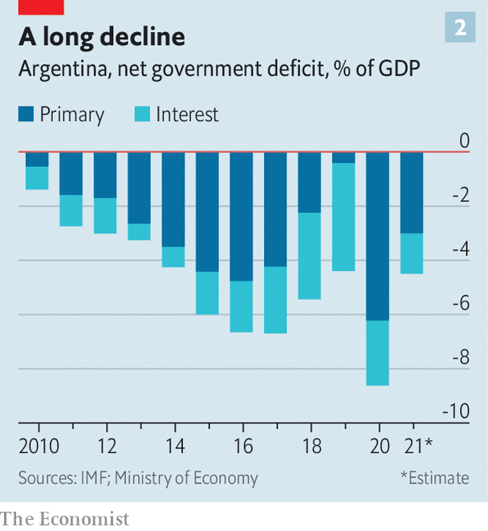

###### Mad existence

# The IMF cannot solve Argentina’s dysfunction 

##### Only a change in Argentine policies can wrench the country from its century-long malaise 

 

> Jan 29th 2022 

Editor′s note: On January 28th, after this story was published, the government of Argentina announced that it had reached an understanding with the . The plan, which will be implemented over the next two and a half years, foresees a reduction in the fiscal deficit from 3% in 2021 to 0.9% by 2024, in part through more efficient tax collection. Any actual deal must be approved by Argentina′s Congress.

IF YOU LEAVE Argentina for ten days, the joke goes, everything changes. Come back in 20 years, however, and everything seems the same. Two decades ago an IMF programme failed to stop an economic crisis in Argentina. Between 1998 and 2002 GDP tumbled by nearly 20%, and the government defaulted on its debt for the seventh time in its history. Today Argentina's future once again hinges on negotiations with the IMF. So far talks are not going well.

In 2020 Argentina’s government defaulted on its debt once again, leaving a $57bn loan provided by the IMF in 2018 in a state of limbo. The government is now negotiating with the fund, seeking an agreement which would revive the loan arrangement and delay repayments.


Over the next two years, Argentina must make payments to the IMF totalling about $40bn or risk becoming a financial pariah (see chart 1). That is money the country does not have. And the backdrop to the negotiations is forbidding. The peso on the parallel exchange market is now worth half the official rate. Annual inflation is above 50%.

 


After a difficult start to the millennium, Argentina’s economy enjoyed a decade of strong growth, powered by a global boom in trade and commodity prices. But from 2012 onwards the market for commodities softened. Frustration with economic stagnation contributed to the election, in 2015, of Mauricio Macri, a liberal-minded politician. His victory ended years of rule by Peronists, members of a populist movement that has dominated Argentina for decades.

Mr Macri’s government pursued some reforms. But structural problems continued to impede growth. And the government’s gradual approach to fiscal consolidation meant that Argentina relied heavily on capital markets to fund a budget deficit which ran at over 5% of GDP through his first three years in office. In 2018, as rising interest rates in the United States contributed to a tightening of global financial conditions, markets grew wary of the state of Argentina’s finances, and Mr Macri turned to the IMF for help.

The loan the IMF agreed to provide—an initial $50bn, subsequently raised to $57bn, of which $44bn was ultimately disbursed—was the largest in the fund’s history. It was intended to reassure markets and thus to restore the flow of private credit; the programme’s architects expected that much of the available money might never need to be handed over.

But markets remained skittish. Signs of stabilisation evaporated with Mr Macri’s loss to Alberto Fernández, a Peronist, in elections in 2019. The peso tumbled, inflation surged and in 2020 the new government began working to restructure nearly $100bn in privately held foreign-currency debt. It cancelled the deal with the IMF.

 


The current negotiations come at a difficult time. A boom in commodity prices in early 2021 provided much-needed relief to the Argentine economy. But GDP remains about 8% below the level of 2017. A slowdown in global growth this year will weigh on commodity prices. As central banks around the world raise interest rates to tame inflation, financial conditions look ever less forgiving. And the government has continued to run hefty budget deficits, which it funds by printing money (see chart 2). In 2021 the central bank printed the equivalent of 4% of GDP.

A self-lacerating evaluation of the 2018 deal, published by the IMF in December, fuelled notions that the fund deserves most of the blame. The potential costs of failed negotiations to the IMF have further contributed to the government’s recalcitrance. Because the fund stands to lose money and face, any attempt to drive a hard bargain will be less credible, the thinking goes.

Although the current negotiations are important, Argentina’s economic ills pre-date the loan in 2018. Populist politicians have long meddled in the markets. After the price of meat rose last year with inflation, beef exports were banned. When the ruling coalition lost a primary election in September, the government slapped price controls on more than 1,400 products, from shaving cream to cat food. Its budgets are distorted by sops to special interests. Public sector employment has ballooned over the past decade while the private sector has shrunk. Regressive utility subsidies amount to 1.5% of GDP for electricity alone.

The IMF cannot simply demand reforms to address such problems. The more it asks of Argentina, the less confident it can feel that conditions will be met. However, the fund seems to have insisted on an improvement in the fiscal outlook. Last year’s economic rebound helped to shrink Argentina’s primary budget deficit (ie, before interest costs) from more than 6% of GDP in 2020 down to 3%.

Martín Guzmán, the economy minister, insists that further reductions should occur at a slow pace, with the primary deficit closed by 2027. That is too slow for the fund’s tastes, and involves too many years of government spending financed by the printing presses.

On top of this, the political class appears too busy squabbling to deal with bigger issues. The government has failed to unite in negotiations. Mr Guzmán seems to spend more time trying to convince the powerful Peronist vice-president, Cristina Fernández de Kirchner, of the need for a deal than writing a credible programme. On January 18th Ms Kirchner wrote on her website that the “Macrista pandemic” (ie, the rule of Mr Macri) had been worse than covid-19. She blames the Peronists’ loss in recent mid-terms—the worst defeat in 40 years—on spending cuts. The temptation to spend ahead of next year’s presidential election could mean that even if a deal is signed, it could quickly veer off track.

Meanwhile the centre-right opposition, whose leaders are fighting over who will be the presidential candidate, have refused to meet Mr Guzmán, arguing that he hasn’t presented a credible economic plan. Even if they win the presidential race, it is not clear they would make serious changes. Federico Sturzenegger, a former central-bank chief, notes that the three non-Peronist administrations that have been in power since the return to democracy in 1983 have failed to stick to fiscal discipline or rein in interest groups.

With deadlines looming, the government is flailing. On January 26th Clarín, an Argentine newspaper, reported that the government had warned that it may miss two payments to the IMF, due on January 28th and February 1st, totalling $1.1bn. It has reportedly asked China for an increase in the size of a standing arrangement with the Chinese government, by which Argentina swaps its currency for an equivalent amount of yuan—a globally accepted reserve currency—thus bolstering its foreign-exchange reserves. Mr Fernández is due to visit Beijing in February.

Such shenanigans are no substitute for fiscal reform. Achieving a budget balance in a difficult post-pandemic environment will not be easy. High inflation is already eroding the real value of some social spending. A new IMF deal without a commitment to reform and near-term budget balance would buy a little time. But it would not do much to boost growth or to win the confidence of investors.

Falling into arrears with the IMF, by contrast, would leave Argentina cut off from other multilateral lenders, who are one of its few remaining sources of credit. In the worst-case scenario, a default could trigger a panic similar to 2001. The outlook is grim. And carries a whiff of déjà vu. ■

