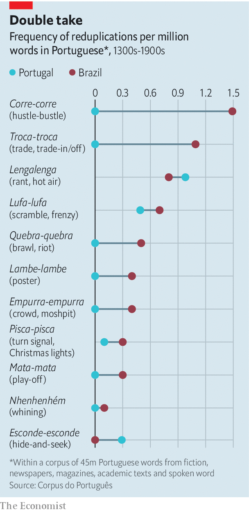

###### Talk talk

# What a rare word for “sex” reveals about Brazilian Portuguese 

##### Brazilians innovate by duplicating 

 

> Jan 29th 2022 

THE SONG, a hit at Brazil’s carnival in 2014, starts like any other. A man wonders whether a woman will still love him after he loses his job, his house and his car. But then the chorus gets weird. If the woman stays, the singer belts over a thumping drum, it is because she likes his “lepo lepo”. Most Brazilians had no idea what “lepo lepo” meant.

A talk-show host put the question to strangers on the street. “I use it a lot, but I don’t know,” one man admitted. Some people guessed that it was slang for penis (it is actually slang for sex or sexual prowess). It turned out that the phrase was unfamiliar outside Bahia, the north-eastern state where Psirico, the band, is from.


No matter. Its construction, a loose example of what linguists call reduplication, a way of forming words in which an existing word or part of a word gets repeated, is common in Brazilian Portuguese. “We play around with words, and end up making new ones,” says Márcio Victor, the lead singer of Psirico.

 


In most cases, the third-person singular form of a verb is repeated to form a noun with a related meaning. For example, “empurra” (she pushes) becomes “empurra-empurra” (jostling crowd, or moshpit). “Lambe” (he licks) becomes “lambe-lambe” (poster). In other cases, the last syllable of a noun is replicated to add intensity. “Choro” (crying) becomes “chororô” (cry-fest or a crybaby).

In many languages reduplication is used to form plurals (in Indonesian, “rumah” means house; “rumah-rumah” houses). In spoken English, it often serves as clarification or to intensify the meaning. The origins of reduplication in Portuguese are hard to pin down. According to a paper in 2019 by Antonia Vieira, a Brazilian linguist, the first Portuguese dictionary, compiled by a priest in the 1700s, contains 44 examples. Many, however, are what Gabriel Araújo of the University of São Paulo calls “pseudo-reduplication”, in which the base that is doubled is an onomatopoeic sound rather than a word with meaning, resulting in words like “pi-pi”, birdcall, and “zum-zum”, the buzz of mosquitoes.

In Brazilian Portuguese, reduplication appears to have produced more, and more varied, words than its European counterpart. In addition to the onomatopoeia of everyday speech, Brazilians use reduplication when talking to children (“au-au” has become a synonym for dog) and as pet names for relatives (“vovó” is a nickname for “avó”, or grandmother; “titi” for “tio”, or uncle). Some examples are thought to be the result of exposure to hundreds of indigenous and African languages, in which reduplication is common.

The urge to reduplicate may reflect a culture that is younger, less conservative and more open to experimentation, some surmise. Reduplication came in handy to name new things in a new world. For example, in the Maré favela in Rio de Janeiro in the 1940s, residents attached a rubber tyre to a wooden barrel to bring water from Guanabara bay and called it a “rola-rola”, from the verb “to roll”. “Brazilians use language to make a hard life more fun,” says Mr Araújo.

Reduplication, a mostly oral tradition, was hardly studied in Brazil until the turn of the 21st century. But in the past two decades it has started to get more attention. It helps that new reduplicated words appear all the time, while old ones change their meaning or gain currency.

The election in 2018 of Jair Bolsonaro, Brazil’s populist president, helped to popularise “mimimi”, an onomatopoeic phrase he uses to mock wokeness and concerns about covid-19. On January 17th a Brazilian newspaper came up with “mente-mente”, from the verb “mentir” (to lie) to criticise the president.

And as YouTube influencers from Brazil become ever more popular, Brazilian Portuguese has begun to creep across the Atlantic. In November a Portuguese news paper ran a story with the headline: “There are Portuguese children who only speak Brazilian”. Reduplication, no doubt, is among the peeves of their parents. ■

