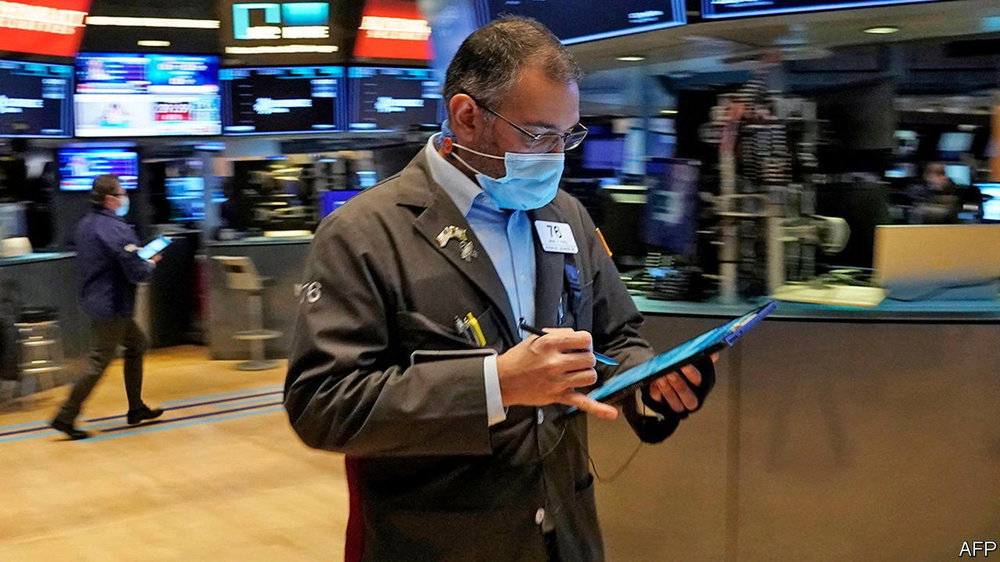
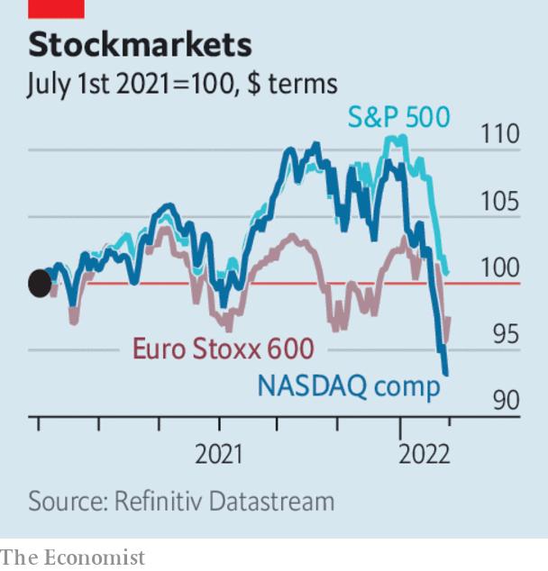

###### The world this week

# Business 

#####  

 

> Jan 29th 2022 

 


The world’s stockmarkets continued to slide this week, as investors prepared for tighter monetary policy. By January 26th the S&amp;P 500 index had dropped by 9% since the start of the year. Share prices elsewhere have been falling too. The NASDAQ composite, a tech-heavy index, has dropped more sharply than the broader market. Higher interest rates would lower the value that investors place on the future profits of speculative firms.


America’s Federal Reserve signalled that it will indeed raise interest rates in March to try to bring inflation under control. That will be the first increase since 2018. The Fed also signalled that it will wind down its bond-buying programme, which was expanded during the pandemic.

Cryptocurrencies have also experienced a sell-off recently, partly caused by growing scrutiny from regulators. Bitcoin sank to a six-month low this week. It has lost roughly half its value since November. The price of smaller currencies, such as ethereum and litecoin, also fell.

Microsoft said that its fourth-quarter sales grew to a record $51.7bn, up 20% from the same period last year. Net income rose to $18.8bn. The results were fuelled by its gaming and Windows software units. But even though they beat analysts’ forecasts, the firm’s share price fell after the announcement. It later recovered when the firm published rosy forecasts for its cloud division.

Boeing reported a loss of $4.3bn for 2021, its third annual loss in a row. That is partly because of a charge of $3.5bn it had to pay to compensate customers for the delays in delivering its 787 Dreamliner. Factory defects and regulatory problems have slowed production.

Results were also gloomy for Cathay Pacific, Hong Kong’s flag-carrier. It said it expects losses to reach up to HK$6.1bn ($783m) in 2021. Although that is an improvement on its HK$21.6bn loss in 2020, the firm continues to suffer under the territory’s severe border restrictions.

Feeling the heat

As part of a firm-wide restructuring plan Unilever, a consumer-goods giant, said that it will axe about 1,500 management jobs. Pressure to improve performance has been increased of late by Trian, an activist hedge fund which has built a stake in the company, and by the firm’s failed bid to buy the consumer-health business of GlaxoSmithKline, a British drugmaker.

Tesla reported record net profits of $2.3bn in the fourth quarter of 2021. But Elon Musk, the electric-car maker’s boss, warned that supply-chain woes, such as the shortage of semiconductors, would probably weigh on the firm’s results during 2022. He noted that Tesla’s factories have been running below capacity for several quarters.

Samsung, a big South Korean chipmaker, reported its best-ever quarter. Net profit rose to 10.8trn won ($9bn), up 64% compared with the same period last year. The results of Intel, another big chipmaker, were less impressive. Fourth-quarter revenues edged up to $20.5bn, but net income fell by 21%. Both firms plan to increase investment this year to meet surging chip demand.

After resolving a row with Mongolia’s government Rio Tinto, the Anglo-Australian miner, said it will push ahead with the expansion of a large copper mine in the country. Wrangling over costs had put the project on hold. A few days earlier Serbia’s government revoked Rio’s licence to build a new lithium mine in the country, following protests by environmentalists.

In Japan the inflation rate rose in December to its fastest pace since the start of the pandemic. Core inflation, which excludes the cost of fresh food, increased by 0.5% compared with the same month a year earlier. The rise was mostly down to higher energy prices.

South Korea’s economy grew by 4% in 2021, the fastest pace of expansion in 11 years. It was helped by a jump in exports and construction activity, which offset a slow recovery in the covid-hit service sectors.

The IMF predicted that the world economy will grow by 4.4% this year. That is a downward revision from its projection in October of 4.9%. It is also a slowdown from last year’s growth rate of 5.9%. The forecast reflects a downgrade in expected growth in America, because of supply-chain woes and monetary tightening, and in China, because of a covid resurgence and financial stress in the property market.

Buying the dip

The IMF also urged El Salvador to reverse its decision to make bitcoin legal tender. Last year the country allowed consumers to use the cryptocurrency in any transactions, in a plan spearheaded by Nayib Bukele, the country’s 40-year-old president. Mr Bukele responded to the suggestion by posting a GIF on Twitter depicting the IMF as Homer Simpson.

