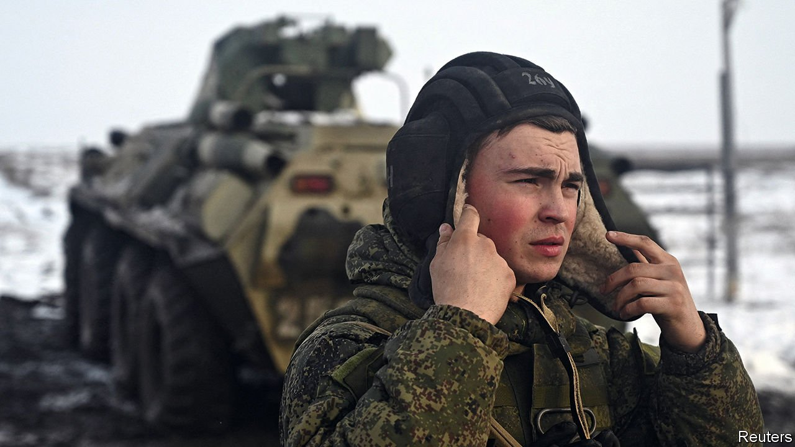
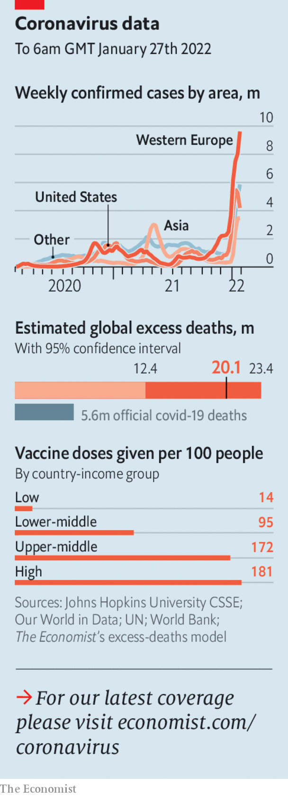

###### The world this week

# Politics 

#####  

 

> Jan 27th 2022 

Russia moved yet more troops close to its border with Ukraine. Vladimir Putin’s party claimed, without evidence, that Ukraine’s government was planning to attack Russian-speakers in eastern Ukraine, and appealed for Mr Putin to lend them military assistance.


Western diplomats warned Russia of severe consequences if it invades Ukraine. High-level diplomatic talks yielded no progress in defusing tensions, and America and some other countries told embassy staff to leave Ukraine. America and Britain sent more defensive equipment to help Ukraine defend itself against a possible attack. NATO beefed up its defences of member states in Russia’s shadow. America promised to help Europe secure more gas, in case Mr Putin decides to restrict supplies.

An electoral college consisting of 1,009 MPs, senators and representatives of regional bodies set about choosing Italy’s next president. The process, which consists of a series of secret ballots held once a day, could go on for some time. Though the president’s role is partly ceremonial, the post carries the responsibility of dissolving parliament and appointing new governments.

Stephen Breyer, one of three liberal justices on America’s Supreme Court, will retire at the end of the court’s current term. President Joe Biden will nominate his successor, thereby maintaining the court’s current 6-3 split between conservatives and liberals. Progressives had pressed Justice Breyer, aged 83, to step down to ensure his replacement by a Democrat-controlled Senate. Mr Biden has promised to nominate a black woman for the vacancy.

Britain’s wait for the results of an inquiry into parties held at the prime minister’s office and residence during covid-19 lockdowns dragged on. Police are also investigating whether those events broke the law. It emerged that another bash took place in Downing Street, this time for Boris Johnson’s birthday. Some Conservative MPs have submitted letters of no confidence in Mr Johnson, though not yet enough to trigger a leadership ballot.

Carrie Lam, Hong Kong’s chief executive, defended a decision to cull nearly 2,000 pet hamsters after several in a pet shop tested positive for covid-19. Meanwhile members of the territory’s European chamber of commerce have speculated that the city may not reopen to outsiders until early 2024, according to a report seen by Reuters.

Citius, altius, coronavirus

Xi Jinping, China’s president, met Thomas Bach, the president of the International Olympic Committee, in a rare face-to-face meeting to discuss how to maintain coronavirus prevention policies during the forthcoming Winter Olympics. The games, which start in Beijing on February 4th, are testing China’s strict zero-covid policy, which is already coming under strain from the Omicron variant.

Thailand became the first Asian country to decriminalise marijuana. The health minister said on January 25th that the government would drop the plant from its list of controlled drugs, allowing people to grow it at home.

Pakistan appointed Justice Ayesha Malik to the Supreme Court, the first time a woman has ascended to that position. Her appointment is noteworthy in a country where only 17% of judges are women, and only 4.4% of those in higher courts.

Lourdes Maldonado, a journalist, was shot dead in Tijuana. The motive was unclear. She was the third reporter to be killed in Mexico this year. Most such murders go unsolved and unpunished. Mexico’s drug gangs, which dislike investigative scrutiny, pull strings in many local governments.

After repeated denials, the Cuban regime finally acknowledged that it is holding mass trials of 700 protesters, including some as young as 16. People who took part in protests last year against the communist regime have been given unusually harsh sentences. Several activists were also arrested ahead of a demonstration in support of political prisoners.

Guatemala’s highest court ruled that five former paramilitary soldiers were guilty of raping 36 indigenous women during the civil war. The attacks took place in the 1980s.

At least two people were killed in Haiti, after a 5.3-magnitude earthquake hit the south-west part of the country. The country has suffered a string of natural disasters. In August an earthquake killed more than 2,000 people.

 


Army officers seized power in Burkina Faso, dissolving the government, suspending the constitution and deposing the president, Roch Kaboré. Lieutenant-Colonel Paul-Henri Sandaogo Damiba took his place. The coup threatens to undermine efforts to fight jihadists in the Sahel. Recent military takeovers in neighbouring Mali, which were supposed to restore order, failed to do so.

Lazarus Chakwera, the president of Malawi, dissolved his cabinet after three ministers were accused of corruption. The shakeup came after Mr Chakwera was accused by church leaders of failing to honour his campaign pledge to fight graft.

Eight people were killed and 50 injured in a crush outside a football stadium in Cameroon ahead of a football match between the host and the Comoros in the Africa Cup of Nations.

The Syrian Democratic Forces, a Kurdish-led militia, regained control of a prison in north-eastern Syria that had been seized by Islamic State. The jihadist group freed hundreds of inmates, some of whom are still on the loose. Dozens of people were killed in the fighting.

An air strike that hit a detention centre in Yemen killed more than 80 people. The attack was carried out by the Saudi-led coalition fighting the Houthi rebels in Yemen. The Houthis responded by launching missiles and drones at the United Arab Emirates, which is a member of the coalition.

