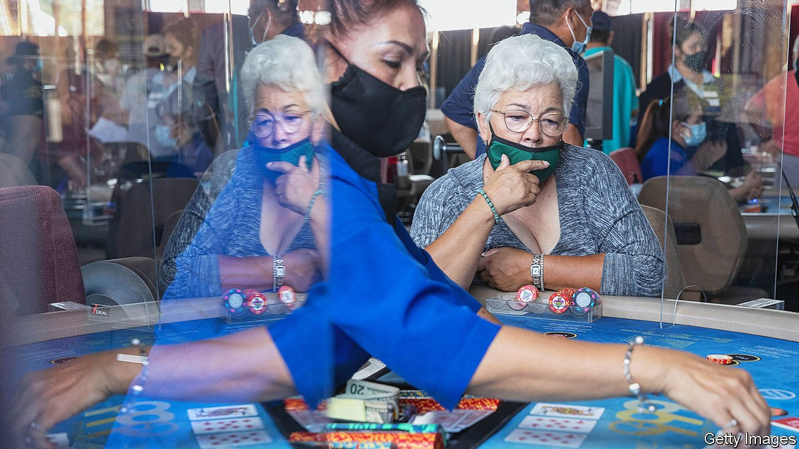

###### Sports betting

# A ballot fight over sports gambling in California has high stakes 

##### Small casinos may well lose out 

 

> Jan 29th 2022 

BLINK AT THE wrong moment while driving south on the I-605 into Long Beach and you might miss it. A sign advertising the Gardens Casino is one of the few markers for the town of Hawaiian Gardens, a square mile nestled at the bottom of Los Angeles County. Inside the casino, hundreds of tables offering poker, baccarat and other games are filled with Angelenos there to eat, drink and gamble. The casino accounts for 70% of Hawaiian Gardens’ tax revenue. The prospect of legal sports gambling could have been a boon for small California towns supported by such card rooms, licensed to play select games. Instead, it could pose an existential danger.

After years of failure by the state legislature in Sacramento to forge a compromise, the battle to legalise sports gambling in California has shifted terrain. Now large online-gambling websites, Native American tribes and the card rooms are taking advantage of California’s permissive referendum rules to sponsor four measures, aiming to qualify them for the ballot in November. Each measure would favour one group at the expense of the others. Rather than usher in a new, competitive market, the spoils look likely to be captured by just a few winners.


The Supreme Court annulled the federal prohibition on sports gambling in 2018. States raced to write the practice into law, eager for new tax revenue. Today, 30 states and the District of Columbia have such laws, with three more set to join them. But California is the best prize: analysts project over $3bn in annual revenue there. The Native American tribes and the card rooms are desperate to lure young sports gamblers, lest they are poached by the gambling sites. For all players, this is a big pot.

The only measure that has qualified for the ballot so far is one backed by California’s Native American tribes. Gambling is a critical source of tax revenue for them, as well as the basis of their power in state politics. The measure would give them a near-monopoly on in-person sports gambling, extending their dominance of the industry. But it is another provision, allowing private citizens to sue casinos and opening the prospect of crippling damages and injunctions, that card rooms fear most. The card rooms suspect their longtime tribal rivals aim to drive them into bankruptcy.

A smaller group of tribes has sponsored another measure that would allow them to offer sports gambling online. Although the tribes may need the technical expertise of the online operators, they could name their price to would-be partners. Frederick Boehmke of the University of Iowa reckons both tribal measures are a gamble that Californian voters’ past sympathy for Native American interests will once again translate into support at the polls.

Yet the tribes are not the only ones hoping to keep the market for themselves. Large online-gambling websites, including DraftKings and Bet MGM, have gone all-in on a third measure. It would allow sports wagers to be run only by the websites and the tribes. This would require non-tribal online operators to pay licensing fees of $100m. Conveniently, only the measure’s sponsors could afford these sums. Nine months before the election they have already committed more than $100m to the effort, just under half the total amount Uber, Lyft and others spent on a ballot fight in 2020, the most expensive in California’s history.

The small cities that host card rooms are betting on a fourth measure. Becca Giden of Eilers &amp; Krejcik Gaming, a research firm, reckons this is the most liberal of the bunch, opening both online and in-person sports gambling to card rooms, the tribes, racetracks and professional sports leagues; online operators would need to find a partner among one of these. But the cities’ principal aim is to stymie the tribes. For Keith Sharp, general counsel of the Gardens Casino, the opportunity of sports gambling is less important than the threat of the measure that has already qualified for the ballot: “If it weren’t there, we would just stand on the sidelines.”

For the tribes and cities that depend on tax receipts from gambling, the stakes could not be higher. Victor Farfan, a lifelong resident of Hawaiian Gardens and a city-council member, remembers what the town was like before the casino arrived in 1997, and how far it has come since. “When I was growing up, it was a tough neighbourhood plagued by gang violence,” he says. “If the ballot goes against us, it could put Hawaiian Gardens back ten years.” ■

For exclusive insight and reading recommendations from our correspondents in America, , our weekly newsletter.

