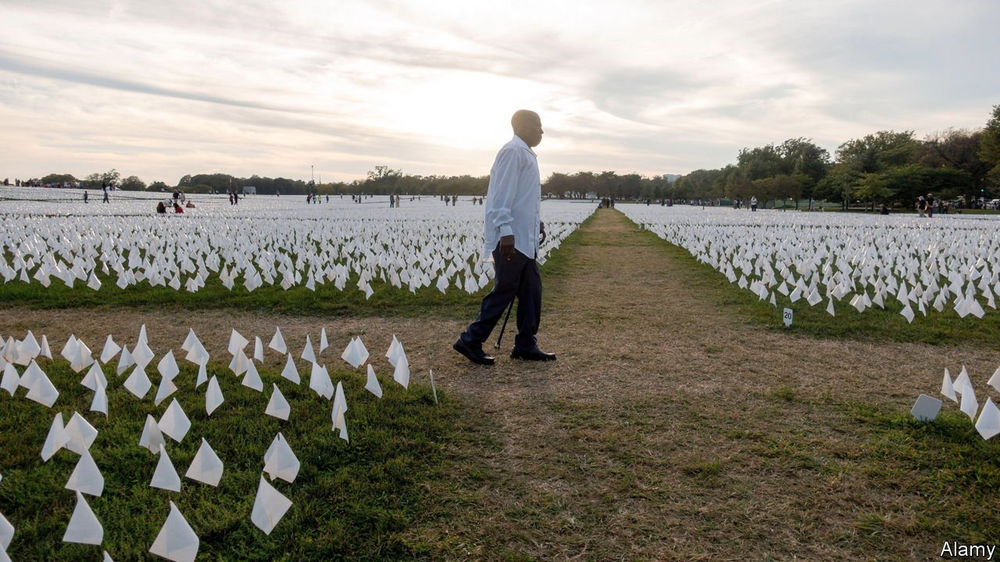

###### Autopsies and covid-19

# America’s elected coroners are too often a public-health liability 

##### The politics of death 

 

> Jan 29th 2022 

IN FLU SEASONS past, James Gill never worried about how the death certificates his office produced might be received by grieving families. As Connecticut’s chief medical examiner, he oversees investigations for about two-thirds of all deaths in the state, and his work is not usually the stuff of controversy. Covid-19 changed that. Relatives sometimes question whether covid was the cause of their loved one’s demise; some want the virus removed from the death certificate. Dr Gill, a civil servant, is insulated from such pressure. That is not so in many parts of America.

Death investigation in America falls into two broad categories. Medical-examiner systems are run by unelected technocrats, physicians who probe deaths and draft certificates. Coroner systems are led by elected officials, who may or may not be medical doctors. Both are supported by forensic pathologists, specialists in autopsies.


About 60% of Americans live under medical-examiner systems, according to Jeffrey Jentzen, a professor at the University of Michigan and author of a history of death investigation. Coroners dominated during the early years of the republic, but were prone to corruption. Undertakers, law-enforcement officials and insurance agents all stood to gain by taking on a second job as a coroner. Issuing death certificates provided many potential avenues for profit, from determining insurance payouts to covering up evidence of a crime.

A push to replace coroners with medical examiners gained traction in the early 20th century, before losing momentum. Coroners attract little attention—about 80% ran unopposed in the latest electoral cycle. But polarisation has created more competition. When Bobbi Jo O’Neal ran for coroner in South Carolina’s Charleston County in 2020, after two decades as a nurse conducting death investigations, she faced a less qualified opponent. Yet as a Republican in an increasingly liberal area, she barely scraped through.

Covid-19 has put death investigators under pressure. With no national supervision, and often minimal guidelines from states, they were left to their own devices. Carl Schmidt, medical examiner for Wayne County in Michigan, says his office decided that if they did not see symptoms of acute respiratory distress, coupled with an inflammatory response signalling a viral infection, the death would not be attributed to covid-19. Others were less meticulous. Dr Schmidt recalls one coroner giving a presentation arguing that conducting covid-19 autopsies was unnecessary. The varied quality of autopsies is one reason why measuring excess deaths gives a better overall gauge of covid’s toll.

But it is the politicisation of the pandemic that has most exposed the weaknesses of coroners in America. Coroners reliant on voters who are sceptical about covid have not been as scrupulous as their medical-examiner peers. One coroner in Missouri candidly told the press that he strikes covid-19 from the death certificates at the request of the family of the deceased. Despite increased demand for their services, coroners have struggled to secure extra resources. Dr Schmidt observes that “some autopsies are done in a garage with a single light bulb, like a Quentin Tarantino movie.”

Excess deaths may be a superior tool for a broad covid count, but death certificates from autopsies provide critical information for understanding the virus. America’s ability to provide reliable ones will remain patchy and poorly resourced. Coroners were “already overwhelmed with the opioid epidemic”, recalls Dr Gill, “and the cavalry wasn’t coming then.” ■

Dig deeper

All our stories relating to the pandemic can be found on our . You can also find trackers showing ,  and the virus’s spread across .

