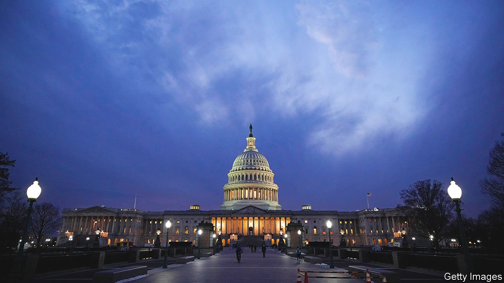

###### Insider trading

# Claims of insider trading in Washington spur efforts to stop it 

##### A backlash against Capitol gains 

 

> Jan 29th 2022 

ATTENTION TO LAWMAKERS’ finances is not new. What is surprisingly recent is a ban on . It was outlawed only in 2012, on the heels of the financial crisis, through the aptly named STOCK Act (Stop Trading on Congressional Knowledge). But as recent allegations of foul play show, the issue is far from resolved. Two newly introduced bills hope to put an end to it.

Before the STOCK Act, trading on non-public information obtained as a sitting member of Congress was not an offence. The act banned it and requires members of Congress and their senior staff to disclose financial holdings, sales and purchases within a 30-day notice period. But enforcement is flawed. Deadlines frequently pass without members disclosing their transactions: recent research by Business Insider, a financial-news site, counts 54 tardy lawmakers in 2020 and 2021. Violations are not publicly reported, and neither are payments of the initial fine of a paltry $200.


No member of Congress has been prosecuted under the STOCK Act. Court filings made public in October suggest that a probe by the Securities and Exchange Commission into allegations against Senator Richard Burr is still going on. This concerns a suggestion that in February 2020 Mr Burr ordered stock sales of up to $1.7m after a briefing on the threat of the fledgling covid-19 pandemic.

Trading scandals are not limited to Congress. Beginning in September 2021, the Federal Reserve drew criticism as the Dallas Fed’s president, Robert Kaplan, and the Boston Fed’s president, Eric Rosengren, and vice-chairman, Richard Clarida, made large trades at a time when they were involved in wrangling over policy in the early stages of the pandemic. Mr Clarida moved between $1m and $5m out of a stock fund before repurchasing from the same fund just three days later—just as the Fed was poised to announce a large stimulus. All three ultimately resigned.

Two senators have introduced bills to limit congressional trading. Jon Ossoff, a Democrat elected in Georgia in 2021, introduced the Ban Congressional Stock Trading Act on January 12th with Mark Kelly, a Democratic senator for Arizona. The next day Josh Hawley, a Republican from Missouri, introduced his Banning Insider Trading in Congress Act. He had previously been in talks with Mr Ossoff about a joint bill. The bills barely differ, mandating not just members of Congress themselves but also their spouses and, in Mr Ossoff’s case, dependent children to place any individual stocks in a “qualified blind trust” upon assuming office. Both bills foresee large financial penalties for non-compliance.

Through a qualified blind trust an independent trustee would control any assets a member of Congress or their family may hold, thus mitigating the risk that they will abuse access to information. Mr Ossoff, who during his election campaign accused his opponent of profiting from trades early in the pandemic, placed his stocks in a blind trust soon after taking office. Only nine other sitting members of Congress have done the same.

These proposed rules differ markedly from the ones the Fed has now implemented. It has put in place a complete ban on purchasing individual stocks. Should Fed officials wish to sell already-purchased shares during their time in office, they will have to give 45 days’ notice. This way, the Fed hopes to prevent officials from abusing their knowledge of monetary policy.

They will still be allowed to buy and sell diversified mutual and exchange-traded funds. “Frankly, I’m mystified by the focus on individual stocks,” says Simon Johnson, of the MIT Sloan School of Management. “Fed professionals and congresspeople have plenty of access to policy changes that can impact the market as a whole.”

Donna Nagy, a law professor at Indiana University, agrees. “Insider trading is already illegal,” she notes. “What is not illegal is owning stocks that are directly and substantially affected by policy the Congress member shapes.” At least 15 lawmakers on the House and Senate Armed Services Committees hold stock in defence contractors. John Hickenlooper, who serves on a Senate Subcommittee for Communications, Media and Broadband, holds between $250,000 and $500,000 each in Alphabet, Amazon and Facebook stock.

“The attention on trading obscures the fact that ownership itself can create conflicts of interest,” Ms Nagy argues. She points to the stringent regulation placed on federal judges, which requires them to recuse themselves from cases if they are a shareholder in any of the involved parties. And, she adds, the assets initially placed in a blind trust are decidedly not blind.

Among Democratic voters, 70% agree that members of Congress should be banned from trading individual stocks. Even more Republicans, 78%, say the same. Within Congress, both sides of the aisle seem in agreement. And yet any bill has large hurdles to surmount. Nancy Pelosi, the House speaker, opposes a ban on congressional trading. She has said that spouses should be able to take part in a free-market economy, stating that she had trust in her members. Overcoming the speaker’s opposition is a tall task, especially with two competing bills. But pressure is building: on January 24th a letter signed by 27 members of Congress (25 Democrats and two Republicans) urged her and the Republicans’ leader in the House, Kevin McCarthy, to bring the legislation to the floor. ■

For exclusive insight and reading recommendations from our correspondents in America, , our weekly newsletter.

