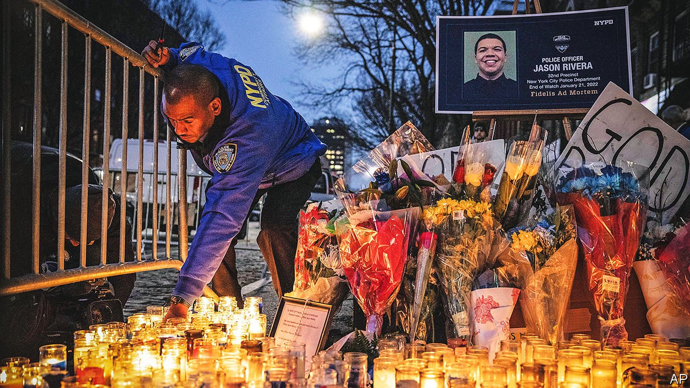

###### New York gun violence

# Eric Adams unveils his blueprint to help New York tackle violence 

##### It will involve more than just robust policing 

 

> Jan 29th 2022 

“IT HAS BECOME like the old West, shoot-outs at high noon,” says Khayan Reed, a violence-disrupter in the Bronx. He works with Stand up to Violence (SUV), a programme begun by Jacobi, a city-run hospital. SUV considers violence a disease that can be cured through intervention. Until the pandemic hit, it was seeing success. Gun violence in its targeted area had decreased. Now, violence is pervasive. “There’s just so many guns,” says Carjah Dawkins-Hamilton, SUV’s director.

New York City is nowhere near the 2,000 murders a year it saw in the early 1990s (it had 488 in 2021). But some neighbourhoods are decidedly unsafe. This month five police officers have been shot, two of them fatally. Several people were pushed onto the subway tracks, and one of them killed. A teenager was killed while working at a Burger King. An 11-month-old baby was hit in the face by a stray bullet.


“Gun violence is a public-health crisis. There’s no time to wait,” says Eric Adams, the new mayor. On January 24th he released his blueprint for combating gun violence. Mr Adams is a former police captain, but his plan goes beyond policing. Every city agency will be involved in public safety, even rubbish collectors. “If you live in a community that is filthy,” says Erica Ford, founder of Life Camp, another violence-intervention group, “you think you’re filthy, which helps to reinforce negative behaviour.” Each agency will have an anti-gun-violence co-ordinator. Mr Adams intends to increase the number of hospital-based intervention programmes, such as SUV. He will redirect resources to those in urgent need of mental-health care.

Next week President Joe Biden is due to visit New York to discuss gun violence with the mayor. Mr Adams is prioritising the issue which won him the election. He will be judged on how successful he is at making streets and the subway safer.

But some of what he wants to do is out of his hands. He lobbied for more gun restrictions and begged Congress to pass the stalled Build Back Better Act, which includes funds for anti-violence initiatives. He wants the state to roll back bail reforms and wants violent teenagers under 18 to be tried as adults. The progressives in Albany, the state capital, are unlikely to oblige.

Controversially, Mr Adams intends to reimagine the disbanded Street Crime Unit, a plainclothes squad. Members will wear modified uniforms and cameras and will be carefully vetted and trained. Some violence-disrupters are worried that this means indiscriminate “stop and frisk”, which a federal court ruled unconstitutional in 2013, will return. But one Life Camp violence-disrupter, who has spent time behind bars, sighs that “desperate times call for desperate measures”.

Most of Life Camp’s workers have incarceration histories, which gives them credibility among the people they are trying to deter from violence. Roger “Nacy” McCleary and Justice Townsend, who were 21 and 19 when they were locked up, served 31 and 27 years. They know only too well what’s at stake. One recent afternoon in Jamaica, Queens, a New York borough, Life Camp’s outreach team canvassed Sutphin Boulevard’s “hotspots”, corners where troublemakers congregate. Along the way, they said hello to everyone. They warmly greeted a 12-year-old going into a shop with his sisters. The disrupters had previously intervened when he started hanging out with a gang. Mr Adams will need a lot of similar interventions for his plan to succeed. ■

For exclusive insight and reading recommendations from our correspondents in America, , our weekly newsletter.

