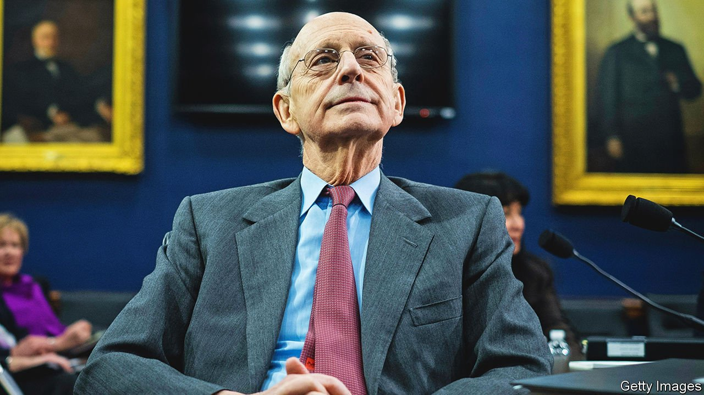

###### Vacancy on the Supreme Court

# Justice Stephen Breyer retires after almost 28 years on the Supreme Court 

##### Joe Biden has said he will choose a black woman as the liberal jurist’s successor 

 

> Jan 29th 2022 

NOT SINCE 2010 has a Democratic president put a justice on the Supreme Court. Joe Biden will now have his chance. On January 26th sources close to Stephen Breyer, the 83-year-old dean of the court’s liberal bloc, said he will retire at the end of the court’s current term. In one sense, Mr Biden’s nomination will change little: a liberal will replace a liberal. But on the campaign trail he promised to nominate a black woman for the first time ever.

Mr Biden will no doubt move quickly. Democrats appear likely to  in mid-term elections later this year. The last time a Democratic president asked a Republican Senate to seat a Supreme Court nominee—when Barack Obama chose  to replace Antonin Scalia in 2016—the nomination never even got a hearing. Mitch McConnell ended filibusters for Supreme Court nominations in 2017 when he was the majority leader.


The Democrats’ bare Senate majority may be just enough to put a new nameplate on Mr Breyer’s door when the court begins its next term on October 3rd. That will require some unity from a caucus that has shown precious little recently.

Senate Democrats have been sniping at each other for months over the stagnation of Mr Biden’s agenda. Progressives have had knives out for two centrist Democrats, Joe Manchin of West Virginia and Kyrsten Sinema of Arizona, who  to pass voting-rights legislation. Chuck Schumer, the majority leader, has taken flack from all sides for a legislative strategy that has sometimes seemed to stem more from his fear of losing a primary later this year than from an effort to actually pass laws.

Now the caucus will need to stick together to confirm Mr Biden’s nominee. Picking up some Republican support from centrists such as Susan Collins of Maine and Lisa Murkowski of Alaska is possible, but in the current climate the White House will not want to count on it. Most probably they will have to butter up Mr Manchin, whose relationship with the White House has deteriorated. He is typically guarded about his intentions but has voted for all of Mr Biden’s judicial nominees.

Justice Breyer was confirmed, in 1994, with 87 votes. He has been a stalwart but pragmatic liberal who believes judges should look beyond a law’s text to its “purposes” and “consequences”. This approach inspired his majority opinions upholding abortion rights, delineating the limits of presidential power and addressing the delicate matter of religion in the public square. He also wrote impassioned dissents in favour of racial integration of public schools and against the constitutionality of the death penalty.

He has been prolix in oral arguments. He has a gentle sense of humour, often acknowledging when he was flummoxed and regularly imploring lawyers for help in writing decisions. “We are going to get people so mixed up no matter what we say,” he fretted during a hearing in 2013. Earlier this month he prefaced a query about a potential settlement in a dispute over flags and free speech with a self-deprecating caveat: “I’m sure this is a useless question.”

A penchant for case-by-case consideration and balance led him to join conservatives in some high-profile cases involving criminal defendants and other matters. He joined decisions that allowed a 40-foot cross on public land and shielded religious schools from some anti-discrimination lawsuits. He followed a similar path personally. In the wake of Bush v Gore, the Supreme Court decision in 2000 that halted vote-counting in Florida and made George W. Bush president, clerks for the liberal and conservative justices weren’t talking to one another. To ease the tension, Justice Breyer walked into the clerks’ dining room—a nearly unheard-of occurrence—and started chatting to the conservatives.

The leading candidate to replace him is , 51, whom Mr Biden promoted from a district court to the powerful circuit court of appeals in the District of Columbia. A unanimous voice-vote in the Senate confirmed Ms Jackson to her seat nine years ago. She has dual degrees from Harvard and spent two years as a federal public defender—a relative rarity among federal judges (prosecutorial experience is far more common). She was vice-chair of the US Sentencing Commission, where she helped revise sentencing guidelines that imposed harsh penalties for crack cocaine that disproportionately affected African-Americans. This injustice was not an abstraction for her: when she was a teen, her uncle was sentenced to life in prison for a minor drug crime; he was granted clemency 30 years later.

A second contender for Justice Breyer’s seat is Leondra Kruger, a 45-year-old judge on the California state supreme court. She, too, wields a pair of Ivy League degrees and clerked on the Supreme Court. She worked in the solicitor-general’s office, which represents the federal government before the Supreme Court, arguing 12 cases. Her presentations were crisp and unflappably calm, even when all nine justices were openly hostile to the position she was dispatched to defend.

Other prospects include two district-court judges—Leslie Abrams Gardner, 47, and J. Michelle Childs, 55—as well as Tiffany Cunningham and Candace Jackson-Akiwumi, both appellate judges in their 40s. Any of them would be groundbreaking. Only two of America’s 115 Supreme Court justices have been African-American; both were male (Thurgood Marshall and Clarence Thomas). And there are only eight black women currently serving on America’s 13 circuit courts, four of whom have been seated in the past year.

Some may take issue with Mr Biden basing his decision on race and gender, though the leading contenders all have the requisite qualifications. The potential nominees are hardly liberal firebrands. Ms Kruger, for instance, has often sided with conservative jurists, and has said that she works to enhance “the predictability and stability of the law”—not exactly the sort of rallying cry that inspires progressives.

However quickly Mr Biden gets a successor to Justice Breyer in place, and whoever she turns out to be, the court’s direction will not change: there will still be twice as many conservatives as liberals. Abortion rights appear likely to be restricted, gun-rights bolstered and affirmative action’s days numbered. At least in the near term, the next justice will probably find herself dissenting early and often. ■

For more coverage of Joe Biden’s presidency, visit our dedicated  and follow along as we track shifts in his . For exclusive insight and reading recommendations from our correspondents in America, , our weekly newsletter.

