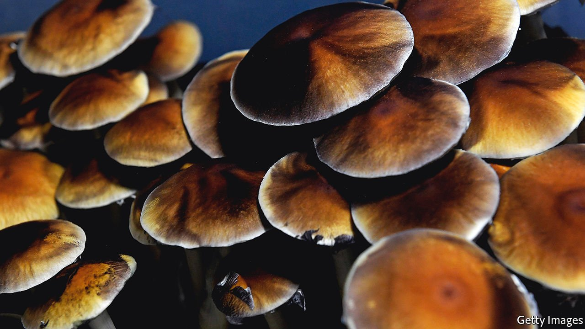

###### Turn on, tune in

# Sensible policy on psychedelic drugs is growing more common 

##### They show tremendous potential in treating certain mental-health disorders 

 

> Jan 29th 2022 

CHAD KUSKE was a Navy SEAL for 18 years. When he retired, he found himself “struggling with depression, substance abuse and anger”. Various treatments had failed, until another ex-SEAL suggested psilocybin, the consciousness-altering compound in “magic mushrooms”. “It basically changed my life forever,” Mr Kuske says. “I realised that I’d been living in my own personal hell and I was keeping myself there by my own choices and I had the power to change that.”

Mr Kuske’s experience is not unusual. Scientists began studying the potential for psychedelics to treat mental illness more than 60 years ago, before anxiety over the drugs’ countercultural popularity in the 1960s shut down research. Thankfully, it has restarted—and studies are showing that psychedelic drugs have potential in treating several thorny mental-health problems. Oregon’s voters approved psilocybin for supervised use in 2020, and other jurisdictions may soon follow suit. This is good news not just for people suffering from depression and post-traumatic stress disorder (PTSD), but also for American drug policy: it shows that evidence-based decisions are replacing moral panic.


That does not mean Oregonians can pick up a few mushrooms on their way home from work and spend the evening tripping. Measure 109, which almost 56% of voters approved, does not legalise psilocybin or make it available at dispensaries, as cannabis now is (a separate measure passed in the same election did decriminalise the possession of small amounts of all drugs, punishable with only a $100 fine that can be voided by completing a health screening at an addiction-treatment centre). Instead, it makes psilocybin therapy available at treatment centres under the supervision of a trained facilitator.

Oregon’s health department will license the centres, facilitators, psilocybin producers and testing labs. People who want therapy will not need to provide a diagnosis of depression or PTSD. Tom Eckert, a psychotherapist who with his late wife, Sheri, began the efforts leading to Measure 109, said he intended such therapy to “sit outside a conventional medical model…It will be open to anyone who can safely benefit from it.” The screening process should help exclude those unsuited to it. Precisely what that means is under discussion. Oregon is still honing its rules, with the goal, according to the state’s health department, of having the treatment centres up and running in the spring of 2023.

Psychedelic drugs put users in an altered state of consciousness. They include lab-synthesised compounds such as LSD and MDMA (commonly called ecstasy) as well as naturally occurring, plant-based substances such as psilocybin, mescaline, ayahuasca and ibogaine. George Goldsmith, whose firm, Compass Pathways, has developed a synthetic version of psilocybin, explains that the drugs act on “a brain network that integrates perception with prediction” and so help break “the dysfunctional pattern of thinking characteristic of so many mood disorders”.

They also appear to spur the growth of neural connections that stress and depression tend to erode, suggesting that they may have a reparative function. Studies have shown that psychedelics have potential to treat addiction, PTSD and severe depression, as well as to alleviate end-of-life anxiety in terminally ill patients.

These studies have mostly had small sample sizes. Some worry they might overestimate psychedelics’ benefits—notably of microdosing, a fashionable practice of regularly taking small doses of psychedelics. A study by Imperial College London found that people given placebos and actual microdoses reported equal levels of well-being and happiness.

Still, America’s Food and Drug Administration—hardly a cheerleader for illegal drugs—called psilocybin a “breakthrough therapy” for depression. That designation is meant to speed development of drugs that may represent a big improvement over current treatment. Mr Goldsmith says his conversations with European regulators have been like “pushing on an open door”.

Far out

Nor is it just Europeans and coastal liberals interested in psychedelics’ potential. Texas legalised research into them last year; the state’s flagship medical school opened the Centre for Psychedelic Research and Therapy in December. Graham Boyd, who runs a political-action committee that supports criminal-justice reform, credits veterans with persuading Rick Perry, the state’s arch-conservative former governor, to back the measure. Jesse Gould, a former Army Ranger who runs a charity that sends veterans abroad for psychedelic retreats and credits ayahuasca with helping him overcome his PTSD, said he initially resisted the therapy because “I didn’t identify as someone who did drugs”.

At least ten cities have made psychedelics a low priority for law enforcement. Legislators in Washington state recently introduced a bill that would replicate Oregon’s model, and California’s legislature is mulling a bill as well. Politicians in around 12 other states have introduced legislation to decriminalise or study the benefits of psychedelic drugs.

Such openness is welcome not just for the benefits it may provide traumatised soldiers or people with severe depression, but for what it indicates about America’s shifting attitude to drugs. “Building prisons and filling them with people who use these substances was the worst policy,” says Mr Boyd. It “obliterated our ability to think clearly about what good policy would look like…Once we clear away the overhang of criminal prohibition I think we can come up with better policy toward all of these substances.” ■

For exclusive insight and reading recommendations from our correspondents in America, , our weekly newsletter.

