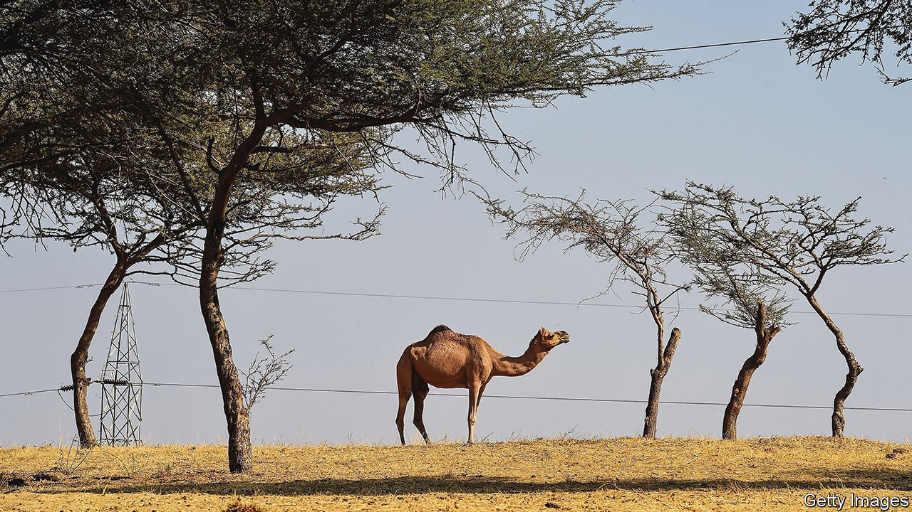

###### Forest grumps

# India’s government and its greens disagree on what counts as forest 

##### An official report includes plantations and parks in its measure 

 

> Feb 5th 2022 

AT THE COP26 climate summit in Glasgow last year, when more than 100 countries committed to ending and reversing deforestation by 2030, India, home to some of the world’s biggest and most biodiverse forests, demurred. No matter: India’s forests seem to be thriving—at least on paper. Between 2019 and 2021 India gained 1,540 sq km in forest cover, according to a biennial report published last month by the Forest Survey of India (FSI), a government agency. Over the past 20 years, says the report, forest cover has grown by 5.7%, or around 40,000 sq km, an area roughly the size of Switzerland.

This should be good news. Forests are a boon for the environment. Many of India’s poorest people depend on them for their livelihoods. Yet India’s greens are unimpressed. They say the FSI’s definition of “forest” is misleading and has been for the past 20 years. Officially, any patch of land greater than a hectare with canopy cover of at least 10% counts as a forest no matter who owns it or to what use it is put. By the FSI’s reckoning, tea estates in the hills of east India, cashew plantations on the western coast and parks in the posh suburbs of Delhi, the capital, all qualify. The FSI “can’t be accused of favouring only tree-clad areas in counting India’s forests”, M.D. Madhusudan, an ecologist, quipped on Twitter, illustrating his point with a scattering of trees in the scorching desert of Rajasthan, a western state.


Indeed, almost all the increase in India’s forest cover in the past two years has been driven by growth in plantations. Of the forest added since 2019, only 31 sq km came in “recorded forest areas”, meaning actual forests. Global Forest Watch, an online tracker that uses a stricter definition, suggests that forest cover may actually have fallen by 3.4% between 2002 and 2020.

The government says its definition aligns with international norms. It also stresses that every tree, whether in a city, plantation or jungle, provides some ecological benefit. This is true. Yet quality matters: fully fledged forests, with dense canopies, provide habitats to animals and health benefits to humans.

The real problem may be methodology rather than definitions. The FSI report is compiled using data from satellite images, which struggle to see the forests for the trees. Raj Bhagat, an expert on remote sensing, says that without rigorous ground-level surveys to supplement the data, the reported change in forest cover is just “noise”. Moreover, the satellite data are not easily accessible, Mr Bhagat and others complain, thwarting attempts at crowdsourced verification. Anoop Singh, the FSI’s director-general, insists the methodology is robust, especially given the constraints of time and resources. And the data are available for anyone to purchase—at a hefty cost.

For more coverage of climate change, register for , our fortnightly newsletter, or visit our 

