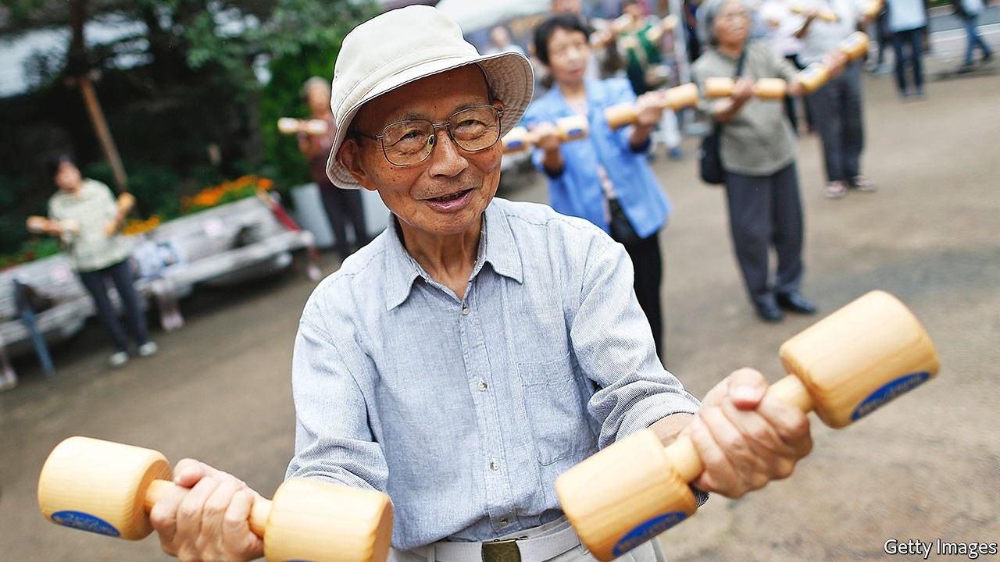

###### Mujin tonic

# Japan is searching for the secrets to healthy old age 

##### Living longer is of little use if the extra years are spent in bed 

 

> Feb 3rd 2022 

MOST PEOPLE see living longer as a good thing. Getting creakily old, however, is a less attractive prospect. Extra days of globetrotting with a spouse or relaxing with a grandchild? Yes, please. Interminable years spent bedridden? No, thank you.

Most people lucky enough to get old will have at least some unhealthy years in later life. The global gap between life expectancy and healthy life expectancy (HLE), a measure of how long a person lives without health problems that impede everyday activity, is nearly ten years, according to the World Health Organisation.


That is bad enough for individuals and their families but it is also concerning for ageing countries where large elderly populations can drain public finances. In Japan, the world’s oldest country, men live an average of 81.6 years and women an average of 87.7 years. But in 2019, the last year for which data are available, the healthy parts of those lives were on average nine years shorter for men and around 12 years shorter for women. (Japan uses surveys of people’s own assessment of their health along with mortality rates to measure HLE.)

Shrinking that gap has thus become an important goal for the Japanese government. Staying healthy for longer, the thinking goes, will make people happier—and put less strain on medical systems, and on the government’s budget. “For a long time [Japan] made a collective effort to extend life expectancy,” says Akiyama Hiroko of the University of Tokyo’s Institute of Gerontology. “As the average age approached 80 years old, we began to think we had achieved it, but also noticed we had many bedridden seniors and many underemployed 60-somethings.”

The health ministry has made extending HLE a central pillar of its policy. It hands out a yearly “Let’s extend healthy life expectancy!” award to those contributing to the effort. Recent winners include Fukui prefecture, north of Kyoto, for its “Sneaker Biz” programme, which encourages local companies to let employees wear sneakers to work, leading to a big increase in step counts, and a group in Osaka that turns abandoned buildings into community cafeterias. Local governments are required to have plans for extending HLE. Initiatives range from practical to quixotic. Oita, on the southern island of Kyushu, rolled out an app that counts steps and turns them into points for discounts at local shops and facilities. Aomori, a frigid northern prefecture, created a “high blood-sugar stopper” division that aims to raise awareness about diabetes; its efforts include a competition for the best diabetes-themed senryu, a form of poetry similar to haiku but focused on human foibles.

Many efforts look a lot like the prescriptions for raising overall life expectancy. It is true that common causes of mortality will also affect healthy living: Aomori, which has low HLE, has high rates of smoking and salt consumption. Screening for diseases helps: Yamanashi, a bucolic prefecture at the foot of Mount Fuji that consistently ranks in the top two prefectures for healthy life expectancy for both men and women, has some of Japan’s highest cancer-screening rates.

But those with the longest healthy lives are not necessarily those with the longest lives overall. Many conditions that crimp the quality of life are not fatal, such as back pain, eye disease or mental-health problems. Helping people stay healthy, rather than simply alive, involves looking at broader social and environmental considerations. Jobs are essential. Working longer keeps people physically and mentally active, but also keeps them connected to others. Yamanashi has the second-highest elderly-employment rate in the country.

Social networks—the real-world kind—play a big role, too. Strong ties with friends, family and neighbours make for better mental health, more active lifestyles and better support. Investments such as upgrading cultural facilities or creating mobile libraries to serve remote communities may not appear to be health-related, but can benefit public health, says Kondo Naoki of the University of Tokyo.

In Yamanashi, many public-health specialists point to mujin, traditional local microcredit associations which have evolved into something more like social clubs. Members chip in funds for regular gatherings, often over noodles and sake (some prefer tea or mah-jong). Mr Kondo’s long-term studies have found that those who participate actively in mujin stay healthier for longer, even when controlling for wealth and other variables. The group activity offers a sense of purpose, and also acts as an informal safety mechanism, with other members noticing when someone is absent or looking worse than the previous month. “Being lonely is most detrimental to health,” says Nagasaki Kotaro, Yamanashi’s governor, who recently started offering subsidies for mujin. The secret to a healthy life, then, is similar to a happy one: keeping busy and regularly seeing friends, even over a drink or two. ■

