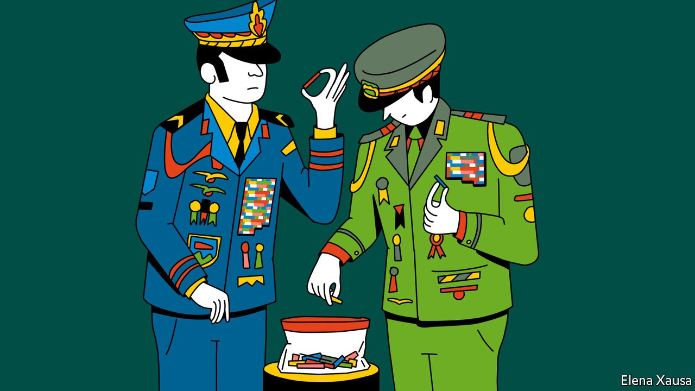

###### Banyan

# Myanmar’s generals have a dubious role model in Thailand 

##### One’s stagnation is better than the other’s disintegration, but that is a low bar 

 

> Feb 3rd 2022 

SOON AFTER General Min Aung Hlaing mounted a coup against Myanmar’s elected government, a year ago this month, the army chief wrote to the prime minister of next-door Thailand for advice. How, he asked Prayuth Chan-ocha, to build a flourishing democracy?

It sounded like a bleak joke. But the generals do not do irony. General Min Aung Hlaing had just smashed what fragile democracy had taken root in Myanmar. In 2014 Mr Prayuth, then Thailand’s army chief, had seized power from an elected civilian government. Before a general election in 2019 in which Mr Prayuth put his army-led party forward, a military-appointed committee rewrote the constitution to entrench the role of the armed forces in politics and to neutralise popular parties.


To be doubly sure, Mr Prayuth also stripped the election commission of independence. When all that still failed to hold back one political force, the Future Forward Party, the courts obligingly dissolved it. This, then, is the “genuine democracy” that Mr Prayuth had promised back in 2014.

And that, to the generals in Myanmar, is the point. They envisage something very similar when they talk about a “disciplined democracy”. That is, re-engineering the political system to stay in charge. Thailand—relatively prosperous, relatively stable, if mainly in relation to Myanmar—is the role model to which that country’s generals aspire, argues Thitinan Pongsudhirak of Chulalongkorn University in Bangkok.

Myanmar and Thailand have different histories, and a historical rivalry. Unlike Myanmar, modern Thailand was never colonised. Nominally it has been a constitutional monarchy since 1932; in reality an absolutist king, in whose name the armed forces speak, holds sway. In contrast, Myanmar’s last king died in exile in India in 1916.

Yet the affinities are stronger—as the generals see it. Pavin Chachavalpongpun of Kyoto University describes how in both countries the top brass claim to act as the ultimate guarantors of the state’s integrity and as protectors of a Buddhist majority. Do not underestimate the personal ties, either. The epitome of the royalist-military nexus under Thailand’s previous monarch, King Bhumibol Adulyadej, who died in 2016, was the late Prem Tinsulanonda, another army chief and prime minister. In 2012 he “adopted” General Min Aung Hlaing as his son.

In their irony-free zones, the generals’ poor long-term performance rarely registers. General Min Aung Hlaing yearns for the blissful prelapsarian era before democrats were allowed a say. Yet the “Burmese way to socialism”—which the army promulgated as the state ideology after it seized power in 1962—brought only grinding poverty. As for Thailand, the armed forces are less economically incompetent. But their favouring of their own interests and a handful of family-led conglomerates has undermined economic institutions while pushing out entrepreneurs. Meanwhile, the fact that the army has staged two coups in the past 15 years suggests that it has yet to perfect its management of the political system.

For how much longer can the generals ignore reality? After all, Myanmar’s coup has produced a failed state. Far from being the bulwark of national unity, the Tatmadaw, as its army is known, is under attack from new, armed-resistance movements even in the ethnic-Burman heartlands from where it has traditionally drawn recruits. General Min Aung Hlaing has managed something that decades of ethnic conflict around Myanmar’s borderlands failed to do: unite the country’s jumble of ethnic minorities with the Burman majority. Myanmar’s bureaucratic administration has crumbled, while hunger mounts and the economy implodes. All the while, the Tatmadaw continues to target civilians.

The Tatmadaw threatened a harsh response towards anyone taking part in the “silent strike” that the underground shadow government called for to mark the coup’s first anniversary. On February 1st streets were empty all the same, and in the central town of Kyaukpadaung a man set himself alight in protest at the Tatmadaw’s brutality.

Over in Thailand, where many Burmese refugees have fled, Mr Prayuth insists that the Tatmadaw, the destroyers of Myanmar, remain an essential part of any effort to repair it. He and those around him also continue to think of themselves as role models for Myanmar’s rulers. Sure, stagnation is better than disintegration. But what kind of commendation is that?

Read more from Banyan, our columnist on Asia:

 (Jan 29th)

 (Jan 22nd) (Jan 15th)

