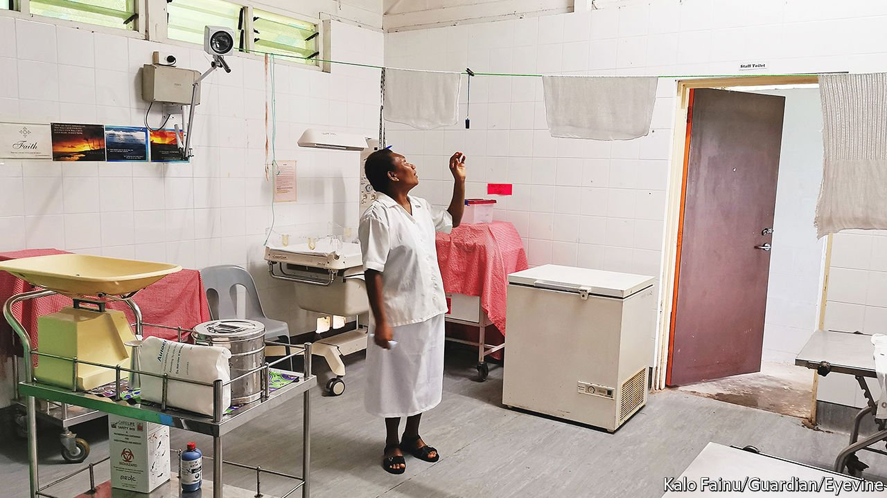

###### A nation of holdouts

# Papua New Guinea’s vaccination rate is only 3.3% 

##### Online misinformation, like covid-19, reaches even the remotest places 

 

> Feb 4th 2022 

FOR CITIZENS of a country where AIDS, dysentery and road traffic accidents rank among the top ten causes of death, it is difficult to get worked up about a newfangled ailment like covid-19. And when friends and family appear more scared of vaccination than of infection itself—when they say that a jab is a one-way ticket to hell—it is perhaps natural to resist getting inoculated. Little surprise then that Papua New Guinea, a desperately poor corner of the world, has the lowest vaccination rate in Asia and among the lowest in the world. Just 3.3% of the population has received even a single dose.

It is not for lack of infection. The country of 9m has officially recorded more than 37,000 cases and some 600 deaths. But these numbers dramatically understate the disease’s prevalence. In rural areas testing is extremely limited. People diagnosed with covid have sometimes been thrown out of their homes by their families, so few are keen to be tested in any case. The bigger hospitals are nonetheless overwhelmed from time to time when cases surge. The Economist’s excess-deaths tracker suggests the true death toll is six times greater than the official number.


The government has tried to keep the pandemic at bay. A state of emergency was declared in March 2020, borders were closed for well over a year and a two-week quarantine in hotels was required of the few allowed to enter. These measures helped, for a while. Yet the virus found its way in, in some cases through the highly porous border with Indonesia and in others thanks to commuting mineworkers from Australia and elsewhere.

The government, to its credit, also acted quickly to secure supplies of vaccines, mostly donated through Covax, a global programme to get jabs to poor countries. Early last year James Marape, the prime minister, took his shot on national television. Influential church leaders urged their flocks to get their jabs. The government set the modest target of inoculating 20% of the population by the end of 2021.

To no avail. Even as the virus has found its way into remote communities, fears of vaccination have only grown, fuelled by scare stories from the internet embellished in the retelling. Despite its rugged terrain and limited development, Papua New Guinea enjoys internet coverage even in far-flung areas, thanks to the efforts of Digicel, a mobile operator focused on small, poor countries. Enough people now have access, usually on old smartphones, to hear the call of the anti-vaxxer.

A tradition of superstition and a belief in sorcery worsen the problem, and add a local twist to the online humbug. Health workers deployed to vaccinate vulnerable people in the near-inaccessible interior of the country report being met with naked hostility. Locals told them they had heard that the vaccine would cause them to drop dead in three years. Others said the jab would turn their arms magnetic. Some believed they were immune because covid was a “white man’s disease”. Many said that the disease was made up.

“They don’t believe in covid,” says Paul Gai, a health worker in Bosset, a swampy lakeside community of some 2,000 people in Western Province, the biggest of the country’s 22 districts. “Most of the people believe in these internet messages.” Many field visits by health workers have ended with zero vaccine recipients and wasted shots. Papua New Guinea even sent a stock of doses to Vietnam as they neared expiry.

Meanwhile, mobile “outreach” clinics and specialist facilities for other common, serious diseases, including malaria, TB and AIDS, have at times been closed to ensure enough resources to keep covid hospitals operating. Expectant mothers have been deprived of antenatal care. TB patients have found it hard to get their drugs.

“Covid-19 is going through the community. It will continue to go through in waves and some people will die, [but] most people will get over it,” says a senior doctor with decades of experience in Papua New Guinea. More people are likely to die of other diseases as a result of well-intentioned attempts to keep covid in check, he says, than of covid itself. It is a grim prognosis for an already stricken country. ■

Dig deeper

All our stories relating to the pandemic can be found on our . You can also find trackers showing ,  and the virus’s spread across .

