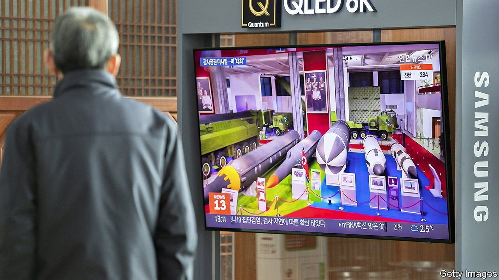

###### New year fireworks

# What is behind North Korea’s flurry of missile tests? 

##### Kim Jong Un fired more rockets in January than any month on record 

 

> Feb 3rd 2022 

OBTAINING INFORMATION on what is going on in North Korea has been even harder than usual over the past couple of years. Kim Jong Un, the country’s dictator, enforced the world’s strictest border closures in response to covid-19 (North Korea claims to have succeeded in keeping out the virus). But there is one area in which the world has been able to glean a surprising amount of insight: the development of Mr Kim’s arsenal of missiles.

 


The latest hint came on January 30th, when North Korea test-fired an intermediate-range ballistic missile (IRBM) that it claimed could reach targets up to 5,000km away. It was the longest-range test since 2017, at the height of the “fire and fury” period of tensions between North Korea and America. The launch topped off the busiest month on record for North Korean missile tests (see chart). It followed a series of shorter-range tests throughout January, including two launches of what state media claimed was a “hypersonic missile” able to manoeuvre at high speed while flying at relatively low altitudes, the better to evade missile defences.


The tests reinforce the impression that the hardships of the pandemic have done little to slow the pace of military development in the closed-off country. They fit with the regime’s recent demonstrations of military prowess and statements by Mr Kim about the importance of martial advances. At a military parade to mark the 75th anniversary of the Workers’ Party in the autumn of 2020, North Korea showcased a range of previously unseen hardware, including an enormous new intercontinental ballistic missile which has not yet been test-fired.

In remarks made at a committee meeting of the Workers’ Party at the end of 2021 and relayed by state media as an apparent stand-in for the dictator’s usual New Year address, Mr Kim outlined two main ambitions for 2022. He called for continued belt-tightening amid efforts to improve agricultural output—and for ceaseless efforts to strengthen the armed forces.

Tests are a necessary part of Mr Kim’s stated goal to advance his missile programme. Still, the sheer number of them in one month, and the launch of the IRBM, have prompted speculation among analysts about other possible motives. Some suggest that Mr Kim decided to conduct them in advance of North Korea’s usual testing season—February and March—to avoid disturbing the Winter Olympics in Beijing, which start on February 4th. His regime, after all, is reliant on Chinese economic support and goodwill.

There are probably domestic reasons, too. Mr Kim may be trying to shore up support given that the economic pain associated with the pandemic lockdown looks set to continue. On February 1st state television aired a documentary emphasising the hardships the country had suffered over the past year, and Mr Kim’s tireless efforts to alleviate them. It suggested his body had “withered away” as a result of his work for the people, an apparent reference to the formerly pudgy Mr Kim’s dramatic weight loss last year.

Shortages and high prices remain a problem inside the country, according to Daily NK and NK News, outlets based in South Korea with sources inside North Korea and along North Korea’s border with China. Freight-train traffic across the border appears to have resumed in January for the first time in two years. But even elites in Pyongyang will have to wait for weeks before any goods reach them, owing to lengthy quarantine measures. Mr Kim may be hoping that pride in the nation’s military strength will allow him to test his citizens’ patience a little longer.

It is less clear what message, if any, the tests are intended to convey to the rest of the world. After America imposed fresh sanctions on North Korea earlier this year, state media dropped hints that the armed forces might abandon the moratorium on long-range missile tests which Mr Kim announced during a period of detente in 2018. But unlike in 2017, the latest round of tests have not been accompanied by unusually aggressive rhetoric towards America or South Korea. The responses from both countries to the flurry of tests have, in turn, been muted. Mr Kim may simply hope to persuade other countries to accept his missile tests, including those that violate UN resolutions, as a fact of life. If so, he seems to be succeeding. ■

