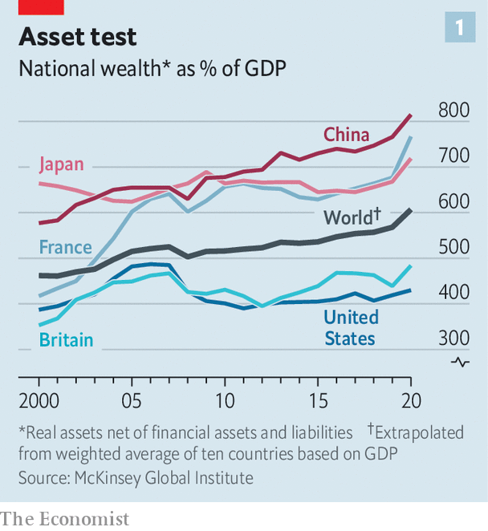
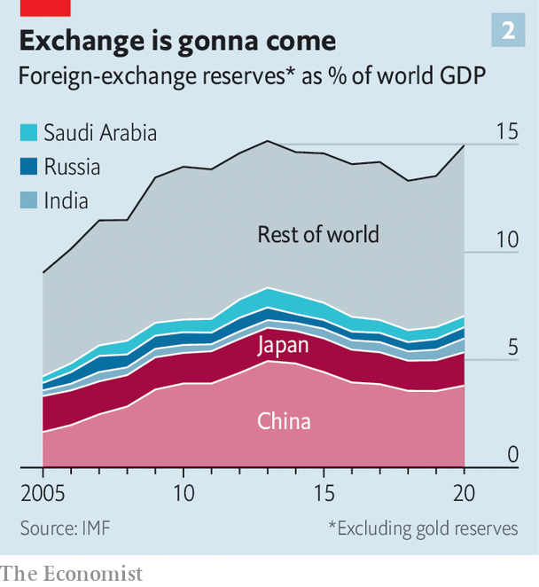
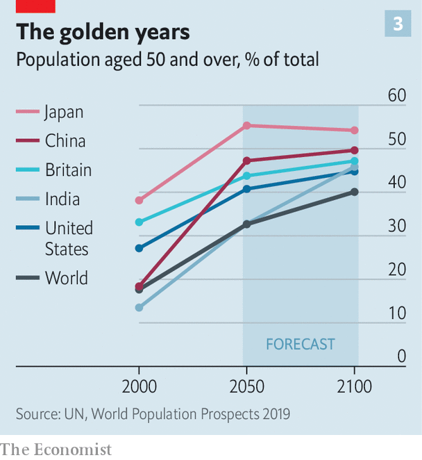
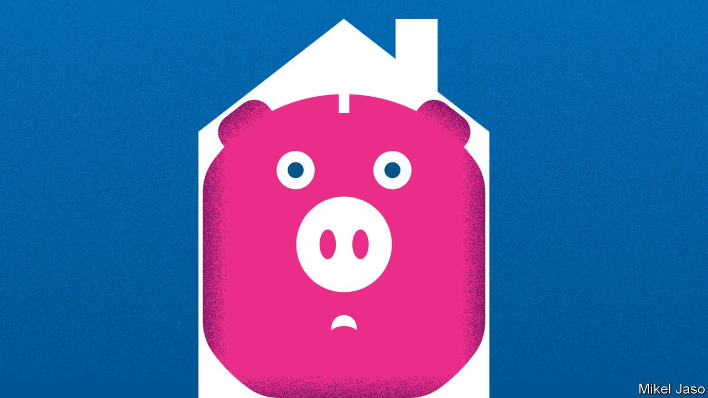

###### Turning Japanese

# Why the world is saving too much money for its own good 

##### And why the pandemic is unlikely to change that 

 

> Feb 5th 2022 

IN 2005, BEN BERNANKE, then a member of the Federal Reserve’s Board of Governors, wondered at a tide of money washing over American shores—and worried about its consequences. Grasping in a speech for a way to describe the phenomenon, he coined a phrase. “Over the past decade,” he noted, “a combination of diverse forces has created a significant increase in the global supply of saving—a global saving glut.” Savers of all sorts—from older Americans preparing for retirement to oil-exporting countries accumulating sovereign-wealth funds—were shoving more money into stocks and bonds than could be put to use by those looking to invest in plants and equipment.

 


In 1999, Mr Bernanke had chided the Bank of Japan for failing to rekindle Japanese growth after a bubble burst, despite reducing interest rates to zero. Yet in the 15 years after he christened the saving glut, finance ministries and central bankers around the world became familiar with the struggle to maintain steady growth in the context of zealous saving. Since 2000 alone, the value of global wealth held by households, firms and governments has roughly tripled, from $160trn to $510trn, or from about 460% of global GDP to 610%, according to McKinsey Global Institute, a think-tank (see chart 1). Many of them have borrowed from each other to acquire assets, taking debts to . But in aggregate they are prudent ants rather than spendthrift grasshoppers. This savings growth helped push asset prices ever upward and interest rates ever lower, creating macroeconomic headaches worldwide.


Now the pandemic has shaken pillars of the global economy in ways which could fundamentally alter saving patterns. Tight labour markets are shifting money to workers who are eager to spend, contributing to the highest inflation in a generation. Central banks which had found themselves unable to push interest rates down enough to keep inflation from falling below their targets are beginning to push rates up to keep inflation from soaring. Yet while new enthusiasm for government borrowing or a retreat from globalisation could help to drain savings and establish a new normal, it seems more probable that Mr Bernanke’s glut will persist, thanks to old habits and old people, who are a growing share of the world’s population.

The rising reservoir of global savings, most of which is held in bank deposits, bonds, corporate equity and property, has been fed by three main tributaries: governments hungry for foreign-exchange reserves, penny-pinching households and firms, and workers nearing retirement age. It was the first flow, saving by governments, which preoccupied Mr Bernanke. Governments’ accumulation of foreign-exchange reserves adds to saving in two ways. Resource-exporting economies save part of the windfall earned from their exports and plough it into stocks and bonds. Some of these piles are held as official reserves; the Russian government has reserves, excluding gold, valued at $460bn, while Saudi Arabia’s are worth $440bn. Windfalls have also been shifted into sovereign-wealth funds; that of Abu Dhabi is worth almost $700bn, while Norway’s is valued at more than $1.3trn.

Other economies pile up foreign-exchange reserves as they intervene in markets to reduce the value of their currencies, to boost exports or to build up a hoard of safe assets which can be drawn upon in times of financial stress. In effect, these interventions squeeze consumption in their home economies, reducing spending relative to production and thus contributing to current-account surpluses which must be absorbed by the rest of the global economy. Reserves held by South Korea, Singapore, Taiwan and India have grown into the hundreds of billions. No country has engaged in such practices to more disruptive global effect than China, which holds some $3.2trn in foreign-exchange reserves.

 


The contribution of growth in reserves to savings was most pronounced around the time Mr Bernanke sounded his warning. From 1998 to 2008, official foreign-exchange reserves jumped from 5.2% of global GDP to 11.5%, powered by a steady rise in oil prices and reserve accumulation by China. During this period, reserve growth probably dominated other sources of saving; research by Francis Warnock and Veronica Cacdac Warnock of the University of Virginia suggests that reserve-accumulation in the year to May 2005 alone reduced the yield on ten-year Treasury bonds by 0.8 percentage points. Reserve growth paused during the global financial crisis, then resumed in the years after, reaching a peak of 15.2% of global GDP in 2013 (see chart 2).

Reserves plateaued thereafter (and indeed fell slightly as a share of GDP), and a decline in the years ahead cannot be ruled out. A protracted period of post-pandemic financial stress could force some emerging economies to deplete their reserves. If economic strains and geopolitical tensions force Russia and China to draw down their hoards, that might place upward pressure on interest rates.

Yet it is also possible that the pandemic will lead to a new surge in reserves. Yes, a shift to zero-carbon energy may eventually doom fossil-fuel windfalls, but the transition might well mean high prices for oil and gas, since new production is likely to stagnate. Meanwhile, the pandemic and its aftermath will probably reinvigorate the appeal of defensive foreign-exchange reserves. During the financial panic of March 2020 and again in recent months, as straitened global conditions squeezed emerging markets, the economies which weathered stresses best were those with ample foreign-exchange reserves. This lesson has already been put to use. By the autumn of 2021, reserves were roughly $1trn higher than they were before covid-19.

The effects of reserve accumulation could also be offset by increased government borrowing. Government debt loads, already high pre-pandemic, have exploded over the past two years; in 2020 alone, public debt as a share of GDP surged by nearly 20 percentage points across advanced economies, to 123%, and nearly ten points across emerging economies, to 63%. Work by Lukasz Rachel, of the London School of Economics, and Larry Summers, of Harvard University, reckons that over the past half century, rising government debt across rich economies pushed up interest rates by about 1.5 percentage points. This effect was more than balanced out by other factors in the past, but might not be in the decades ahead.

A first-class problem

A second stream of saving has flowed from the households and firms which have done best over the past few decades. Since the 1970s, inequality has risen across many economies. Wealthier households have a higher propensity to save, so this shift in the distribution of income contributed to the saving glut, according to work by Atif Mian, of Princeton University, Ludwig Straub, of Harvard University, and Amir Sufi, of the University of Chicago. From 1983 to 2019, the share of American income going to the top 10% of the income distribution rose by 15 percentage points, they reckon. Because of this “saving glut of the rich”, average annual saving by the top 1% of American earners alone has outstripped annual average net domestic investment since 2000. Increased inequality accounts for about 0.6 percentage points of the decline in rich-world interest rates since the 1970s, say Messrs Rachel and Summers.

High-rolling households have not been alone in stockpiling savings. For decades, corporations have been hoarding money as well, retaining a large share of their hefty net profits. According to Peter Chen, of the Analysis Group, an economic consultancy, and Brent Neiman, of the University of Chicago, and Loukas Karabarbounis, of the University of Minnesota, annual global corporate saving rose from less than 10% of world GDP to nearly 15% between 1980 and 2015. The corporate sector has been acting as a net lender to the global economy, rather than as a net borrower from it.

As with reserve accumulation, the relative importance of such factors has waxed and waned. Income inequality rose sharply from around 1980 to 2000. In the years since, it has levelled off in some economies, like Britain’s, and increased at a slower pace in others, like America’s. Corporate saving, in contrast, rose relatively slowly before 2000, then much faster thereafter, as firms salted away cash from increased profits. In America, for instance, corporate profits have hovered above 10% of GDP for most of the period since 2006, after never rising above 8% over the prior quarter century.

Income inequality and corporate profitability cannot be forecast with any certainty. Both reflect the interaction of myriad forces, from the balance of corporate and labour power, to the state of technological progress and productivity growth, to government tax and regulatory policy. It is possible that the trends of the past half century might be upended by the pandemic and its aftermath. Over the past 18 months, tight labour markets helped push wages upward and strengthened workers’ leverage in bargaining with their employers. Slower growth in the labour forces of ageing societies could help to preserve these gains, and perhaps enable a resurgence by organised labour. Firms—especially big and profitable technology ones—are in the cross-hairs of regulators looking to boost competition. Better times for workers should also squeeze profits, in addition to reducing inequality.

A retreat from globalisation could amplify these trends. It would increase the earning power of the working masses in rich countries, while hitting the profits of multinational firms and the higher incomes of their white-collar workers. On the other hand, substantial reversals in inequality are relatively rare in recent economic history. The great compression in incomes that occurred from the 1910s into the post-war decades occurred as fortunes were hammered by the Depression and liquidated to fund wars, as taxes on the rich soared well above current levels. For now, such upheavals seem unlikely.

What is more, as Mr Mian and co-authors write, the effects of inequality on saving can feed on themselves. As high saving by the rich pushes down interest rates, they argue, poorer households increase their borrowing to sustain their consumption. But as debt piles up, they find themselves forced to reduce spending to pay back loans. Their debt payments, furthermore, represent a transfer of more money to rich households whose purchases of assets (like mortgage-backed securities) effectively finances the borrowing of the non-rich. The trap which results—of perpetually high inequality, low interest rates, and high debt among poorer households—could prove difficult to escape, sustaining the savings of the rich as a potent macroeconomic force.

Far more certain is the third great river of savings, whose flow, which has grown in importance, might well swamp other post-pandemic changes in behaviour. The world is not getting any younger, and in coming decades the savings of the old stand to apply relentless pressure on the macroeconomy. Across time and countries, household saving follows a reliable pattern. When workers are young, they save little or even take on debt. Their savings rise through their 30s and 40s before peaking a decade or so before retirement. As populations have grown older over the past half century, in the rich world especially, the share of workers in their prime saving years has risen as well, leading to ever more money in nest-eggs and ever lower yields on the assets therein.

 


In a recent paper examining the effects of demographic change on saving, Etienne Gagnon, Benjamin Johannsen and David López-Salido of the Federal Reserve Board suggest that ageing in America may account for about one percentage point of the drop in interest rates since the 1980s. (Other recent work finds still larger effects, of as much as three percentage points.) If past is prologue, rates seem sure to remain low. Barring a surge in procreation, or the embrace of a dystopian “Logan’s Run” approach to the aged, the world’s population will continue to get older. The share of global population over the age of 50 rose from 15% in the 1950s to 25% today, say Adrien Auclert and Frédéric Martenet, of Stanford University, Hannes Malmberg, of the University of Minnesota, and Matthew Rognlie, of Northwestern University. It is expected to rise to 40% by 2100 (see chart 3).

That may well turn out to be an underestimate, if recent fertility trends are anything to go by. In 2021, India’s birth rate declined to just 2.0 children per woman—below the rate at which births and deaths are in rough balance. Indeed, a growing number of emerging markets have flipped to the slow population growth common in rich countries. Recent research by Matthew Delventhal of Claremont McKenna College, Jesús Fernández-Villaverde of the University of Pennsylvania and Nezih Guner of the Universitat Autònoma de Barcelona concludes that such transitions—the switch from high mortality and fertility rates to low ones which accompanies economic development—are happening faster over time. The transition took a half century or more 100 years ago, but now tends to be compressed into just two or three decades. Some 80 countries have completed this transition, and in virtually all the rest it is under way.

What is more, the pandemic further depressed birth rates in many countries. China’s birth rate touched a record low in 2021, potentially bringing forward the era of declining Chinese population. America experienced a baby bust too, which in combination with falling immigration depressed the population growth rate to just 0.1% in 2021—the smallest annual increase on records going back to 1900. The end of the pandemic could bring a rebound in birth rates. But there is no mistaking the broader trend: the world is greying, fast.

Innumerable shades of grey

Will the effect of ageing on saving necessarily remain the same in future as it was over the past half century? In an influential book, Charles Goodhart, of the London School of Economics, and Manoj Pradhan, of Talking Heads Macroeconomics, a research firm, argue that the greying of the population will depress interest rates only up to a certain point, after which there will be a “great demographic reversal”. Their view rests in part on the observation that while workers on the verge of retirement save heavily, those already retired begin to spend down their stores of stocks and bonds. An increase in the share of the population above retirement age, then, could mean that the proportion of workers in their high-saving years will peak and then decline, dragging down saving and pushing up interest rates.

 


A great demographic reversal seems intuitive, particularly in places like America where an oversize cohort—the baby-boomers—is easing into retirement. But other economists say there are reasons to expect ageing to continue to depress interest rates. They note, for example, that it is the age profile of a population as a whole which matters. Even as more people retire, the age of the typical working person will continue to rise toward those prime saving years. There are boomers aplenty, but the median age in America is still just 38. Another reason is that, in the emerging world, a larger share of workers have their prime saving years still ahead of them. The median age in India is only 28, for instance. So long as financial markets remain reasonably integrated around the world, higher saving anywhere helps to depress interest rates everywhere.

Perhaps most important, people in retirement do not tend to spend everything. Rather, for a number of motives—to avoid outliving their savings, or to provide for heirs, among others—they tend to maintain large stocks of wealth well into retirement. In Britain, for instance, as of 2018, people 80 or older held more wealth than those aged 45 to 49. Recent work by Noëmie Lisack, of the Banque du France, Rana Sajedi, of the Bank of England, and Gregory Thwaites, of the University of Nottingham, estimates that this habit of leaving behind savings will by mid-century depress interest rates by nearly half a percentage point relative to current levels. With neither inequality nor the level of reserves showing signs of sustained fall, the ineluctable force of demography should continue to drive savings growth.

The world, in other words, may come to look ever more like Japan. There, the median age is 48, more than a quarter of the population is over 65, and the yield on a 30-year government bond is a cool 0.8%, despite a government debt load of 259% of GDP. A generation ago, Mr Bernanke reckoned that Japan’s lacklustre growth and subterranean rates of inflation and interest were the consequence of “self-induced paralysis” by the central bank. Today, such realities seem more like the dull fate of a world with more savings than it quite knows what to do with. ■

