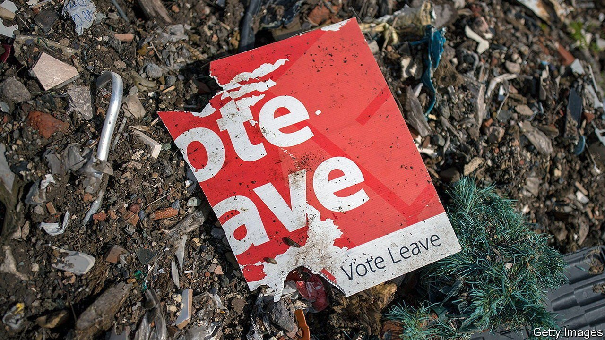

###### Digging deep

# A quixotic plan to roll back EU law 

##### It risks greater executive power, and confusion in court 

 

> Feb 3rd 2022 

TOM DENNING, a Master of the Rolls, once described European law as “like an incoming tide.” It was 1974, a year after Britain signed the accession treaty that opened its statute book to laws and judgments crafted in Brussels and Luxembourg. “It flows into the estuaries and up the rivers. It cannot be held back.”

Four decades later Brexiteers succeeded in their campaign to stem the flow. But European law has shaped Britain’s legal landscape in areas from labour regulations to banking rules and agricultural practices. Reworking that terrain is now the objective of Boris Johnson’s government. On January 31st, as part of a relaunch after revelations of lockdown-busting parties, he announced its determination to uproot remnants of European law from the British statute book. It is an ideological move. Only lawyers will benefit.


Detaching Britain from the European legal order after the referendum presented government lawyers with their most complex puzzle in decades. Simply quitting would cause chaos. A mass of EU law would cease to have any effect. Legal certainty about the interplay between British and European laws would end. That was a nightmare prospect for judges, businesses and citizens, all of whom need clarity about what is permitted and forbidden, which rulings count as precedents and which laws take precedence.

Under Mr Johnson’s predecessor, Theresa May, the government settled on an elegant solution. A vast act snapshotted all EU law on exit day and “onshored” it, with a copy kept in the National Archives. It formed a new kind of hybrid: created by Parliament, but with many qualities of European law, taking precedence over old domestic statues and normally interpreted by judges as if Britain had never left the bloc. Over time Parliament could pass new laws that amended old EU ones, laying new earth over old and letting Britain’s spell in Europe subside into legal history.

Many Brexiteers thought it an artful solution, compatible with Britain’s new independence. It is a mark of how ideologically brittle Brexit has become that Mr Johnson feels compelled to undo it. The project of ridding the statute book of traces of European law, dubbed “Operation Bleach” inside the government, was the hobbyhorse of Lord Frost, the former chief EU negotiator, who resigned from the cabinet before Christmas. His ambition lives on.

A catalogue of remnants of EU law will be compiled, open to the public so citizens can track its erasure. Rather than wait for Parliament to legislate for new rules covering planes, chemicals, cosmetic surgery and so on over time, ministers propose a new power to rewrite retained EU law via secondary legislation. This would sidestep any need for an Act of Parliament. The government says speed is essential to shape regulations suited to fast-moving industries. (And anyway, says Suella Braverman, the attorney-general, many EU laws had “no democratic legitimacy” to start with.)

Lawyers fret about a significant shift in power from lawmakers to Whitehall. Secondary legislation is scrutinised only lightly; the House of Commons has not annulled a statutory instrument since 1979. The plans run counter to the Brexiteers’ avowed aim of returning power to the legislature. “If the idea is to restore true sovereignty to Parliament,” says Sylvia de Mars of Newcastle Law School, “then Parliament needs to consider issues of substance.”

Root and branch

More quixotic is a plan to “normalise” retained EU law, and thus change the basis on which judges handle it. Ministers are considering whether to strip it of its supremacy over pre-Brexit domestic law, and to remove the need for judges to heed old EU court judgments and legal principles when interpreting it. Ministers acknowledge this risks introducing legal uncertainty. Complex court cases over, say, financial derivatives could now involve days of chewing over abstract questions that were previously crystal-clear. A workaround will be required in order to resolve clashing laws, the government admits. The Bar Council, the barristers’ professional body, calls it a “litigator’s dream”.

All this is a strange use of ministers’ energies, when the government is making sluggish progress on designing new regulatory systems outside the EU. Without radical reform, Brexiteers admit, Britain cannot hope to make up for the economic cost of leaving the bloc. Lord Frost had hoped to hire a big name from America or Australia to lead the Brexit Opportunities Unit, a Whitehall body tasked with leading this work. But the salary did not attract top-notch candidates, and the unit remains without a permanent head.

Vote Leave, the Brexit campaign, put the benefits of divergence at £33bn a year; the government has downgraded that to £1bn. Daniel Hannan, a leading Brexiteer, has called its plans “thin, watery, tasteless gruel”. Still, ministers spy a chance to write the rulebooks for emerging sectors such as artificial intelligence, gene-editing and self-driving cars. That would be more useful than raking over well-trodden ground. ■

