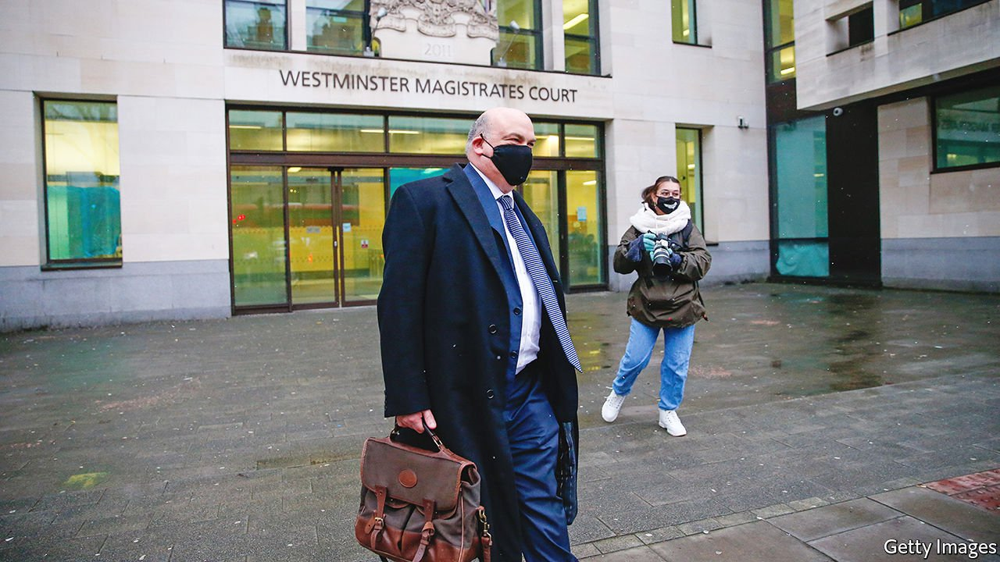

###### HP v Autonomy

# Mike Lynch has lost Britain’s biggest fraud case 

##### As extradition to America looms, he will not be the only one with regrets 

 

> Feb 5th 2022 

TECH BOSSES are used to being feted by the British establishment. A warm welcome at 11 Downing Street, once reserved for City grandees, is increasingly offered to fintech upstarts. Budgets are tailored to their lobbyists’ shopping lists. MI6’s chief spy has pledged that spooks will work with them on new technologies.

But there is a big exception: Mike Lynch, aka “Britain’s Bill Gates”. In 1996 he founded Autonomy, a software firm that he sold in 2011 to an American tech giant, Hewlett-Packard (HP), for $10.3bn (then £6.2bn). It remains the biggest-ever sale of a British software company. But on January 28th, after a decade of legal warfare, a high-court judge ruled that Mr Lynch had fraudulently inflated the firm’s value by misleading HP about its performance. Hours later Priti Patel, the home secretary, approved Mr Lynch’s extradition to America on criminal charges for the same fraud allegations.


Mr Lynch will appeal against both decisions. They nevertheless mark the close of Britain’s biggest fraud trial. HP sued for $5.1bn (the judge expects to award “substantially less”), having written $8.8bn off Autonomy’s value the year after buying it. The trial lasted 93 days, 20 of which Mr Lynch spent being cross-examined. He then had to wait two years for the ruling.

No one has come out looking good. The judge ruled that Mr Lynch and his former chief financial officer, Sushovan Hussain, had dishonestly padded revenues. Under their direction, Autonomy met revenue targets by selling hardware at a loss in transactions that served no commercial purpose and were not disclosed to the market. They sold software to friendly resellers whom they reimbursed by buying products from them that Autonomy had “little or no identified need or use” for, creating phantom revenue. Mr Lynch’s arguments that he knew nothing about any fraudulent transactions, and that the differences they made to Autonomy’s valuation were in any case immaterial, were dismissed.

Deloitte, Autonomy’s auditor, emerged tarnished, too. In September 2020 the national accounting watchdog fined it a record-breaking £15m ($20m) for “serious and serial failures” in its audit. Among them was accepting Autonomy’s description of $28m in costs for hardware it sold as a sales and marketing expense. Two of the audit firm’s then-partners, Richard Knights and Nigel Mercer, were handed personal fines of £500,000 and £250,000.

Despite its victory, HP hardly emerged smelling of roses. During the trial Léo Apotheker, its chief executive at the time of the acquisition, admitted to not having read Autonomy’s most recent financial reports before buying it. Nor had he read the due-diligence report prepared by KPMG, HP’s advisers; not being a chartered accountant, he said, he “would not have been able to add any value”. (His chief financial officer had not read it either.) Soon after the acquisition, Mr Apotheker was sacked.

The case shines a spotlight on Britain’s extradition treaty with America. Signed in 2003 in the aftermath of the terrorist attacks of September 2001, it has since come under fire for being overly favourable to American prosecutors. Mr Lynch is appealing against his extradition, arguing that as a British citizen whose company was headquartered in Cambridge and listed on the London Stock Exchange (LSE), he should be tried for any criminal charges in Britain. MPs are disquieted, too. Tom Tugendhat, a Tory leadership hopeful, has called for the treaty to be “rebalanced”.

The outcome casts a pall over Britain’s tech scene, where Mr Lynch is not only the most successful recent exponent but also a key investor. Invoke Capital, the venture-capital fund he set up after selling Autonomy, is the only one in Europe to have its own in-house R&amp;D division, which it has used to boost early-stage firms working on artificial-intelligence and machine-learning technologies. The first such investment, Darktrace, a cyber-security firm, floated on the LSE in April last year. None of this excuses fraud, which Britain’s courts have decided Mr Lynch is guilty of. But others besides him will be sorry about that. ■

