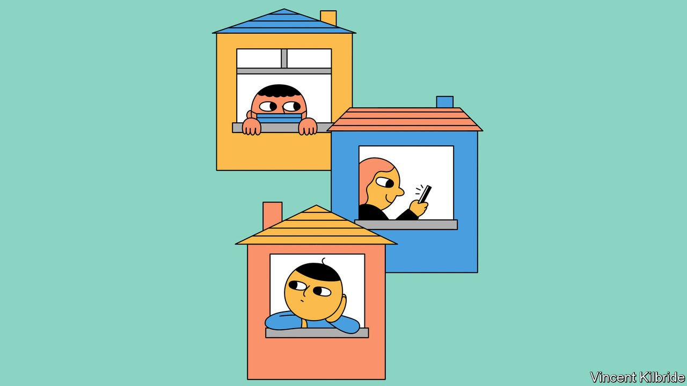
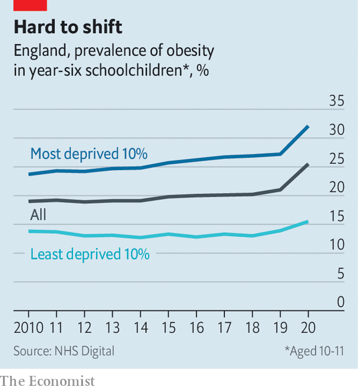

###### The pandemic generation

# Some British children have been changed by covid-19, probably for good 

##### Strangers to mathematics, and to sex 

 

> Feb 4th 2022 

A HUDDLE OF 16- and 17-year-olds outside Luton Sixth Form College, in southern England, are describing how the pandemic has affected their lives. It is a long and bitter tale. Their education has suffered from repeated disruption; they have become nervous and listless; they have been unable to get drunk together. One girl says, sadly, that she and her friends became so used to meeting online during lockdowns that they have almost forgotten how to relate in person: “Even when we’re together, it’s as though we’re not there.”

In some ways children’s and adolescents’ lives are returning to normal. Almost all schools reopened after Christmas. On January 20th, 87% of pupils were present. But a cohort has been affected by the disruptions of the past two years, in ways likely to shape them for life. Max Davie, a paediatrician, calls it “an unfortunate but fascinating natural experiment”.


During lockdown Britain was thrown back in time, to a society in which most children were educated and fed at home. Some returned repeatedly to that state as the virus swept through their schools and communities. It is as though the national welfare state splintered into millions of private ones. The “domestic soundtrack” became more important in children’s lives, says Binks Neate-Evans of the National College of Education. That was better for some than for others.

Research for the Department of Education last summer found that primary-school children had fallen behind in mathematics by just over two months relative to the previous year group. Children poor enough to receive free school meals slipped by half a month more. And large regional differences emerged. Those in London were 0.8 months behind where they should be; those in south-west England (the region of England that suffered least from covid-19) had not slipped at all. Children in north-east and north-west England were at least three months behind.

If the laggards cannot catch up—which seems likely, given the government’s reluctance to shell out for tutoring—they will be hurt for life. The Education Policy Institute, a think-tank, estimates that an extra year of schooling raises lifetime earnings by 8%. Missing out on three months entails a loss of between £15,600 ($20,900) and £30,900. The greater learning loss in the north of England will make it even harder to “level up” that part of the country, as the government wants to do.

The covid cohort did, however, become technologically expert. During lockdown, parents and schools decided that excessive screen time and online bullying were less alarming than isolation from peers, and nudged children online. “They migrate to social media anyway, and during the pandemic we encouraged that,” says Jenny Langley, head of Kingsway Park High School in Rochdale.

Many became comfortable at home. A government survey of 8- to 15-year-olds in August 2020 found that their favourite three places to spend time were parks, beaches and gardens. A year later, their top choice was “indoors”. Other surveys have shown that most parents rather enjoyed spending more time with their children, and, perhaps more surprisingly, that most children and teenagers liked spending more time with their parents.

Medical data tell a similar story of mostly contented idleness. Between March 2020 and July 2021 (the latest month for which data are available) the number of children aged 5-14 admitted to hospital for accidents was lower than the pre-covid average in every month. The number of children treated in hospital after falling from playground equipment has dropped particularly steeply, though that may in part reflect a desire to avoid burdening the NHS.

 


The lack of physical activity, combined with other disruptions, has made a cohort of children fatter. In November the National Child Measurement Programme, which covers English primary schools, reported a sharp rise in obesity, especially in deprived districts (see chart). As with mathematics scores, this may not be a blip. Obese children find it harder than others to do sport or eat a normal amount. “An unhealthy weight makes it harder to get back to a healthy weight,” says Dr Davie.

Teenagers have cut back especially on one physical activity. Conceptions among girls under 18 had been falling even before covid-19. But the number plunged to just 5,696 in the second and third quarters of 2020 (the last for which statistics are available), down from 7,188 in the same two quarters a year earlier. Teenagers are probably having less sex, not just getting better at using contraception. They now account for only 4.4% of sexually transmitted infections treated in hospitals. Brook, which runs sexual-health clinics for young people, found that attendance fell by 56% in the first year of the pandemic.

Young people are also remaining in education longer. More 16-year-olds are staying on at schools and sixth-form colleges, partly because of grade inflation at GCSE. Only 65,000 under-19s started apprenticeships in the 2020-21 academic year—down a third since 2018-19. This change, like some others, is likely to stick. Luke Sibieta of the Institute for Fiscal Studies, another think-tank, says that participation tends to rise during recessions and not to fall back afterwards. That may help mitigate the harm from school closures.

Push and pull

Some of these changes are good, others bad. But many point in the same direction. Children and adolescents have been bound more tightly to family and home, and separated from their friends. Teenagers are doing less of the things that made teenagers in the past feel adult, such as leaving school, working and having sex. The pandemic has stretched childhood. ■

Dig deeper

All our stories relating to the pandemic can be found on our . You can also find trackers showing ,  and the virus’s spread across .

