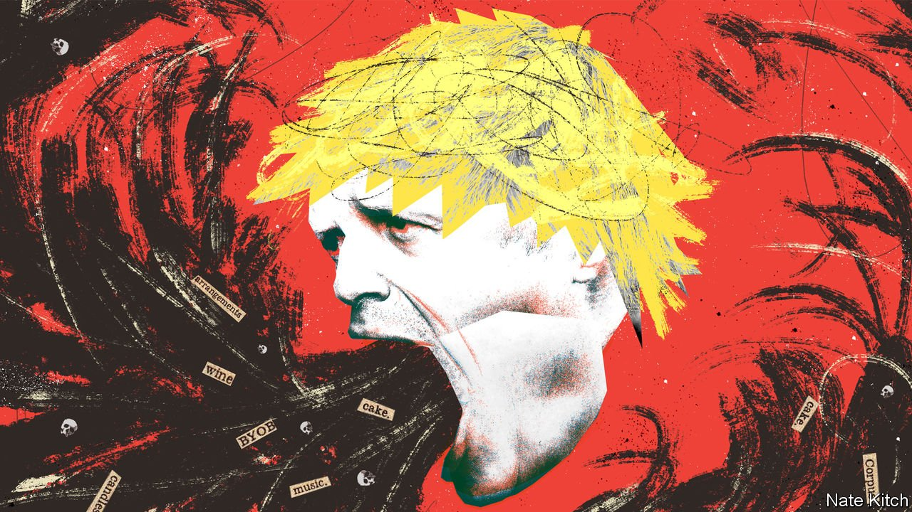

###### Bagehot

# Sue Gray delivers a first report on those Downing Street parties 

##### Every part of the British establishment has debased itself 

 

> Feb 5th 2022 

PEOPLE LASH out when cornered and Boris Johnson is no exception. In a bad-tempered debate in Parliament on January 31st, MPs picked over a summary report into a series of —including Mr Johnson’s own flat—and other locations during lockdown. Sir Keir Starmer, Labour’s leader, called on the prime minister to resign and labelled him “unworthy of his responsibilities”. Mr Johnson in turn repeated a misleading far-right meme by accusing Sir Keir, a former director of public prosecutions, of failing to charge Jimmy Savile, a former children’s entertainer and Britain’s most notorious paedophile.

It was a low point in a scandal that has . Everyone from the prime minister to the police to the civil service bears some of the blame. The report, by , a senior civil servant, criticised “failures of leadership” that allowed 16 parties to go ahead while the country was in lockdown. A dozen are being looked into by the police, whose investigations may take months. After a contemptible performance in Parliament, Mr Johnson’s future as prime minister . Yet the rot extends well beyond the current resident of Downing Street.


Take Britain’s civil service. It prides itself on being a Rolls-Royce institution. But its involvement in the succession of parties suggests that a better comparison would be to a Morris Minor. Martin Reynolds, Mr Johnson’s principal private secretary, is supposed to be a cunning bureaucrat, able to understand base politics and the complicated machinery of Whitehall. Instead, he invited more than 100 people to a booze-up during a national lockdown, reminding them via email to bring their own bottles. He resembles a hapless lackey of Stringer Bell, a drug-lord in HBO’s “The Wire”, slapped down for minuting a meeting of heroin dealers: “Is you taking notes on a criminal fucking conspiracy?”

The civil service’s initial investigation was cack-handed. When reports of parties emerged before Christmas, Simon Case, the inexperienced cabinet secretary, was asked to look into what had gone on. He later had to recuse himself after it emerged that his office had hosted a pub quiz during lockdown. The job was then handed to Ms Gray, a backroom fixer notorious among transparency campaigners for blocking freedom-of-information requests.

If the civil service botched its investigation, so did the Metropolitan Police. At first, it took the unpopular but understandable decision not to investigate historic breaches of pandemic regulations, which were usually punished in summary fashion by smallish fines. Hypocrisy among politicians and civil servants is inadvisable, but not itself criminal. The Met then U-turned and investigated. Worse, it demanded that Ms Gray excise details in her report concerning parties it was looking into. With touching naivety, lawyers suggested that would ensure that the evidence given to police had not been pre-edited by witnesses in order to fit the facts revealed by Ms Gray—as if the thought of co-ordinating stories might never otherwise have crossed the minds of those involved in a potentially career-ending scandal.

With the Met involved, however, conspiracy is less likely than cock-up. Screwing up an investigation into illegal parties in one of Britain’s most heavily guarded locales is about par for the course for Britain’s biggest police force. Its enforcement of covid regulations was erratic. Last March it broke up a vigil in memory of Sarah Everard, a 33-year-old who had been raped and murdered by one of its own officers during the spring lockdown. Yet officials smuggling suitcases clinking with wine bottles were left unchallenged.

Journalists revelled in revealing the juicy details that triggered public rage. During one party drunken attendees reportedly broke a swing in the Downing Street garden that belonged to the prime minister’s two-year-old son. But the scandal also highlighted the cosy relationship between Downing Street and the press. One party was for James Slack, the prime minister’s departing spokesman. His next job? Deputy editor of the Sun. Oddly the tabloid, usually ferocious in its reporting, failed to land the scoop.

Norms that once governed British politics are no more. MPs soberly declare that Mr Johnson should resign if he has broken the ministerial code, the rules by which the country’s leaders are supposed to abide. Lying to Parliament, as Mr Johnson was repeatedly accused of doing, is one such crime. But legally, the code is little more than a PDF on a website. And in any case, the prime minister has the final say. For an indication of how seriously Mr Johnson takes the document, read his foreword to the latest version, which begins: “The mission of this Government is to deliver Brexit…for the purpose of uniting and re-energising our whole United Kingdom and making this country the greatest place on earth.” At least it omitted the thumbs-up and Union flag emojis.

Bad chap theory

The prime minister has no intention of resigning, whatever the code says. Instead, the question moves to those around him. Do they have the courage to ? It could be done with 54 letters from Conservative MPs to a backbench committee calling for a no-confidence vote, followed by a majority of MPs in a secret ballot. That would-be regicides do not yet have the numbers indicates a paucity of alternatives. It is just two years since Mr Johnson won an 87-seat majority, on the Conservatives’ largest vote-share since 1979. Tory MPs will stick with Mr Johnson for as long as they think he is their best bet for retaining their seats and staying in power. He is the product of a broken system, not its cause.

In Parliament on January 31st, Sir Keir wound up with a simple attack on the prime minister: “He is a man without shame.” Unfortunately, British politics relies on shame to function. The country still runs on the “good chap” theory of government: the idea that politicians abide by the invisible lines of the constitution. An absence of legal constraints requires an abundance of personal restraint, and Mr Johnson has none. A bad chap can go a long way. ■

Read more from Bagehot, our columnist on British politics: (Jan 29th)

 (Jan 22nd)

 (Jan 15th)

