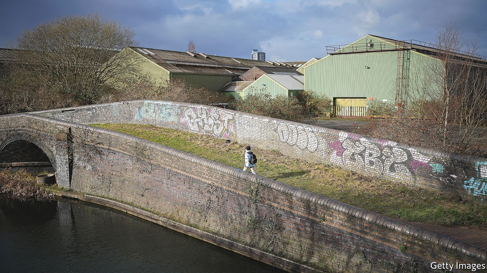
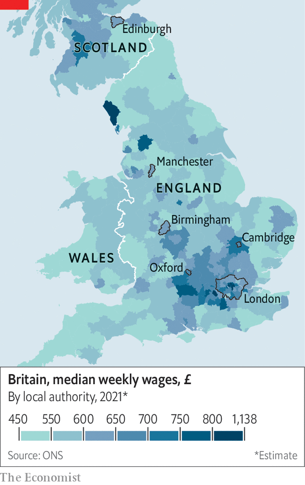

###### Levelling up

# The British government’s “levelling up” plans are oddly old-fashioned 

##### Targets, targets everywhere 

 

> Feb 5th 2022 

INCREDIBLE AS IT may seem, there was a time when MPs did not talk incessantly about “levelling up”. According to Hansard, Parliament’s chronicler, the phrase was uttered in the House of Commons just 57 times between January 2010 and July 2019, when Boris Johnson became prime minister. The tally since then is 3,227. A rebranding last September gave Britain a Department for Levelling Up, Housing and Communities. And on February 2nd the government explained how it would do it.

 


The aspiration to raise the fortunes of Britain’s poorer regions burns strongly, for economic and political reasons. Britain is highly unequal geographically. Skilled workers and well-paid jobs cluster around London and to a lesser extent the Scottish lowlands (see map). In 2019 gross value added per person—a measure of output—was 78% higher in London than in the United Kingdom as a whole. In the general election that year the Conservative Party won many seats outside the charmed zone, in the Midlands and north of England. It would like to hold on to them.


The publication of the government’s levelling-up strategy was delayed, partly because of covid-19, partly because Mr Johnson is not the sort of prime minister who relishes pulling together a large, complex plan involving many departments. And the strategy almost seems to come from an earlier era of government. It has a particularly strong New Labour flavour.

Although Mr Johnson compares levelling up to integrating the former East Germany, he has ruled out a German-style splurge. The plans come with little new money. A Shared Prosperity Fund, worth £2.6bn ($3.5bn) over three years, simply replaces cash that poor regions used to receive from the EU. Some pots of jam that are currently spread thickly in London will be distributed more widely. The business department promises to spend more on research and development outside the triangle of London, Oxford and Cambridge. Arts Council England will pay for more culture outside the capital.

The British state already redistributes large sums from south-east England to the rest of the country. In the 2019-20 fiscal year, London had a net fiscal surplus of £36bn, while the north-west had a deficit of £23bn. A forthcoming increase in payroll taxes will probably widen the gap because it will fall most heavily on well-paid workers and their employers. The government is, in effect, gambling that the metropolitan goose will keep laying golden eggs even if fed a little less.

The big idea in the white paper is English devolution. Further powers for existing metropolitan governments are promised, beginning with Greater Manchester and the West Midlands, although the government is vague about which powers. Counties including Cornwall, Devon and Norfolk are invited to start negotiating for new “county deals”. Those that create directly elected leaders could be in line for more money and powers, such as a long-term investment fund and the ability to levy a supplement to business rates.

But levelling up involves at least as much centralisation as devolution. The government has created pots of money, such as the Towns Fund, and invited selected local authorities to bid for a share. To assess bids, more civil servants are required: the number employed in the Cities and Local Growth Unit is set to rise from 420 to 750. Sometimes the government simply announces that places deserve extra help. It promises to “proactively identify” 20 towns or boroughs that require regeneration. Schools in 55 areas where children do particularly badly will receive more money to help retain teachers in “high-priority subjects”—which have, naturally, also been specified by the government in Westminster.

In some ways the plans are reminiscent of those created by the Labour governments under Sir Tony Blair and Gordon Brown. They feature a list of performance indicators, such as increasing healthy life expectancy by five years and ensuring that 90% of children reach expected standards in reading, writing and mathematics. Progress will be centrally tracked and reported on, much as New Labour tracked progress in cutting child poverty. Trying to regenerate poor places through cultural spending was also a New Labour staple. But there is one big difference. Sir Tony and Mr Brown believed that Britain needed a strong London. Mr Johnson seems to think pretty much the opposite.

The new plans mention the capital often. The government says that by 2030, everywhere in England could have powers like London, and promises “London-style” transport systems. But there are two ways of achieving that. The less benign one, which might be called levelling down, is proceeding apace. Last year the government challenged London’s development master plan. It has bailed out the city’s transport network, which has been clobbered by covid-19, but only reluctantly and at the last minute. Transport for London is now considering drastic cuts to services. As the mayor, Sadiq Khan, has complained, even London might not have a London-style transport system for long. ■

