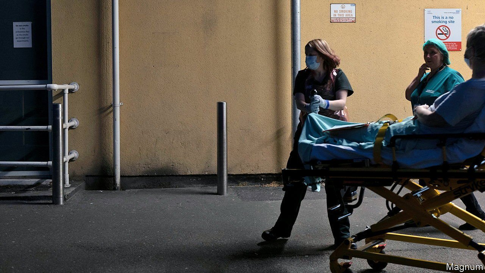

###### To infinity and beyond

# The government is promising to tackle the NHS backlog 

##### Without proper workforce planning, it will fail 

 

> Feb 3rd 2022 

DAYS BEFORE a deadline for National Health Service frontline staff to get vaccinated against covid-19, the government started to waver. It scrapped its plans entirely on January 31st. If mandatory vaccination had gone ahead, hospitals would have had to sack an estimated 70,000 workers—some 5% of staff—in England alone. Although patients would be safer if those caring for them were all jabbed, the NHS is so understaffed that losing so many people would have been catastrophic.

The backlog of patients awaiting care is larger than at any time since 2007, when records began. During the ten-year austerity squeeze that started in 2010 the NHS fared better than other parts of the public sector—but still received lower budget increases than during the previous decade. Meanwhile, demand continued to rise inexorably. Then came the pandemic.


In the queue are patients in need of treatments that are not deemed emergencies, such as cataract removal and operations on hips and knees. Many are managing chronic pain. A quarter are waiting for a diagnosis, perhaps for an X-ray or MRI scan; as they wait, undiscovered cancers and damaged joints will worsen. Some conditions may become untreatable before they are ever diagnosed.

Government data suggest that 6m people are waiting in England alone. But that figure is almost certainly wrong. The quality of the data is very poor, says Rob Findlay of Insource, a data-management company that works with the NHS to help it understand its waiting lists. The health-care system is bad at tracking urgent care that has been delayed, and waits for follow-up appointments after procedures have been done are not counted at all.

Just as worrying as the waiting lists themselves are “missing” referrals—people who, in normal times, would have been referred to a specialist by their primary-care doctor, but who did not present at surgeries during the pandemic. GPs saw millions fewer patients than normal during the past two years, and the National Audit Office reckons that 8m-9m people would have been referred. “We don’t know how many are going to come back,” says Mr Findlay, “or what condition they will be in.”

Compounding the problem, in any given week as many as 5,000 costly hospital beds are occupied by medically fit patients. They linger largely because social care is so underfunded that they cannot be offered the far cheaper support that would enable them to go home. One hospital trust in Northumbria is so fed up with this problem that it is proposing to offer social-care services itself.

In September 2021 the government directed an extra £5.4bn ($7.3bn) over three years to support non-emergency care. (In a typical year, the NHS spends £28bn on such care.) In April payroll taxes are due to rise, with the extra money intended for health care and, in the longer term, social care, too. Even so, the health secretary, Sajid Javid, has warned that the waiting list could grow to 13m patients in the next few years. That is one Briton in five.

The government has yet to publish its (much-delayed) plan for tackling the backlog. It will include setting up new diagnostic centres and making efforts to move non-emergency care into dedicated facilities, whether NHS or private, that will not be disrupted by the annual winter surge in emergency admissions of elderly people. Better use of technology will be used to link up hospitals and other care providers, such as nursing homes or proposed new surgical hubs, increasing efficiency. The number of beds will have to rise. The aim is to increase the number of non-emergency procedures by 30% by 2024 compared with the pre-pandemic baseline.

At least as urgent is a realistic, up-to-date workforce plan—something that has been promised since 2016. On January 24th Sir Simon Stevens, until recently the boss of NHS England, criticised the government on this front, in stinging terms. Accusing it of “wilful blindness”, he pointed out that funding for Health Education England, the body responsible for ensuring the NHS workforce is big enough and has the right skills, was so precarious that running costs were covered on a horizon of just ten weeks. Unsurprisingly, this short-termism means it is not able to do its job properly: a recent presentation on its work opened with the dispiriting disclaimer that “we do not warrant or represent that the report is appropriate for your purposes”.

By some estimates, clearing the backlog will take the best part of a decade. As it has grown, so too has the use of private care, with those who can afford to deserting the NHS. Healthcode, a company that clears medical bills for the private health sector, says the volume of bills going through the private sector has gone up by 8% since 2019, a level of growth not seen before. But few voters in the poorer constituencies that swung to the Conservatives in 2019 will have that sort of money. It all adds up to a headache for the government, which is unlikely to have much to show for the extra spending before the general election due in 2024. As patients find themselves fighting for their lives, so will politicians. ■

