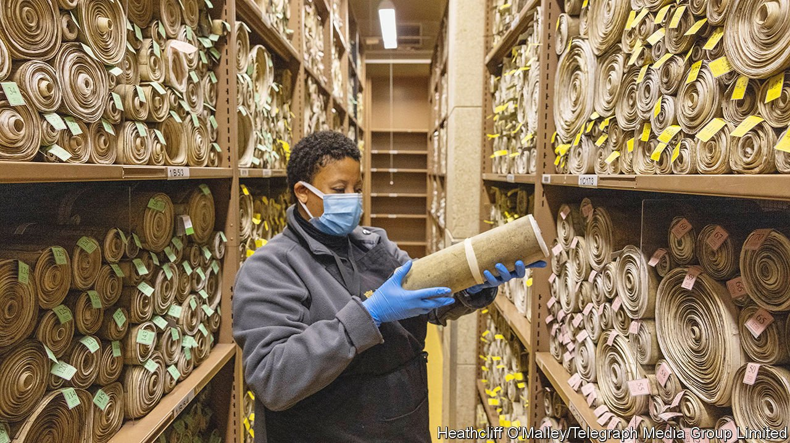

###### Scrolling through

# The laws are being removed from Parliament 

##### The symbolism is unfortunate; the rationale is sound 

 

> Feb 3rd 2022 

ONE BY ONE, every parliamentary act is being removed from its shelf in the Palace of Westminster, put in a lidded grey box—a small curatorial coffin—and carried away. Some are celebrity statutes: the Bill of Rights; the Act of Union. Others colonised countries and later set them free, enabled British slaving and ended it, oppressed women and emancipated them. By the end of 2025, all will be elsewhere.

The symbolism, for a government being investigated by the police, is unfortunate. But the rationale is sound. Parliament’s archives need reform. Ever since 1497, when a medieval clerk decided the old archive was too far away, Parliament has taken care of its own laws. Over half a millennium they have built up, and now the archives have over 10km of shelving. They hold 64,000 acts of Parliament, diaries, letters, speeches and assorted bits and bobs, including bolt-cutters (used to remove a suffragette from the railings of Parliament), a banner, recently discovered in a cupboard (“VOTES FOR WOMEN”) and, for complicated reasons, half a gravestone (in a box marked “CAUTION: EXTREMELY HEAVY”).


One reason for the grand removal will be familiar to any archivist: outmoded data formats. Many libraries struggle with CD-ROMS and floppy disks; Parliament’s version is vellum. Until 2017 Britain’s laws were written on parchment that was rolled into scrolls and laid on shelves in the Acts Room. They were not ordered according to any principle as common as the Gregorian calendar, but instead by the year of the reign during which they were passed. So a law passed in 1536 (for the “Punysshement of Pyrotes and Robbers of the See”) is dated, in parliamentary time, as “28 Hen 8”.

The Acts Room is popular with film and television crews, says Adrian Brown, the director of the archives. Step inside and it is easy to see why. The laws lie stacked like bolts of cloth in a tailor’s, the spirals of each scroll as perfect as the rings on a tree. This is democracy, distilled, and it takes up startlingly little space. Here, a king can be confined to a bookcase, and centuries can be strode past in steps.

Aesthetically, the laws are beautiful. Practically, they are a nightmare. The problem is partly the parchment. Shelving scrolls is tricky. The storage technique is familiar to anyone who owns a wardrobe with a top shelf: pop things in, one on top of another, hope you don’t need the one at the bottom—and if you do, tug. The system is hardly “ideal from a retrieval point of view”, says Mr Brown, though the smaller ones do slide out neatly enough.

The Victoria Tower that houses the archives is also a problem. “If you were designing a modern archive you wouldn’t put it in a 350-foot tower,” says Mr Brown. Twelve storeys high, with a central spiral staircase, it could be described as a fine example of perpendicular Gothic—or as a giant chimney filled with paper (in the 1950s a firebreak was added halfway up). Parliament has form when it comes to unfortunate storage arrangements. The Palace of Westminster had to be rebuilt after the Great Fire of 1834, which was started by archival materials (in that case, tally sticks). It is not yet known where the new archives will be, but there will definitely be less of an up-draft. Just sometimes, Parliament learns from its mistakes. ■

