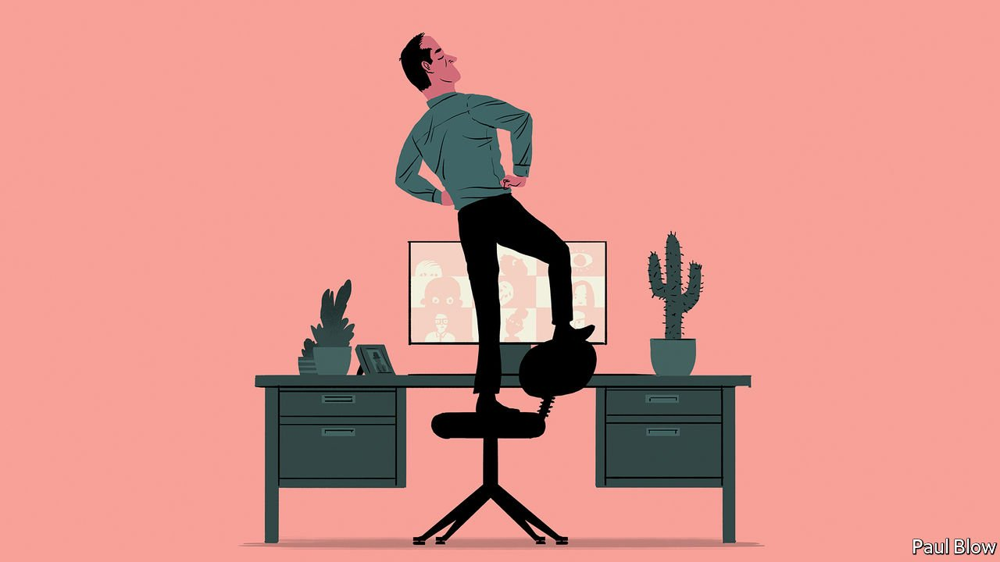

###### Bartleby

# Body language in the post-pandemic workplace 

##### Much of the research into non-verbal communication is now redundant 

 

> Feb 5th 2022 

COMMUNICATION IS AN essential part of leadership. And body language is an essential part of communication. On these slim pillars rests a mini-industry of research and advice into how executives can influence, encourage and ascend without needing to say a word. The pandemic has made much of it redundant.

Plenty of studies have looked into the non-verbal behaviour that marks out “emergent leaders”, people who do not have a specified role in the hierarchy but naturally assume a position of authority in groups. They are a bag of tics. They nod; they touch others but not themselves; they gesture; they furrow their brows; they hold themselves erect; their facial expressions are more animated.


Other research suggests that, to win votes in an election, candidates should deliver speeches with their feet planted apart. The second-most popular TED talk claims that two minutes of private, hands-on-hips “power posing” can infuse a job candidate with confidence and improve others’ perceptions of them.

Gazing can foster a sense of psychological safety as well as confer authority: in a recent paper, a trio of researchers from Harvard Business School found that receiving more eye contact from a bigwig led to greater participation in group interactions. Leaders who adopt open body positions, with arms and legs uncrossed, are also more likely to encourage contributions.

There are three problems with this body of research on non-verbal communication. One is that so much of it is blindingly obvious. Nodding at someone rather than shaking your head in incredulity when they are speaking to you—this does indeed send a powerful signal. But so does punching someone in the face, and no one thinks that requires a journal publication.

A second problem is that people look for different things from their bosses. Frowning is seen as a mark of emergent leaders but not of supportive ones; the reverse is true of smiling. (The effect of smiling with lowered eyebrows cries out for study.) A recent paper found that male recipients regarded bosses who used emojis, a form of not-quite-verbal communication, in an email as more effective, but that female recipients perceived them as less effective.

The third problem is newer. Almost all of the research on body language dates from a time of in-person interactions. Even when the pandemic wanes and offices in the West refill, most buildings will not return to full capacity. Employees will keep working remotely for at least part of the week; Zoom will remain integral to white-collar working lives. And if there is one thing for which online interactions are not suited, it is body language.

That is partly because bodies themselves are largely hidden from view: whatever language they are speaking, it is hard to hear them. You will know the partners, pets and home-decor choices of new colleagues before you will know how tall they are. And although faces fill the video-conferencing screen, meaningful eye contact is impossible.

Once past a basic threshold of attentiveness—not looking down at your mobile phone, say—most people have the same glassy-eyed stare. If several faces appear on screen, these participants have no way of knowing that you are gazing specifically at them. (Anyway, admit it: the face you are looking at with most interest is your own.) If your camera is in the wrong place, you may think you are looking meaningfully at your team but you are actually just giving them a view of your nostrils. Animated expressions are hard to spot, particularly when people attending hybrid meetings in the office are Lowry-like figures seated metres away.

There are no good ways to compensate for these problems. One tactic is to go all in on expressiveness, nodding furiously and gesturing dementedly—a small tile of caged energy somewhere in the bottom left-hand corner of the screen. Another is to do a “Zoom loom”, placing yourself so close to the camera that you will give everyone nightmares.

The simpler option is not to think too hard about body language. At a few specific moments, like job interviews and set-piece speeches, first impressions matter and a bit of self-conscious posing pays off. But posture is not leadership. If you want to give people a break from staring at a screen, turning off your camera is a good way to do it. If you want to waggle your eyebrows, up or down, let them loose. And if you need to be told that looking at someone makes them feel valued, you have bigger issues.

