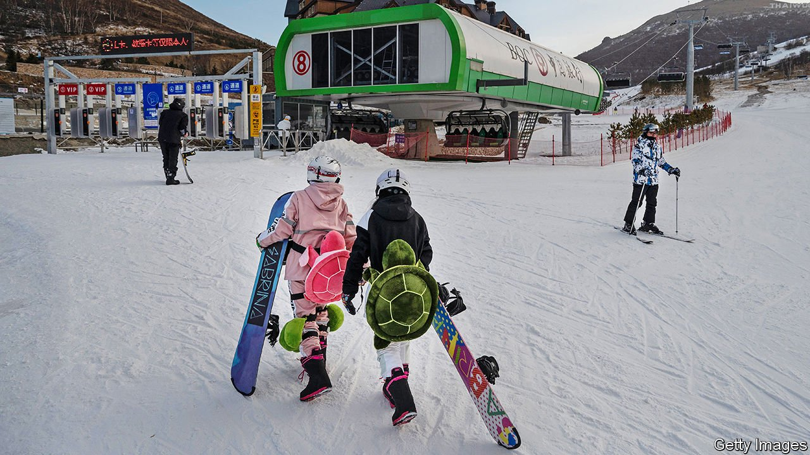

###### The hills are alive

# China’s ski industry faces an avalanche of risks 

##### Developers have ploughed mountains of money into the snow business. Will it melt away? 

 

> Feb 5th 2022 

IN MUCH OF the world the business of running ski slopes has, like most of tourism, been crippled by lockdowns and travel restrictions. China is no exception. Visits to Chinese ski areas slumped by 38% in 2020—steeper than a global decline of 14% after covid-19 hit. Two in five winter-sports businesses lost more than half their revenue as a result of anti-virus measures, according to the Beijing Olympic City Development Association, an official group set up to champion sport. One in 14 ski areas, especially small ones, gave up the ghost in 2020. As China prepares to host the Winter Olympics, which open in Beijing on February 4th, its ski-industrial complex is hoping that this celebration of all pursuits below freezing will mark the end of a short-lived icy patch.

Unlike Europe and America, where the winter-sports sector’s downhill slide predates the pandemic, Chinese skiers were taking to the slopes in record numbers. The Beijing Ski Association says that people paid more than 20m visits to China’s ski venues in 2019, twice as many as in 2014. Eileen Gu, a teenager raised in San Francisco who has chosen to represent China, where her mother was born, in freestyle skiing, has recalled that just a few years ago she knew virtually all the freestyle skiers in the country. Now the gold-medal contender suggests they are like snowflakes in a blizzard.


Investors have been swept up, too. China had nearly 800 ski areas before the pandemic, four times the number in 2008 and not a world away from around 1,100 in the Alps, where they began popping up around 1900. Though the Chinese areas still have many fewer lifts than Western ones, they are getting more sophisticated. Some now offer summer pastimes like mountain-biking, hiking and rafting. China’s 36 indoor ski centres—it has more of these than any other country—accounted for a fifth of all ski visits in the country in 2020. Sunac China is the world’s largest operator of such venues. Indoor ski slopes contributed to the success of the developer’s culture-and-tourism business (which also includes malls, water-sports venues and hotels), where revenues grew by 166% year on year in the first half of 2021.

Even so, Chinese ski-resort operators are vulnerable to two industry-wide uncertainties. The first is climate change. Since milder temperatures mean less snow, ski resorts everywhere are hostage to global warming. Doubts over sufficient snowfall have prompted Olympic organisers this year to rely entirely on artificial snow for the first time. But making the white stuff artificially uses an awful lot of water—a scarce resource in China’s drought-prone north, home to half its population and most of its resorts. The Olympic games alone may need 2m cubic metres—enough to fill 800 Olympic-size swimming pools—to produce sufficient snow cover, according to Carmen de Jong, a hydrologist at the University of Strasbourg. Officials reckon the event will use up to a tenth of all water consumed during the ski events in the Chongli district, which will host them. Indoor slopes, for their part, need less snow but all of it is artificial.

The second uncertainty has to do with future demand. China still has room to catch up with big skiing nations. Chinese skiers hit the slopes once a year in the winter of 2020-21, on average, compared with half a dozen times for those in Austria or Switzerland. Optimists also point out that many Chinese skiers are young, and so in principle have plenty of skiing left in their legs; whereas in America more than one-fifth of skiers are over 55, about 80% of China’s are under 40 years old, according to Laurent Vanat, a consultant on the global ski industry.

However, precisely because China lacks a strong tradition of skiing, absolute beginners are exceptionally common on its pistes. Around 80% of skiers in China are first-timers this season, up from 72% in 2019, according to Mr Vanat. In Europe and America the share is less than 20%. China’s ski industry is counting on a strong showing from Ms Gu and the rest of the national team to convert such neophytes into regulars. Like her, though, resort owners face tough terrain ahead. ■

For more expert analysis of the biggest stories in economics, business and markets, , our weekly newsletter. And for more coverage of climate change, register for , our fortnightly newsletter, or visit our 

