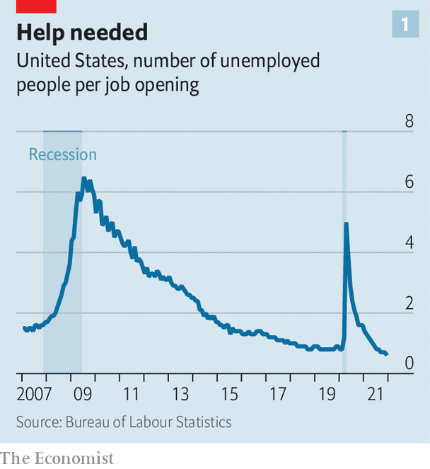
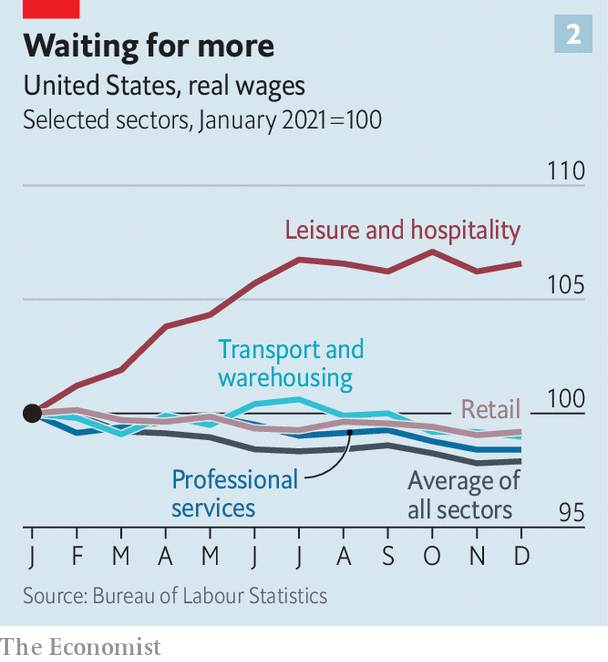

###### We’re hiring

# How America’s talent wars are reshaping business 

##### The labour shortages are forcing firms to get creative 

 

> Feb 5th 2022 

DCL LOGISTICS, like so many American firms, had a problem last year. Its business, fulfilling orders of goods sold online, faced surging demand. But , wages were rising and staff turnover was high. So DCL made two changes. It bought robots to pick items off shelves and place them in boxes. And it reduced its reliance on part-time workers by hiring more full-time staff. “What we save in having temp employees, we lose in productivity,” explains Dave Tu, DCL’s president. Full-time payroll has doubled in the past year, to 280.

As American companies enter another year of uncertainty, the workforce has become bosses’ principal concern. Chief executives cite worker shortages as the greatest threat to their businesses in 2022, according to a survey by the Conference Board, a research organisation. On January 28th the Labour Department reported that firms had spent 4% more on wages and benefits in the fourth quarter, year on year, a rise not seen in 20 years. Paycheques of everyone from McDonald’s burger-flippers to Citi group bankers are growing fatter. This goes some way to explaining why profit margins in the S&amp;P 500 index of large companies, which have defied gravity in the pandemic, are starting to decline. On February 2nd Meta spooked investors by reporting a dip in profits, due in part to a rise in employee-related costs as it moves from Facebook and its sister social networks into the virtual-reality metaverse.


At the same time, firms of all sizes and sectors are testing new ways to recruit, train and deploy staff. Some of these strategies will be temporary. Others may reshape American business.

 


The current jobs market looks extra ordinary by historical standards. December saw 10.9m job openings, up by more than 60% from December 2019. Just six workers were available for every ten open jobs (see chart 1). Predictably, many seem comfortable abandoning old positions to seek better ones. This is evident among those who clean bedsheets and stock shelves, as well as those building spreadsheets and selling stocks. In November 4.5m workers quit their jobs, a record. Even if rising wages and an ebbing pandemic lure some of them back to work, the fight for staff may endure.

For decades American firms slurped from a deepening pool of labour, as more women entered the workforce and globalisation greatly expanded the ranks of potential hires. That expansion has now mostly run its course, says Andrew Schwedel of Bain, a consultancy. Simultaneously, other trends have conspired to make the labour pool shallower than it might have been. Men continue to slump out of the job market: the share of men aged 25 to 54 either working or looking for work was 88% at the end of last year, down from 97% in the 1950s. Immigration, which plunged during Donald Trump’s nativist presidency, has sunk further, to less than a quarter of the level in 2016. And covid-19 may have prompted more than 2.4m baby boomers into early retirement, according to the Federal Reserve Bank of St Louis.

These trends will not reverse quickly. Boomers won’t sprint back to work en masse. With Republicans hostile to outsiders and Democrats squabbling over visas for skilled ones, a surge in immigration looks unlikely. Some men have returned to the workforce since the depths of the covid recession in 2020, but the male participation rate has plateaued below pre-pandemic levels. A tight labour market may persist.

Both workers and employers are adapting. For the most part, they are doing so outside the construct of collective bargaining. Despite a flurry of activity—Starbucks baristas in Buffalo and Amazon workers in Alabama will hold union votes in February—unions remain weak. Last year 10.3% of American workers were unionised, matching the record low of 2019. Within the private sector, the unionisation rate is just 6.1%. Strikes and pickets will be a headache for some bosses. But it is quits that could cause them sleepless nights.

Pay as they go

Companies’ most straightforward tactic to deal with worker shortages is to raise pay. If firms are to part with cash, they prefer the inducements to be one-off rather than recurring and sticky, as with higher wages. That explains a proliferation of fat bonuses. Before the Christmas rush Amazon began offering workers a $3,000 sign-on sweetener. Compensation for lawyers at America’s top 50 firms rose by 16.5% last year, in part thanks to bonuses, according to a survey by Citigroup and Hildebrandt, a consultancy. In January Bank of America said it would give staff $1bn in restricted stock, which vests over time.

 


But base pay is rising, too. Bank of America says it will raise its minimum wage to $25 by 2025. In September Walmart, America’s largest private employer, set its minimum wage at $12 an hour, below many states’ requirement of $13-14 but well above the federal minimum wage of $7.25. Amazon has lifted average wages in its warehouses to $18. The average hourly wage for production and nonsupervisory employees in December was 5.8% above the level a year earlier; compared with a 4.7% jump for all private-sector workers. Firms face pressure to lift them higher still. High inflation ensured that only workers in leisure and hospitality saw a real increase in hourly pay last year (see chart 2).

Raising compensation may not, on its own, be sufficient for companies to overcome the labour squeeze, however. This is where the other strategies come in, starting with changes to recruitment. To deal with the fact that, for some types of job, there simply are not enough qualified candidates to fill vacancies, many businesses are loosening hiring criteria previously deemed a prerequisite.

The share of job postings that list “no experience required” more than doubled from January 2020 to September 2021, reckons Burning Glass, an analytics firm. Easing rigid preconditions may be sensible, even without a labour shortage. A four-year degree, argues Joseph Fuller of Harvard Business School, is an unreliable guarantor of a worker’s worth. The Business Roundtable and the US Chamber of Commerce, two business groups, have urged companies to ease requirements that job applicants have a four-year university degree, advising them to value workers’ skills instead.

Another way to deal with a shortage of qualified staff is for firms to impart the qualifications themselves. In September, the most recent month for which Burning Glass has data, the share of job postings that offer training was more than 30% higher than in January 2020. New providers of training are proliferating, from university-run “bootcamps” to short-term programmes by specialists such as General Assembly and big employers themselves. Employers in Buffalo have hired General Assembly to run data-training schemes for local workers who are broadly able but who lack specific tech skills. Google, a technology giant, says it will consider workers who earn its online certificate in data analytics, for example, to be equivalent to a worker with a four-year degree.

Besides revamping recruitment and training, companies are modifying how their workers work. Some positions are objectively bad, with low pay, unpredictable scheduling and little opportunity for growth. Zeynep Ton of the MIT Sloan School of Management contends that making low-wage jobs more appealing improves retention and productivity, which supports profits in the long term. As interesting as Walmart’s pay increases, she argues, are the retail behemoth’s management changes. Last year it said that two-thirds of the more than 565,000 hourly workers in its stores would work full time, up from about half in 2016. They would have predictable schedules week to week and more structured mentorship. Other companies may take note. Many of the complaints raised by labour organisers at Starbucks and Amazon have as much to do with safety and stress on the job as they do wages or benefits.

Companies that cannot find enough workers are trying to do with fewer of them. Sometimes that means trimming services. Many hotel chains, including Hilton, have made daily housekeeping optional. “We’ve been very thoughtful and cautious about what positions we fill,” Darren Woods, boss of ExxonMobil, told the oil giant’s investors on February 1st.

Increasingly, this also involves investments in automation. Orders of robots last year surpassed the pre-pandemic high in both volume and value, according to the Association for Advancing Automation. UPS, a shipping firm, is boosting productivity with more automated bagging and labelling; new electronic tags will eliminate millions of manual scans each day.

New business models are pushing things along. Consider McEntire Produce in Columbia, South Carolina. Each year more than 45,000 tonnes of sliced lettuce, tomatoes and onions move through its factory. Workers pack them in bags, place bags in boxes and stack boxes on pallets destined for fast-food restaurants. McEntire has raised wages, but staff turnover remains high. Even as worker costs have climbed, the upfront expense of automation has sunk. So the firm plans to install new robots to box and stack. It will lease these from a new company called Formic, which offers robots at an hourly rate that is less than half the cost of a McEntire worker doing the same job. By 2025 McEntire wants to automate 60% of its volume, with robots handling the back-breaking work and workers performing tasks that require more skill. One new position, introduced in the past year, looks permanent: a manager whose sole job is to listen to and support staff so they do not quit. ■

For more expert analysis of the biggest stories in economics, business and markets, , our weekly newsletter.

