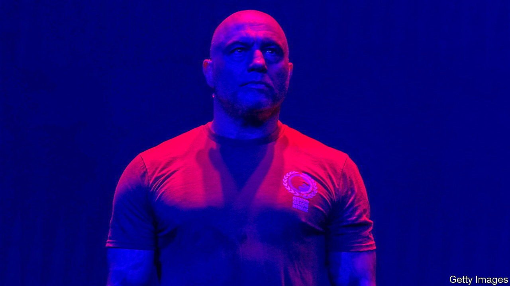

###### Don’t know what you’ve got ’til it’s gone

# Spotify, Joe Rogan and the Wild West of online audio 

##### Streamers look increasingly like social media, but without the content controls 

 

> Feb 5th 2022 

NEIL YOUNG was five years old when, in 1951, he was partially paralysed by polio. Joni Mitchell was nine when she was hospitalised by the same illness around the same time. Both grew up to become famous singers—and, lately, prominent campaigners against anti-vaccine misinformation. The two musicians, followed by a handful of others, have withdrawn their music from the world’s biggest streaming service in protest at a podcast that gave airtime to anti-vaxxers.

“The Joe Rogan Experience”, to which Spotify bought exclusive rights in 2020 for a reported $100m, hosted vaccine sceptics and promoted dubious remedies such as ivermectin, which Mr Rogan himself tried out when he caught covid last year. At the time of writing Mr Rogan, Spotify’s most popular podcaster, had promised to “balance things out” in future interviews, but was still on air, to the irritation of his critics (including some Spotify staff, who in the past have accused him of sins including transphobia). Mr Young, Ms Mitchell and a few others were holding out.


The bust-up looks like a gift to Spotify’s rivals. Yet it has raised questions about content moderation which could prove tricky—and rather expensive—for all audio-streaming platforms.

As the biggest streamer, with 180m paid subscribers, Spotify has power over artists. Mr Young says he gets about 60% of his streaming income there. A rough calculation by Will Page, a former Spotify chief economist, based on figures from MRC, a data firm, suggests the musician stands to lose about $300,000 this year if he continues his boycott (though it seems that, for now, streaming of his songs is up by about 50%, owing to more plays on other platforms amid publicity from the spat). But Spotify, too, is vulnerable. On February 2nd it warned of slowing subscriber growth, sending its share price tumbling. Its main rivals, Apple and Amazon, have market values some 70 and 40 times its own $37bn, respectively, and bundle audio along with TV, gaming and more. Mr Young and Ms Mitchell are no longer A-list stars, but their departure undermines Spotify’s claim to offer “all the music you’ll ever need”. Apple and Amazon wasted no time in promoting the pair on their social-media feeds.

Nonetheless, the Rogan affair touches on a sensitive subject for all streamers. Unlike “The Joe Rogan Experience”, which is professionally produced and owned by Spotify, most of the tens of thousands of new podcasts and songs uploaded to the platforms every day are user-generated. Services like Spotify thus increasingly resemble social networks like YouTube. A big difference is that their oversight of what is uploaded seems primitive by comparison.

Spotify, a 16-year-old company, published its “platform rules” only after the Rogan controversy erupted. Apple has content guidelines for podcasts, but for music only a style guide that asks artists to flag explicit lyrics and to keep album artwork clean. Amazon seems to have published even less by way of rules for audio content.

And whereas most social networks publish regular reports on what content they remove, the audio platforms are mute on the subject. Amid Rogangate, Spotify revealed it had deleted 20,000 podcast episodes over covid misinformation. The rest is guesswork. Facebook employs 15,000 content moderators. How many work for the audio streamers? None will say. (Insiders suggest the answer is not many.)

“It’s always been baffling to me how podcasts have flown under the content-moderation radar,” says Evelyn Douek of Harvard Law School. “It’s a massive blind-spot.” It could also prove to be a pricey one. As audio platforms host more user-generated content, the moderation task will expand. It will probably involve lots of human moderators; automating the process with artificial intelligence, as Facebook and others are doing, is even harder for audio than it is for text, images or video. Software firms’ valuations “have long been driven by the notion that there’s no marginal cost”, says Mr Page. “Content moderation might be their first.” ■

For more expert analysis of the biggest stories in economics, business and markets, , our weekly newsletter.

