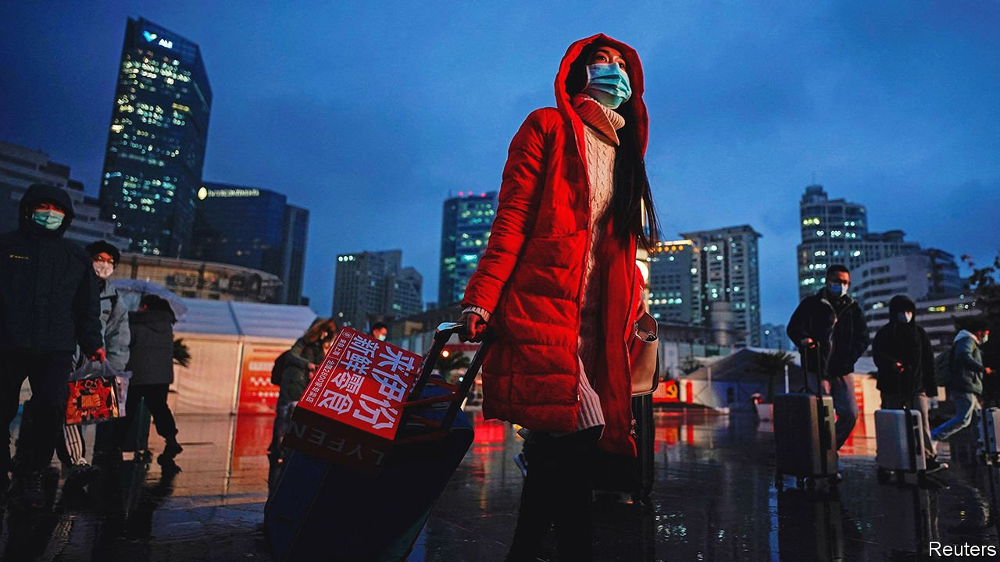

###### Not home for the holidays

# Chinese New Year is disrupted for a third year 

##### And the economy is feeling the pinch 

 

> Feb 3rd 2022 

SPEAKING TO FOREIGN bigwigs at last month’s World Economic Forum, President Xi Jinping said that, to meet its many challenges, humanity must “act with the courage and strength” of a winged tiger. At home, however, the year of the tiger he welcomed on February 1st has not felt much like the winged variety. Chinese people are struggling to negotiate their third muted new year of the pandemic amid an array of ever-changing travel rules.

Some 260m “journeys” were made in the ten days after January 17th (an official metric whereby each leg of a trip, such as a flight or a train ride, counts as a journey) and 1.2bn journeys are forecast before February 25th. That would be up by 36% on a year ago, but still way down on the 3bn journeys taken during new year of 2019.


The Omicron variant is bubbling up. Media describe people travelling long distances only to be told on arrival that they must quarantine for two weeks or return home. In Hangzhou officials have offered gift vouchers to those forgoing holiday travel. In Ningbo and Hefei, some factories remain open and a daily subsidy of 100 yuan ($16) is offered to those who stay at work.

In the first week of new year 2021, consumers spent 821bn yuan on retail and food, up by 29% on covid-ravaged 2020 and by 5% on 2019. But economic growth slowed from 4.9% to 4% in the last quarter of 2021. With no visitors even for the Winter Olympics, opening on February 4th, few expect the tiger year to start with a roar.

