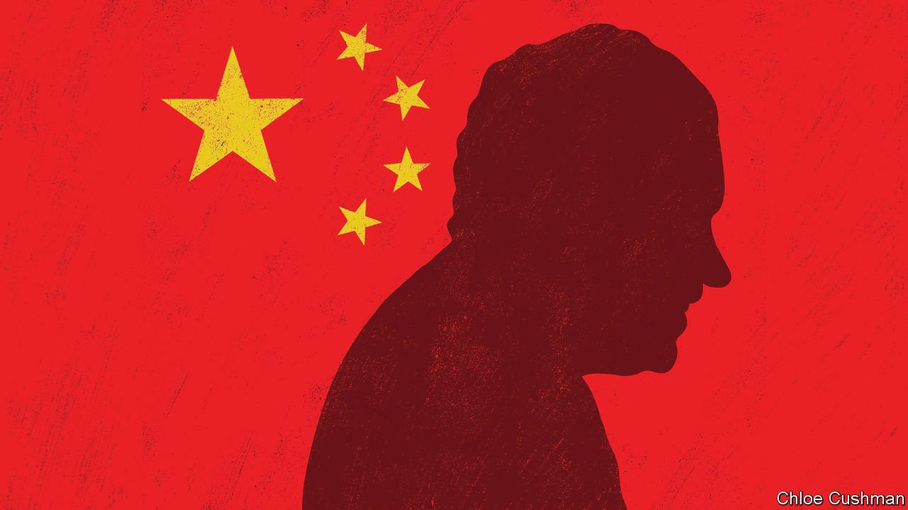

###### Chaguan

# Nixon’s visit to China, 50 years on 

##### Eye-witnesses from 1972 offer their views of a relationship in bad shape 

 

> Feb 3rd 2022 

HALF A CENTURY ago Richard Nixon took a gamble that made history. On a cold, hazy February morning, he landed in Beijing, the capital of a communist regime that America did not officially recognise, to meet China’s ailing tyrant, Mao Zedong.

The president’s stated motives were grandly visionary. China, home to a fifth of humanity, languished in angry isolation in 1972, its borders all but closed to the world. Desperately poor, its people were six years into the Cultural Revolution, a decade of ideological purges and violence at times approaching civil war. Nixon, a cold-war hawk who had spent years smearing opponents as soft on communism, had come to believe that a stable global order must include China. “We simply cannot leave China forever outside the family of nations, there to nurture its fantasies, cherish its hates and threaten its neighbours,” Nixon wrote in 1967. His visit was a global sensation, televised live. Years later, it inspired an opera.


Yet alongside noble talk of ending China’s isolation, Nixon and his foreign-policy adviser, Henry Kissinger, flew to China for secret, cynical reasons, too. With China and the Soviet Union on such terrible terms that Mao feared a Soviet invasion, Mr Kissinger and his president saw a chance for geometric diplomacy, to realign the global balance of power. In their plans, embracing weak China would usefully unsettle the mighty Soviet Union. They hoped it would also hasten the end of America’s war in Vietnam, as North Vietnamese leaders realised it was time to sue for peace. The costs included betraying an ally. Nixon was ready to end diplomatic ties with a rival Chinese government, the Nationalist regime that had fled to Taiwan after losing a civil war to Mao. The price of a successful visit in 1972 was a joint declaration, the Shanghai communiqué, in which America “acknowledged” that “all Chinese” agree that Taiwan is part of China, though it stopped short of accepting that the Communist Party should run the island.

Declassified American records of the visit reveal much relish for cynical realpolitik. Nixon and close aides calculated the benefits of each move to America, but also to the president’s re-election campaign. They sighed about the brilliance and subtlety of Mao and his prime minister, Zhou Enlai, despite the horrors unfolding in China at that time. Fifty years on, China’s leaders seem nostalgic for such values-free diplomacy, hinting that it offers the best way of repairing relations that are in dire shape. China’s read-out of a telephone call on January 27th between the foreign minister, Wang Yi, and America’s secretary of state, Antony Blinken, notes the upcoming 50th anniversary of the Shanghai communiqué, without mentioning Nixon’s visit. Mr Wang cited a clause from the communiqué which talked of looking past essential differences in America’s and China’s social systems. He told Mr Blinken that a pre-requisite for peaceful co-existence, in 1972 or in the future, was each country eschewing any “intention to change the other”. China’s message seems to be: if 1972 made history, all credit goes to Mao’s and Nixon’s ability to weigh national interests coldly, and none to lofty rhetoric about ending China’s isolation.

That being a bleak take on an important event, Chaguan sought advice from Chinese and Americans who remember the Nixon-Mao visit. Shi Yinhong, an expert on America at Renmin University, was 20 years old in February 1972. He is sceptical that romantic visions about the family of nations moved either man. Mao chose to meet Nixon and emerge from strategic isolation as a calculated move to counter the Soviet Union, he says. Professor Shi is sure that Nixon’s aims were similarly unsentimental: to get America out of Vietnam without China filling a regional vacuum, and to align with China against the Soviets. With the balance of power between America, China and Russia changed beyond recognition, he sees few lessons from 1972 that apply directly today. Even a renewed focus on national interests cannot help much, he worries, because America and China are determined to pursue stability “on their own terms”, by maximising their respective power.

Very different memories move Zha Jianying, who in 1972 was a 12-year-old schoolgirl in Beijing. Her father, like many intellectuals, was in a labour camp. She recalls a life of shabby, propaganda-filled monotony, and a fear that “maybe this is going to be the rest of our lives”. Nixon’s arrival, from long-demonised America, offered a first glimmer of hope by showing that “a different world exists”, says Ms Zha, now a writer based in New York.

Ideology, practicality, despondency

Winston Lord, an aide to Mr Kissinger, attended the Nixon-Mao meeting as a note-taker. To him the visit involved both grand vision and realpolitik. If Nixon’s initial impulse was to end China’s isolation, while Mr Kissinger was at first focused on the balance of power, the pair soon shared both reasons for rapprochement, he says. To Mr Lord, later America’s ambassador to China, it is a straw man to claim that the Shanghai communiqué was mostly a pledge to ignore ideology. To him, the genius of the communiqué lay in artful drafting which postponed intractable problems, such as Taiwan’s final status, while allowing co-operation where possible.

In contrast, a diplomat and lead translator for the Nixon delegation, Chas Freeman, argues that America frittered away opportunities created in 1972 for a peaceful accommodation between Taiwan and the mainland. He urges America to push Taiwan to negotiate a settlement now, to avoid a war, though he concedes that Chinese rulers would roll back some democratic freedoms in Taiwan. “The most likely course of events is tragic,” Mr Freeman says.

Trade and people-to-people exchanges were an afterthought in 1972, says Nicholas Platt, a diplomat on Nixon’s trip who later served in America’s first liaison office in China. In time “those more mundane issues became the relationship,” he says, driven by “the power of curiosity” between America and China. Drawing China out was a noble goal in 1972. It remains one. But curiosity between China and the West is fading. A sad anniversary looms. ■

Read more from Chaguan, our columnist on China: (Jan 29th)

 (Jan 22nd)

 (Jan 15th)

