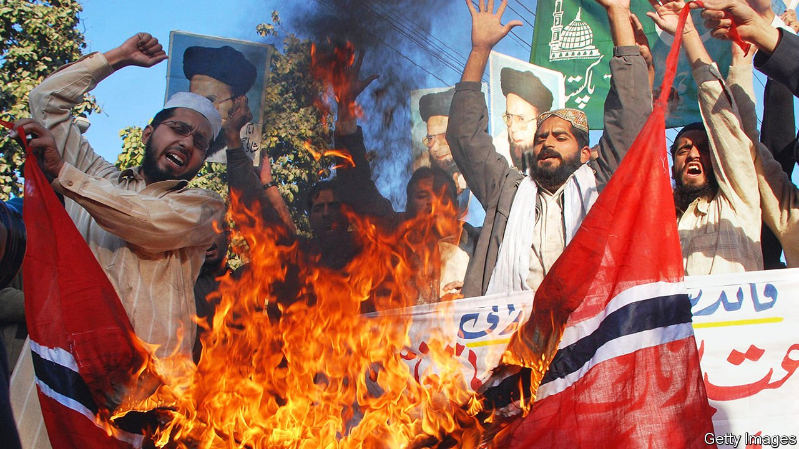

###### The megaphone and the muzzle

# A history of free expression charts its seesawing progress 

##### Repression leads to liberalisation and vice versa, says Jacob Mchangama 

 

> Feb 3rd 2022 

Free Speech. By Jacob Mchangama. Basic Books; 528 pages; $32 and £25

A GLOBAL FIRESTORM erupted in 2005 after the publication in a Danish newspaper of 12 provocative cartoons of the Prophet Muhammad. Jacob Mchangama, a Dane and then a young lawyer, was dismayed. In the Muslim world he watched states that rarely allowed protest of any kind encourage violent demonstrations. Those governments also redoubled their diplomatic efforts to define “defamation of religions” as a human-rights violation that should be banned everywhere.


He found the response elsewhere even more alarming. Respectable people across the Western world blamed the cartoonist and his editors, not the repressive forces that drove the newspaper staff into hiding. This was not what Mr Mchangama, the product of a confidently secular Nordic democracy, had expected.

As his new book recalls, free expression was suffering setbacks on other fronts, too. In the late 1990s, when he was a student, the internet presaged a glorious era of liberty for people who otherwise lacked money or power to speak and organise. The victory in 2008 of Barack Obama, an erstwhile outsider, marked a high point of those expectations. Even then, though, digital freedom was already in retreat. Authoritarian regimes proved adept at exploiting and policing social media for their own malign ends. Western governments were often heavy-handed in their regulation of extremist discourse. And the gigantic power wielded by a few tech companies was troubling, regardless of how they used it.

All this led Mr Mchangama (whose paternal forebears came from the Comoro Islands) to apply his legal mind to supporting intellectual liberty: by podcasting and founding a think-tank, and by studying free expression’s fluctuating fortunes over the past 25 centuries. His conclusions, presented in a crisp and confident march through Western history, are sobering.

His view that freedom of speech is under threat from many directions—and, politically, from both right and left—is not original. More distinctive is his determination to show the ebb and flow of liberty as a dynamic process, under way at least since the era of ancient Greece. Accordingly, stringent repression of thought and speech becomes self-defeating and stimulates brave opponents. But great bursts of freedom also prove finite.

For example, the intellectual energy unleashed by the printing press and the Protestant Reformation was dissipated in waves of sectarian wars and mutual persecution. After the shock of the American and French revolutions, and the rise of Napoleon Bonaparte, Britain’s establishment became severely repressive in the early 19th century. But a countervailing movement of liberal thought and debate, carried along by technological and social change, proved more powerful.

Yet that trend, too, had its limits and its hypocrisies. John Stuart Mill was a brilliant Victorian advocate of intellectual freedom, but he participated in, and defended, the colonial administration of India. And as Britain became more open and tolerant at home, it curbed liberty of expression in its overseas possessions, especially amid the rise of independence movements.

The effects of colonial repression continued to be felt long after colonialism ended, as the book shows. Laws dating from the British Empire have been used to stifle dissent in modern India, and recently in Hong Kong. Measures that strangle freedom can easily outlive the conditions that engendered them—as, luckily, can laws and constitutions that entrench liberty. In America, where the possibility of frank, productive debate seems threatened by cultural warfare, the constitution’s First Amendment sets a limit on any faction’s ability to muzzle its opponents.

The important thing, Mr Mchangama argues, is to read history correctly. For instance, in his view modern Germany has erred on the side of draconian regulations for “hate speech” on digital platforms, in part out of a well-meaning belief that the Weimar Republic was too complacent in allowing the poisonous ideology of Nazism to be aired. But that analysis of Hitler’s rise is not borne out by the facts: in reality, the book maintains, the Weimar authorities did try, rather haplessly, to rein in the Nazis through curbs on freedom of expression. By contrast, they failed to act when Hitler’s thugs committed acts of violence that should have led to prosecution.

Keep it in the family

The historical lessons closest to the author’s heart come from the classical era. He contrasts the robust free-speech culture of Periclean Athens with the mannered exchanges of ancient Romans, which were confined to a small elite. Central to the Athenian system, he says, were the concepts of isegoria—an equal entitlement to speak, for all classes of men—and parrhesia, the right to express even the most outrageous thoughts. He thinks these laudable notions, absent in ancient Rome, provide a yardstick to judge modern societies. (He might have added that the decline of Athenian democracy is as telling as its zenith: the city’s internal affairs were manipulated by outsiders who exploited its openness—just as trolls, spies and lobbyists for autocrats do in democracies today.)

These parallels are instructive, but they raise a wider question about the circumstances in which virtually unbridled speech can flourish and be tolerated. Many groups, including families and friends, remain intact—and can absorb the noisiest of arguments—because of unspoken and often unconscious limits on the sayable, even the thinkable. That kind of informal system works best in smallish communities, such as the citizenry of ancient Athens or the political class of modern democracies. In a digital universe of billions, incorporating many religions and ideologies, no such commonality exists.

The result is that a cartoon which seems fair game to a Scandinavian intellectual can look, on the streets of Islamabad or Cairo, like an invitation to riot or even kill. Keeping legal restrictions on free expression to a minimum is a vital principle that ought to be sacrosanct. But it will not close that yawning gap. ■

