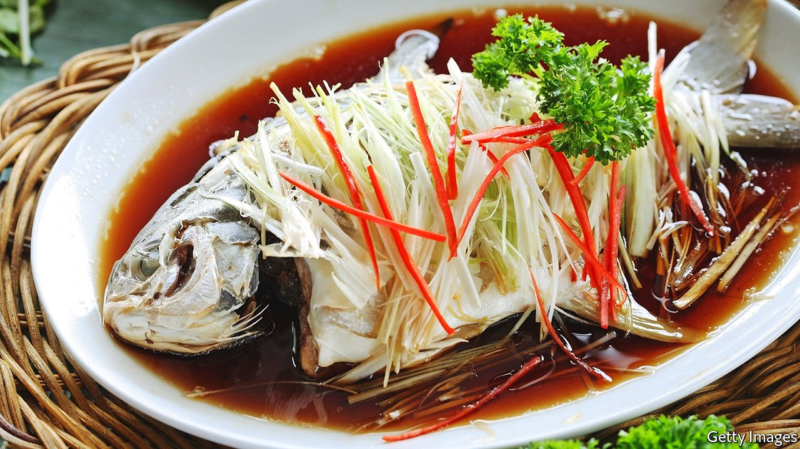

###### World in a dish

# Lucky new-year foods embody a benign view of good fortune 

##### Steam a fish for abundance, and make sure there are leftovers 

 

> Feb 5th 2022 

“WHY STEAM fish”, asked Andy Ricker, an author and restaurateur who ran several acclaimed Thai restaurants in America, “when you can batter chunks and immerse them in hot oil? When you can grill it over charcoal?” As he discovered while travelling around Thailand, one answer is that steamed fish can be delicious. A recipe Mr Ricker developed includes ginger, spring onions, celery leaves and oyster mushrooms, which bolster the pure marine sweetness of the fish without contamination by the taste of oil or smoke. Another reason is that, in the right context, steamed fish can be lucky.

The Chinese words for “fish” and “plenty” are homonyms; a whole fish, eaten on the eve of the lunar new year—which this year fell on February 1st—represents a wish for abundance to come. It can be braised, deep-fried or roasted in a pan, but if you live on a coast, or have access to first-rate fish, steaming is the way to go. These new-year meals are suffused with symbolism. Enough fish should be cooked to ensure leftovers, which signify hopes for a surplus in the year ahead. Spring rolls, with their fanciful resemblance to gold bars, represent hopes for wealth. Uncut noodles symbolise longevity; sweet rice cakes anticipate a better future.


Such customs are not unique to the Sinitic world. On the Jewish new year, Rosh Hashanah, Jews bake their challah, a traditional enriched bread, in a round shape to signify the cycle of life and creation. The bread, and often apples too, are smeared with honey, symbolising the wish for a sweet year. Pomegranates, with their many seeds, embody a desire to do many mitzvot—literally “commandments”, but more commonly understood as “good deeds”—in the coming year.

On New Year’s Day in America, black southerners have long eaten Hoppin’ John, a delicious dish of rice and black-eyed peas or cowpeas, cooked with salt pork or smoked ham hock (interest in African-American culture has made the recipe popular elsewhere). The peas symbolise coins, and the greens that are usually served as well stand for dollar bills. Some people put a clean dime in the pot; whoever gets it on their plate will enjoy a glut of good luck.

Whether anyone actually believes in a causal relationship between eating these foods and receiving the promised benefits is unclear. Mainly, these culinary traditions continue for the same reason that other traditions do: people have fond memories of observing them with their parents, and want to pass them down to their own offspring.

Diverse as these dishes are, they all imply an optimistic and democratic view of good fortune. Fish and noodles, bread and apples, beans and greens appear regularly on Chinese, Jewish and southern tables. They are neither costly nor exotic, suggesting that luck is not something bought expensively or sought with difficulty. Rather these foods are ordinary, yet suffused with benevolent meaning when eaten at the right time and in the right frame of mind. Good fortune, they suggest, lies all around, and is always within reach. ■

