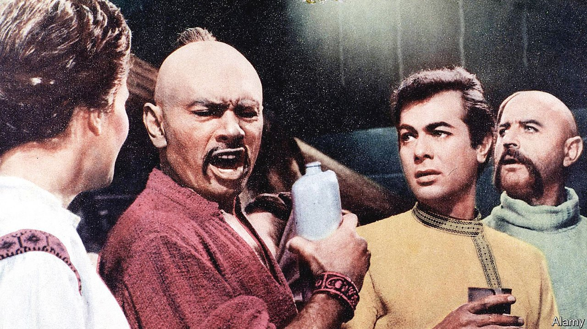

###### Back Story

# “Taras Bulba” and the tragedy of Russia and Ukraine 

##### Literature offers a better way to think about their vexed relations 

 

> Feb 5th 2022 

HE IS DAUNTLESS in battle, defiant in adversity and loyal to his comrades. With his last words, he foresees the coming of an invincible tsar. Taras Bulba, hero of Nikolai Gogol’s novella of the same name, is an avowed Russian patriot. Yet something in the picture is askew. Taras wears trousers “wide as the Black Sea”; he carries the gunpowder for his Turkish pistol in a dangling horn. This ideal Russian is actually a Ukrainian Cossack. His story, and Gogol’s own, are a reminder of the nuances of identity in their tense region—and of lost possibilities in Russia’s relations with Ukraine.

All modern Russian literature, Dostoyevsky reputedly said, came out of Gogol’s “Overcoat”, a mesmerising short story about a clerk in St Petersburg and a coat with a cat-fur collar. But Gogol himself came out of Ukraine. Born there in 1809, he moved to St Petersburg, the imperial capital, and wrote in Russian. “Taras Bulba”, the tale of a Cossack warlord bent on fighting the Poles, was one of the fables of the steppe with which he first beguiled his Russian readership.


As his reputation grew, Gogol revised the narrative to emphasise its Russianness. The Cossacks live to fight—no one dies of old age—and, when they are not fighting, they “drink and carouse as only a Russian can”. Slain in battle, one exclaims, “May Russia flourish for ever!” Taras’s son, Andriy, falls in love with a Polish princess; as bad luck has it, she winds up trapped in a city that the Cossacks besiege. Andriy saves her and betrays his father. Taras duly kills him.

Like his protagonist’s, Gogol’s politics grew more nationalistic over time. In “Dead Souls” he famously portrayed Russia as a horse-drawn troika barrelling through history. He became fanatical, went mad, and died in 1852.

Yet neither Gogol nor “Taras Bulba” quite pull off their nationalist shtick. Some critics said the writer had a “double soul”, both Russian and Ukrainian. Gogol, an outsider even in his pomp, sometimes agreed. “I myself don’t know what soul I have,” he told a friend. Some bibliophiles in Kyiv claim Mykola Hohol (the Ukrainian version of his name) as their own.

As for Taras and the Cossacks, they make pretty delinquent poster boys. Their boozing proves ruinous, and they rampage around the countryside like a barbaric mob; their grotesque anti-Semitism taints the whole story. In any case, Gogol’s emphasis on their freedom undercuts their fealty to Russia. And then there is Andriy. From a certain point of view, his fate is a timely warning of the dangers of betraying the Slavic brotherhood and turning West. But for most modern readers, and doubtless many earlier ones, Andriy’s compassion and self-determination make him a hero rather than a traitor.

Gogol’s novella, and his life, suggest a way of thinking about Russia and Ukraine rooted in the ironies and contradictions of art, rather than the deathly binaries of autocracy. The same goes for other writers buffeted around the tsarist and Soviet empires by force, opportunity or caprice. The house in which Mikhail Bulgakov lived during the Russian civil war—and where he set “The White Guard”—is a museum on Kyiv’s prettiest street. Vasily Grossman, author of the second-world-war epic “Life and Fate”, was born in Ukraine. Taras Shevchenko is revered as the father of Ukrainian literature (and was exiled to Siberia for his efforts). But he sometimes wrote in Russian and spent years in St Petersburg.

Together their work offers an app roach to relations in which Ukrainian and Russian identities are linked but distinct. More than that, they form an overlapping canon that transmutes a dark shared past into a golden joint inheritance. Through literature if not in politics, the entwined histories of the two countries can engender both mutual respect and a benign cultural affinity. With his tantrums and tanks, Vladimir Putin has violated not just peace and borders, but the humane bonds that art can forge. To many in the region, he has made the idea of a shared culture seem tragically improper.

Hollywood made a film of “Taras Bulba” in 1962. Compared with the original, there are more orgies and fewer pogroms. As Andriy, Tony Curtis is a suave sort of Cossack. Most importantly, they changed the ending: Taras (Yul Brynner) is triumphant and merciful, whereas in the book he is vengeful and burned alive. Read it closely, in fact, and you see that all the talk of national pride and interests is a cynical cover for his bloodlust and ambition. War, Gogol knew, can be sparked by the ego and scheming of a single man.

